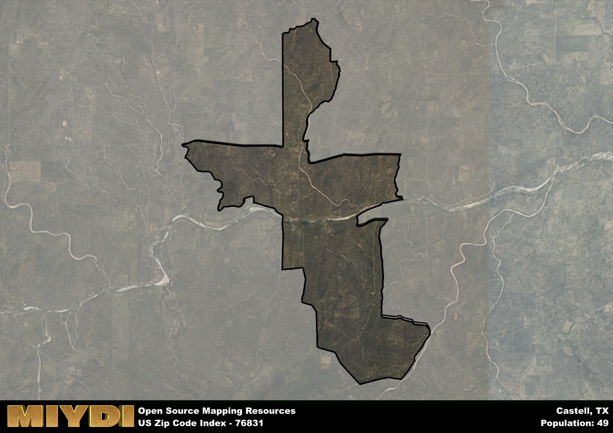

**Area Name:** Castell

**Zip Code:** 76831

**State:** TX

# Castell: A Hidden Gem in the Heart of Texas  
Located in central Texas, zip code 76831 encompasses the charming neighborhood of Castell. Situated along the banks of the Llano River, this area is surrounded by picturesque landscapes and rolling hills. While Castell is a small community, it is conveniently located near larger towns such as Llano and Mason, providing residents with easy access to urban amenities while still enjoying a tranquil rural setting.

Originally settled in the mid-19th century by German immigrants, Castell has a rich history that is evident in its architecture and cultural traditions. The area was named after the nearby Castell Creek and quickly became a hub for agriculture, particularly farming and ranching. Throughout the years, Castell has maintained its small-town charm and is known for its tight-knit community and preservation of its German heritage.

Today, Castell offers a mix of recreational activities, including fishing and kayaking on the Llano River, as well as hiking and camping in the surrounding Hill Country. The area is also home to a few local businesses, such as family-owned restaurants and shops, that cater to both residents and visitors. With its stunning natural beauty and unique cultural heritage, Castell remains a hidden gem in the heart of Texas.

# Castell Demographics

The population of Castell is 49.  
Castell has a population density of 1.56 per square mile.  
The area of Castell is 31.44 square miles.  

## Castell AI and Census Variables

The values presented in this dataset for Castell are AI-optimized, streamlined, and categorized into relevant buckets for enhanced utility in AI and mapping programs. These simplified values have been optimized to facilitate efficient analysis and integration into various technological applications, offering users accessible and actionable insights into demographics within the Castell area.

| AI Variables for Castell | Value |
|-------------|-------|
| Shape Area | 110496899.675781 |
| Shape Length | 80254.9757689039 |

## How to use this free AI optimized Geo-Spatial Data for Castell, TX

This data is made freely available under the Creative Commons license, allowing for unrestricted use for any purpose. Users can access static resources directly from GitHub or leverage more advanced functionalities by utilizing the GeoJSON files. All datasets originate from official government or private sector sources and are meticulously compiled into relevant datasets within QGIS. However, the versatility of the data ensures compatibility with any mapping application.

## Data Accuracy Disclaimer
It's important to note that the data provided here may contain errors or discrepancies and should be considered as 'close enough' for business applications and AI rather than a definitive source of truth. This data is aggregated from multiple sources, some of which publish information on wildly different intervals, leading to potential inconsistencies. Additionally, certain data points may not be corrected for Covid-related changes, further impacting accuracy. Moreover, the assumption that demographic trends are consistent throughout a region may lead to discrepancies, as trends often concentrate in areas of highest population density. As a result, dense areas may be slightly underrepresented, while rural areas may be slightly overrepresented, resulting in a more conservative dataset. Furthermore, the focus primarily on areas within US Major and Minor Statistical areas means that approximately 40 million Americans living outside of these areas may not be fully represented. Lastly, the historical background and area descriptions generated using AI are susceptible to potential mistakes, so users should exercise caution when interpreting the information provided.
