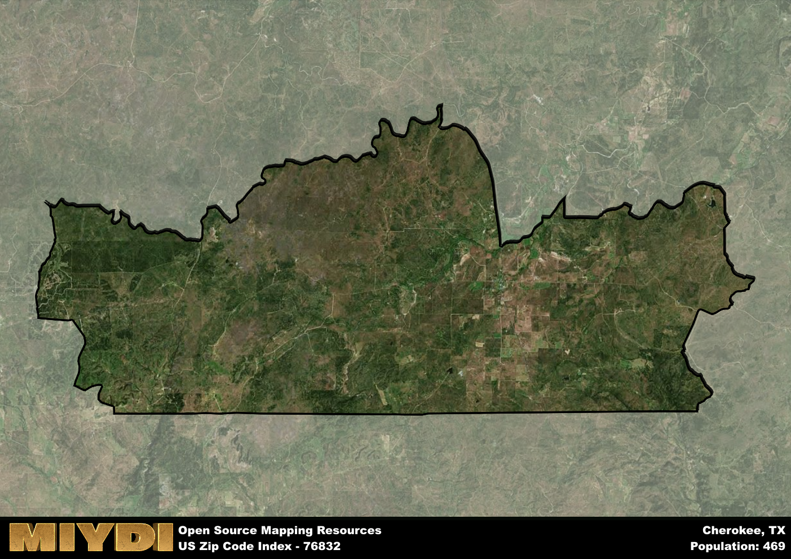

**Area Name:** Cherokee

**Zip Code:** 76832

**State:** TX

# Cherokee: A Historic Neighborhood in Central Texas

Located in central Texas, the zip code area 76832 corresponds to the neighborhood of Cherokee. This area is situated within the larger metropolitan context of the city of Cherokee, which is known for its rich history and vibrant community. Cherokee is bordered by several other neighborhoods and is a key residential area within the city, providing easy access to major population centers and amenities.

Cherokee has a fascinating historical narrative that dates back to its settlement in the early 19th century. Originally established as a trading post, Cherokee quickly grew into a bustling community with a diverse population. The area played a significant role in the development of central Texas, attracting settlers and businesses with its fertile land and strategic location along major trade routes. Over the years, Cherokee has retained its small-town charm while embracing modern developments.

Today, Cherokee is a thriving neighborhood with a mix of residential, commercial, and recreational offerings. The area is known for its strong sense of community, with residents actively participating in local events and initiatives. Cherokee boasts a variety of businesses, including shops, restaurants, and services that cater to the needs of its residents. Additionally, the neighborhood is home to several parks and cultural attractions, providing plenty of opportunities for recreation and exploration. Cherokee continues to evolve while preserving its unique identity within the larger urban fabric of central Texas.

# Cherokee Demographics

The population of Cherokee is 469.  
Cherokee has a population density of 3.24 per square mile.  
The area of Cherokee is 144.82 square miles.  

## Cherokee Income and Economic Data

These demographic numbers are sourced from IRS return data, providing comprehensive insights into the population dynamics and economic trends within Cherokee.

**Breakdown of return types for Cherokee**

The table offers insight into the composition of tax returns filed with the IRS, categorizing them into three main types. Single returns represent filings by individuals, joint returns by married couples, and head of household returns by individuals who qualify as heads of households, typically having dependents. This breakdown provides an understanding of the different filing statuses adopted by taxpayers when submitting their tax documentation.

| Return Types filed for Cherokee                              | Percentage          |
|----------------------------------------------------------|---------------------|
| Single Returns                                            | 0.36 |
| Joint Returns                                             | 0.57 |
| Head Household Returns                                    | 0 |

The income and economic data presented here is sourced from the IRS income brackets, utilized for categorizing tax returns by income levels. This table displays income ranges for both single filers and married couples, along with the corresponding number of returns and the percentage within each bracket, providing valuable insight into the distribution of taxes across various income groups.

| Bracket Name       | Single Filer Income Range | Married Couple Range | Number of Returns | Percentage of Returns |
|--------------------|----------------------------|----------------------|-------------------|-----------------------|
| 10% Bracket        | Up to $10,275              | Up to $20,550        | 90 | 0.32% |
| 12% Bracket        | $10,276 - $41,775          | $20,551 - $83,550    | 70 | 0.25% |
| 22% Bracket        | $41,776 - $89,075          | $83,551 - $178,150   | 50 | 0.18% |
| 24% Bracket        | $89,076 - $170,050         | $178,151 - $340,100  | 30 | 0.11% |
| 32% Bracket        | $170,051 - $215,950        | $340,101 - $431,900  | 40 | 0.14% |
| 35% Bracket        | $215,951 - $539,900        | $431,901 - $647,850  | 0 | 0% |

### Exploring Taxpayer Diversity: A Breakdown of Different Types of Tax Returns in Cherokee

The table offers insights into various types of tax returns filed, reflecting different aspects of taxpayer activities and demographics. Categories include charitable returns for donations, dependent returns for claimed dependents, educator population, elderly population, real estate returns, self-employment returns, student loan returns, and unemployment returns, providing valuable insights into taxpayer behavior and demographics.

| Cherokee Filing Types                    | Count | Percentage |
|--------------------------------------|-------|------------|
| Charitable Donations                 | 0 | 0% |
| Dependents Claimed                   | 0 | 0% |
| Educator Residents                   | 0 | 0% |
| Elderly Population                   | 100 | 0.36% |
| Farming Population                   | 70 | 0.25% |
| Real Estate Transactions             | 0 | 0% |
| Self-Employed Individuals            | 70 | 0.25% |
| Student Loan Cases                   | 0 | 0% |
| Unemployment Benefit Filings         | 0 | 0% |

## Cherokee AI and Census Variables

The values presented in this dataset for Cherokee are AI-optimized, streamlined, and categorized into relevant buckets for enhanced utility in AI and mapping programs. These simplified values have been optimized to facilitate efficient analysis and integration into various technological applications, offering users accessible and actionable insights into demographics within the Cherokee area.

| AI Variables for Cherokee | Value |
|-------------|-------|
| Shape Area | 511843701.445313 |
| Shape Length | 137949.82245955 |

## How to use this free AI optimized Geo-Spatial Data for Cherokee, TX

This data is made freely available under the Creative Commons license, allowing for unrestricted use for any purpose. Users can access static resources directly from GitHub or leverage more advanced functionalities by utilizing the GeoJSON files. All datasets originate from official government or private sector sources and are meticulously compiled into relevant datasets within QGIS. However, the versatility of the data ensures compatibility with any mapping application.

## Data Accuracy Disclaimer
It's important to note that the data provided here may contain errors or discrepancies and should be considered as 'close enough' for business applications and AI rather than a definitive source of truth. This data is aggregated from multiple sources, some of which publish information on wildly different intervals, leading to potential inconsistencies. Additionally, certain data points may not be corrected for Covid-related changes, further impacting accuracy. Moreover, the assumption that demographic trends are consistent throughout a region may lead to discrepancies, as trends often concentrate in areas of highest population density. As a result, dense areas may be slightly underrepresented, while rural areas may be slightly overrepresented, resulting in a more conservative dataset. Furthermore, the focus primarily on areas within US Major and Minor Statistical areas means that approximately 40 million Americans living outside of these areas may not be fully represented. Lastly, the historical background and area descriptions generated using AI are susceptible to potential mistakes, so users should exercise caution when interpreting the information provided.
