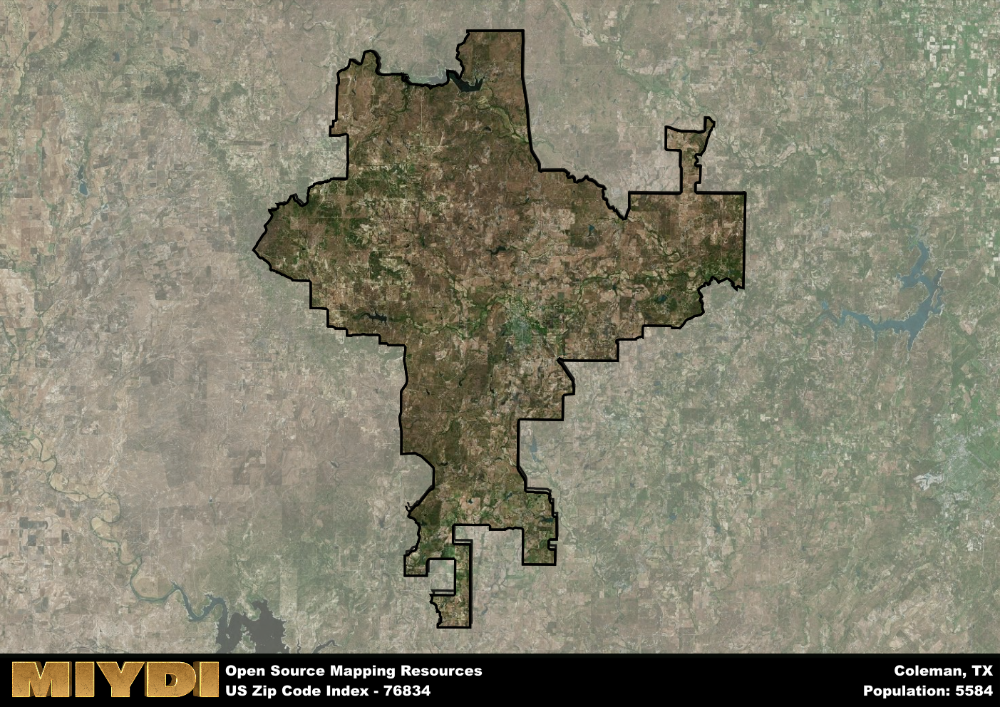

**Area Name:** Coleman

**Zip Code:** 76834

**State:** TX

# The Charming Neighborhood of Coleman in Zip Code 76834

Situated in the heart of Coleman County, the zip code area 76834 encompasses the charming neighborhood of Coleman. Bordered by the city limits of Coleman, this area seamlessly integrates with the surrounding communities of Santa Anna to the east and Talpa to the west. As part of the larger metropolitan context, Coleman serves as a hub for agricultural activities and is connected to nearby cities like Abilene and Brownwood through well-maintained highways.

The area corresponding to zip code 76834 has a rich historical narrative dating back to the late 19th century when it was established as a trading post. Over the years, Coleman has grown into a vibrant community known for its friendly residents and small-town charm. The area experienced significant growth during the oil boom in the early 20th century, which led to the development of various businesses and services that continue to thrive today.

Today, the neighborhood of Coleman in zip code 76834 boasts a diverse economy supported by agriculture, oil production, and small businesses. Residents and visitors can enjoy a range of recreational amenities, including parks, sports facilities, and community events. The area also features historic sites such as the Coleman County Courthouse and the Santa Anna Mountain Peak, offering a glimpse into its storied past. With its strong sense of community and unique character, Coleman remains a sought-after destination for those looking to experience the best of small-town Texas.

# Coleman Demographics

The population of Coleman is 5584.  
Coleman has a population density of 12.93 per square mile.  
The area of Coleman is 431.78 square miles.  

## Coleman Income and Economic Data

These demographic numbers are sourced from IRS return data, providing comprehensive insights into the population dynamics and economic trends within Coleman.

**Breakdown of return types for Coleman**

The table offers insight into the composition of tax returns filed with the IRS, categorizing them into three main types. Single returns represent filings by individuals, joint returns by married couples, and head of household returns by individuals who qualify as heads of households, typically having dependents. This breakdown provides an understanding of the different filing statuses adopted by taxpayers when submitting their tax documentation.

| Return Types filed for Coleman                              | Percentage          |
|----------------------------------------------------------|---------------------|
| Single Returns                                            | 0.45 |
| Joint Returns                                             | 0.41 |
| Head Household Returns                                    | 0.14 |

The income and economic data presented here is sourced from the IRS income brackets, utilized for categorizing tax returns by income levels. This table displays income ranges for both single filers and married couples, along with the corresponding number of returns and the percentage within each bracket, providing valuable insight into the distribution of taxes across various income groups.

| Bracket Name       | Single Filer Income Range | Married Couple Range | Number of Returns | Percentage of Returns |
|--------------------|----------------------------|----------------------|-------------------|-----------------------|
| 10% Bracket        | Up to $10,275              | Up to $20,550        | 930 | 0.42% |
| 12% Bracket        | $10,276 - $41,775          | $20,551 - $83,550    | 580 | 0.26% |
| 22% Bracket        | $41,776 - $89,075          | $83,551 - $178,150   | 300 | 0.14% |
| 24% Bracket        | $89,076 - $170,050         | $178,151 - $340,100  | 150 | 0.07% |
| 32% Bracket        | $170,051 - $215,950        | $340,101 - $431,900  | 190 | 0.09% |
| 35% Bracket        | $215,951 - $539,900        | $431,901 - $647,850  | 60 | 0.03% |

### Exploring Taxpayer Diversity: A Breakdown of Different Types of Tax Returns in Coleman

The table offers insights into various types of tax returns filed, reflecting different aspects of taxpayer activities and demographics. Categories include charitable returns for donations, dependent returns for claimed dependents, educator population, elderly population, real estate returns, self-employment returns, student loan returns, and unemployment returns, providing valuable insights into taxpayer behavior and demographics.

| Coleman Filing Types                    | Count | Percentage |
|--------------------------------------|-------|------------|
| Charitable Donations                 | 30 | 0.014% |
| Dependents Claimed                   | 50 | 0.023% |
| Educator Residents                   | 40 | 0.018% |
| Elderly Population                   | 790 | 0.36% |
| Farming Population                   | 280 | 0.127% |
| Real Estate Transactions             | 40 | 0.018% |
| Self-Employed Individuals            | 400 | 0.181% |
| Student Loan Cases                   | 80 | 0.036% |
| Unemployment Benefit Filings         | 230 | 0.1% |

## Coleman AI and Census Variables

The values presented in this dataset for Coleman are AI-optimized, streamlined, and categorized into relevant buckets for enhanced utility in AI and mapping programs. These simplified values have been optimized to facilitate efficient analysis and integration into various technological applications, offering users accessible and actionable insights into demographics within the Coleman area.

| AI Variables for Coleman | Value |
|-------------|-------|
| Shape Area | 1555155117.85938 |
| Shape Length | 333137.583183869 |

## How to use this free AI optimized Geo-Spatial Data for Coleman, TX

This data is made freely available under the Creative Commons license, allowing for unrestricted use for any purpose. Users can access static resources directly from GitHub or leverage more advanced functionalities by utilizing the GeoJSON files. All datasets originate from official government or private sector sources and are meticulously compiled into relevant datasets within QGIS. However, the versatility of the data ensures compatibility with any mapping application.

## Data Accuracy Disclaimer
It's important to note that the data provided here may contain errors or discrepancies and should be considered as 'close enough' for business applications and AI rather than a definitive source of truth. This data is aggregated from multiple sources, some of which publish information on wildly different intervals, leading to potential inconsistencies. Additionally, certain data points may not be corrected for Covid-related changes, further impacting accuracy. Moreover, the assumption that demographic trends are consistent throughout a region may lead to discrepancies, as trends often concentrate in areas of highest population density. As a result, dense areas may be slightly underrepresented, while rural areas may be slightly overrepresented, resulting in a more conservative dataset. Furthermore, the focus primarily on areas within US Major and Minor Statistical areas means that approximately 40 million Americans living outside of these areas may not be fully represented. Lastly, the historical background and area descriptions generated using AI are susceptible to potential mistakes, so users should exercise caution when interpreting the information provided.
