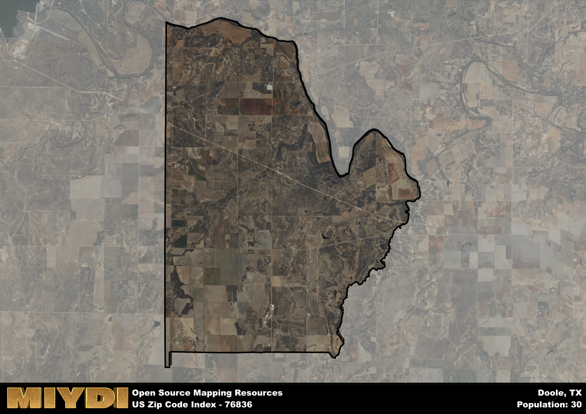

**Area Name:** Doole

**Zip Code:** 76836

**State:** TX

# Doole: A Charming Zip Code in Central Texas

Located in central Texas, zip code 76836 encompasses the small community of Doole. Surrounded by vast open fields and rolling hills, Doole is situated within close proximity to larger cities such as Brady and San Angelo. Despite its rural setting, Doole is well-connected to major transportation routes, making it an accessible and tranquil retreat from the hustle and bustle of urban life.

Doole has a rich history dating back to the mid-19th century when it was founded as a farming and ranching community. Over the years, the area has seen periods of growth and decline, with the construction of railroads and highways playing a significant role in shaping its development. The name "Doole" is believed to have originated from a local settler or prominent figure in the community, adding to the area's unique identity.

Today, Doole is a close-knit community known for its friendly residents and scenic countryside. The economy is primarily driven by agriculture, with cattle ranching and farming being the main sources of income for many residents. The area also offers a range of recreational activities, including fishing and hunting, making it a popular destination for outdoor enthusiasts. Visitors can explore historic sites such as old farmhouses and barns, providing a glimpse into Doole's past and preserving its heritage for future generations.

# Doole Demographics

The population of Doole is 30.  
Doole has a population density of 0.53 per square mile.  
The area of Doole is 56.18 square miles.  

## Doole AI and Census Variables

The values presented in this dataset for Doole are AI-optimized, streamlined, and categorized into relevant buckets for enhanced utility in AI and mapping programs. These simplified values have been optimized to facilitate efficient analysis and integration into various technological applications, offering users accessible and actionable insights into demographics within the Doole area.

| AI Variables for Doole | Value |
|-------------|-------|
| Shape Area | 200390886.679688 |
| Shape Length | 70941.3842504913 |

## How to use this free AI optimized Geo-Spatial Data for Doole, TX

This data is made freely available under the Creative Commons license, allowing for unrestricted use for any purpose. Users can access static resources directly from GitHub or leverage more advanced functionalities by utilizing the GeoJSON files. All datasets originate from official government or private sector sources and are meticulously compiled into relevant datasets within QGIS. However, the versatility of the data ensures compatibility with any mapping application.

## Data Accuracy Disclaimer
It's important to note that the data provided here may contain errors or discrepancies and should be considered as 'close enough' for business applications and AI rather than a definitive source of truth. This data is aggregated from multiple sources, some of which publish information on wildly different intervals, leading to potential inconsistencies. Additionally, certain data points may not be corrected for Covid-related changes, further impacting accuracy. Moreover, the assumption that demographic trends are consistent throughout a region may lead to discrepancies, as trends often concentrate in areas of highest population density. As a result, dense areas may be slightly underrepresented, while rural areas may be slightly overrepresented, resulting in a more conservative dataset. Furthermore, the focus primarily on areas within US Major and Minor Statistical areas means that approximately 40 million Americans living outside of these areas may not be fully represented. Lastly, the historical background and area descriptions generated using AI are susceptible to potential mistakes, so users should exercise caution when interpreting the information provided.
