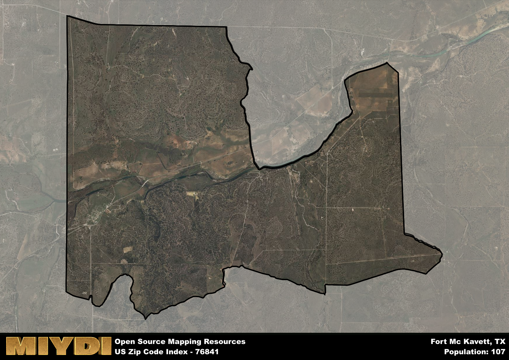

**Area Name:** Fort Mc Kavett

**Zip Code:** 76841

**State:** TX

# Fort Mc Kavett: A Historic Gem in West Texas

Located in the heart of West Texas, zip code 76841 encompasses the historic area of Fort Mc Kavett. Situated within Menard County, this neighborhood is surrounded by vast stretches of rolling plains and is approximately 25 miles southwest of the city of Menard. While the area itself is relatively rural, it is part of the larger metropolitan context of San Angelo, which is about 70 miles to the northwest, providing residents with access to additional amenities and services.

Established in 1852, Fort Mc Kavett played a crucial role in the settlement of the Texas frontier. Originally built to protect settlers from Native American raids, the fort quickly became a hub for trade and communication in the region. The fort was named after Captain Henry Mc Kavett, who was killed during the Mexican-American War. Over the years, Fort Mc Kavett evolved into a thriving community, attracting settlers and businesses seeking opportunities in the expanding West Texas landscape.

Today, Fort Mc Kavett retains much of its historic charm, with well-preserved buildings and sites that offer a glimpse into its past. The area's economy is primarily driven by agriculture and ranching, with local businesses catering to the needs of the community. Residents and visitors alike can explore the Fort Mc Kavett State Historic Site, which showcases the fort's history through exhibits and guided tours. Outdoor enthusiasts can also enjoy the area's natural beauty through hiking, camping, and birdwatching opportunities in nearby parks and wildlife areas.

# Fort Mc Kavett Demographics

The population of Fort Mc Kavett is 107.  
Fort Mc Kavett has a population density of 4.82 per square mile.  
The area of Fort Mc Kavett is 22.21 square miles.  

## Fort Mc Kavett AI and Census Variables

The values presented in this dataset for Fort Mc Kavett are AI-optimized, streamlined, and categorized into relevant buckets for enhanced utility in AI and mapping programs. These simplified values have been optimized to facilitate efficient analysis and integration into various technological applications, offering users accessible and actionable insights into demographics within the Fort Mc Kavett area.

| AI Variables for Fort Mc Kavett | Value |
|-------------|-------|
| Shape Area | 78257791.0273438 |
| Shape Length | 49915.3994990239 |

## How to use this free AI optimized Geo-Spatial Data for Fort Mc Kavett, TX

This data is made freely available under the Creative Commons license, allowing for unrestricted use for any purpose. Users can access static resources directly from GitHub or leverage more advanced functionalities by utilizing the GeoJSON files. All datasets originate from official government or private sector sources and are meticulously compiled into relevant datasets within QGIS. However, the versatility of the data ensures compatibility with any mapping application.

## Data Accuracy Disclaimer
It's important to note that the data provided here may contain errors or discrepancies and should be considered as 'close enough' for business applications and AI rather than a definitive source of truth. This data is aggregated from multiple sources, some of which publish information on wildly different intervals, leading to potential inconsistencies. Additionally, certain data points may not be corrected for Covid-related changes, further impacting accuracy. Moreover, the assumption that demographic trends are consistent throughout a region may lead to discrepancies, as trends often concentrate in areas of highest population density. As a result, dense areas may be slightly underrepresented, while rural areas may be slightly overrepresented, resulting in a more conservative dataset. Furthermore, the focus primarily on areas within US Major and Minor Statistical areas means that approximately 40 million Americans living outside of these areas may not be fully represented. Lastly, the historical background and area descriptions generated using AI are susceptible to potential mistakes, so users should exercise caution when interpreting the information provided.
