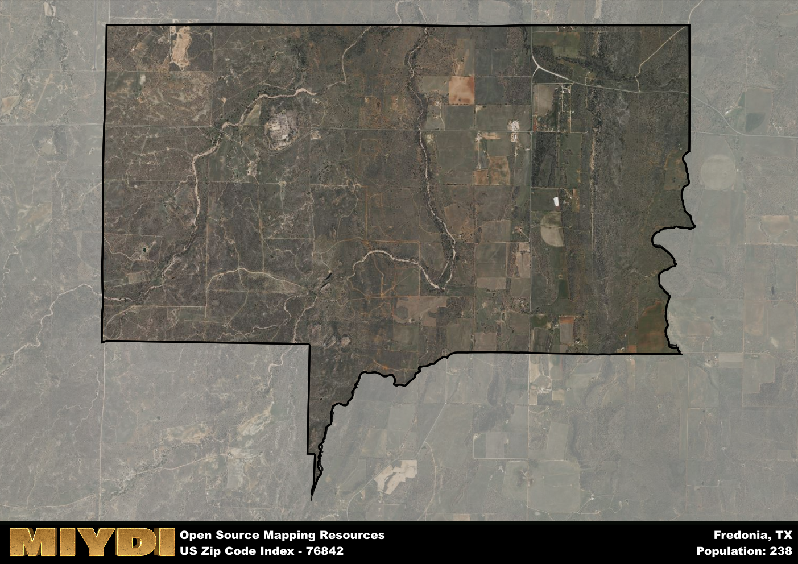

**Area Name:** Fredonia

**Zip Code:** 76842

**State:** TX

# Charming Fredonia: A Historic Gem in Central Texas

Located in central Texas, zip code 76842 encompasses the small, picturesque town of Fredonia. Bordered by rolling hills and fields, Fredonia is situated within the larger metropolitan area of San Angelo, just a short drive away. The town is characterized by its quiet, rural surroundings, providing a peaceful escape from the hustle and bustle of city life while maintaining convenient access to urban amenities.

Fredonia has a rich historical narrative, originally settled in the mid-1800s by pioneers seeking fertile land for agriculture. The town grew steadily over the years, eventually becoming a hub for farming and ranching activities in the region. Fredonia played a significant role in the development of central Texas, serving as a vital community for settlers and travelers passing through the area.

Today, Fredonia boasts a strong agricultural economy, with farms and ranches dotting the landscape. The town offers a range of neighborhood-specific services, including locally-owned businesses, schools, and healthcare facilities. Residents and visitors alike can enjoy recreational activities such as hiking, fishing, and camping in the surrounding natural areas. Additionally, Fredonia is home to several historic sites that showcase the town's heritage, making it a charming destination for those interested in exploring the history of central Texas.

# Fredonia Demographics

The population of Fredonia is 238.  
Fredonia has a population density of 13.17 per square mile.  
The area of Fredonia is 18.07 square miles.  

## Fredonia AI and Census Variables

The values presented in this dataset for Fredonia are AI-optimized, streamlined, and categorized into relevant buckets for enhanced utility in AI and mapping programs. These simplified values have been optimized to facilitate efficient analysis and integration into various technological applications, offering users accessible and actionable insights into demographics within the Fredonia area.

| AI Variables for Fredonia | Value |
|-------------|-------|
| Shape Area | 63780223.0820313 |
| Shape Length | 40098.9699042613 |

## How to use this free AI optimized Geo-Spatial Data for Fredonia, TX

This data is made freely available under the Creative Commons license, allowing for unrestricted use for any purpose. Users can access static resources directly from GitHub or leverage more advanced functionalities by utilizing the GeoJSON files. All datasets originate from official government or private sector sources and are meticulously compiled into relevant datasets within QGIS. However, the versatility of the data ensures compatibility with any mapping application.

## Data Accuracy Disclaimer
It's important to note that the data provided here may contain errors or discrepancies and should be considered as 'close enough' for business applications and AI rather than a definitive source of truth. This data is aggregated from multiple sources, some of which publish information on wildly different intervals, leading to potential inconsistencies. Additionally, certain data points may not be corrected for Covid-related changes, further impacting accuracy. Moreover, the assumption that demographic trends are consistent throughout a region may lead to discrepancies, as trends often concentrate in areas of highest population density. As a result, dense areas may be slightly underrepresented, while rural areas may be slightly overrepresented, resulting in a more conservative dataset. Furthermore, the focus primarily on areas within US Major and Minor Statistical areas means that approximately 40 million Americans living outside of these areas may not be fully represented. Lastly, the historical background and area descriptions generated using AI are susceptible to potential mistakes, so users should exercise caution when interpreting the information provided.
