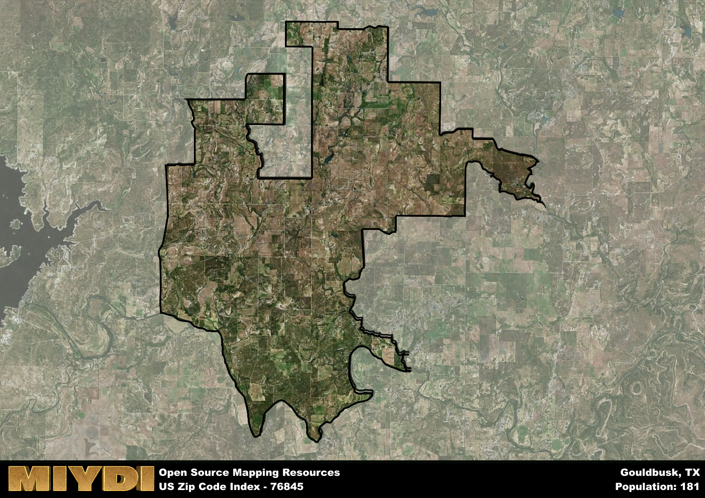

**Area Name:** Gouldbusk

**Zip Code:** 76845

**State:** TX

# Gouldbusk: A Historic Rural Community in Central Texas

Located in central Texas, the zip code area 76845 encompasses the small rural community of Gouldbusk. Surrounded by vast farmlands and ranches, Gouldbusk is situated within close proximity to the cities of Brady and Brownwood. Despite its rural setting, Gouldbusk is an integral part of the larger Brownwood metropolitan area, contributing to the region's agricultural economy and cultural heritage.

Gouldbusk has a rich historical background dating back to the late 19th century when it was first settled by pioneers drawn to the area's fertile land and abundant natural resources. The community was named after Captain Harry Goulding and his wife, who were early settlers in the region. Over the years, Gouldbusk has experienced steady growth, with agriculture playing a vital role in shaping the local economy and identity of the area.

Today, Gouldbusk remains a close-knit community with a strong agricultural presence. The area is known for its production of cotton, wheat, and cattle, which sustain the local economy. Residents enjoy a peaceful rural lifestyle with access to essential services such as schools, churches, and small businesses. Gouldbusk also boasts several recreational amenities, including parks and outdoor spaces, making it an ideal place for nature lovers and outdoor enthusiasts. Additionally, the area is home to historic sites that offer a glimpse into its past, preserving the unique heritage of Gouldbusk for future generations.

# Gouldbusk Demographics

The population of Gouldbusk is 181.  
Gouldbusk has a population density of 1.63 per square mile.  
The area of Gouldbusk is 111.19 square miles.  

## Gouldbusk AI and Census Variables

The values presented in this dataset for Gouldbusk are AI-optimized, streamlined, and categorized into relevant buckets for enhanced utility in AI and mapping programs. These simplified values have been optimized to facilitate efficient analysis and integration into various technological applications, offering users accessible and actionable insights into demographics within the Gouldbusk area.

| AI Variables for Gouldbusk | Value |
|-------------|-------|
| Shape Area | 397725877.140625 |
| Shape Length | 165441.955640277 |

## How to use this free AI optimized Geo-Spatial Data for Gouldbusk, TX

This data is made freely available under the Creative Commons license, allowing for unrestricted use for any purpose. Users can access static resources directly from GitHub or leverage more advanced functionalities by utilizing the GeoJSON files. All datasets originate from official government or private sector sources and are meticulously compiled into relevant datasets within QGIS. However, the versatility of the data ensures compatibility with any mapping application.

## Data Accuracy Disclaimer
It's important to note that the data provided here may contain errors or discrepancies and should be considered as 'close enough' for business applications and AI rather than a definitive source of truth. This data is aggregated from multiple sources, some of which publish information on wildly different intervals, leading to potential inconsistencies. Additionally, certain data points may not be corrected for Covid-related changes, further impacting accuracy. Moreover, the assumption that demographic trends are consistent throughout a region may lead to discrepancies, as trends often concentrate in areas of highest population density. As a result, dense areas may be slightly underrepresented, while rural areas may be slightly overrepresented, resulting in a more conservative dataset. Furthermore, the focus primarily on areas within US Major and Minor Statistical areas means that approximately 40 million Americans living outside of these areas may not be fully represented. Lastly, the historical background and area descriptions generated using AI are susceptible to potential mistakes, so users should exercise caution when interpreting the information provided.
