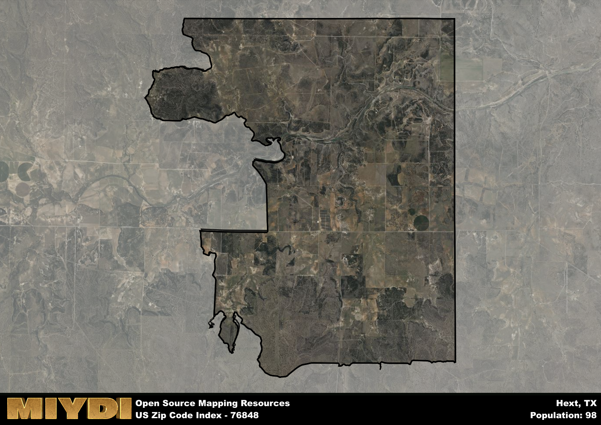

**Area Name:** Hext

**Zip Code:** 76848

**State:** TX

# Hext: A Small Community in Central Texas

Located in central Texas, the zip code 76848 corresponds to the small community of Hext. Situated in Menard County, Hext is surrounded by rural landscapes and is approximately 30 miles southwest of the city of Menard. While it is a predominantly rural area, Hext is integrated into the larger fabric of central Texas through its proximity to major highways and transportation routes connecting it to nearby towns and cities.

Hext has a rich historical narrative, originally established as a stop along the Texas and New Orleans Railroad in the late 1800s. The community grew as a result of the railroad's presence, with the town being officially platted in 1911. The area was named after R.E. Hext, a prominent local rancher and businessman. Over the years, Hext has maintained its small-town charm and close-knit community feel, with residents proud of their town's heritage and history.

Today, Hext remains a tight-knit community with a focus on agriculture and ranching. The area is known for its picturesque landscapes and outdoor recreational opportunities, including hunting and fishing. While there are limited services within the immediate area, residents have access to essential amenities in nearby Menard. Hext is also home to historic sites such as the Hext Cemetery, providing a glimpse into the area's past. Overall, Hext offers a peaceful and idyllic setting for those seeking a quiet rural lifestyle in central Texas.

# Hext Demographics

The population of Hext is 98.  
Hext has a population density of 2.25 per square mile.  
The area of Hext is 43.61 square miles.  

## Hext AI and Census Variables

The values presented in this dataset for Hext are AI-optimized, streamlined, and categorized into relevant buckets for enhanced utility in AI and mapping programs. These simplified values have been optimized to facilitate efficient analysis and integration into various technological applications, offering users accessible and actionable insights into demographics within the Hext area.

| AI Variables for Hext | Value |
|-------------|-------|
| Shape Area | 153849960.191406 |
| Shape Length | 75203.9439796096 |

## How to use this free AI optimized Geo-Spatial Data for Hext, TX

This data is made freely available under the Creative Commons license, allowing for unrestricted use for any purpose. Users can access static resources directly from GitHub or leverage more advanced functionalities by utilizing the GeoJSON files. All datasets originate from official government or private sector sources and are meticulously compiled into relevant datasets within QGIS. However, the versatility of the data ensures compatibility with any mapping application.

## Data Accuracy Disclaimer
It's important to note that the data provided here may contain errors or discrepancies and should be considered as 'close enough' for business applications and AI rather than a definitive source of truth. This data is aggregated from multiple sources, some of which publish information on wildly different intervals, leading to potential inconsistencies. Additionally, certain data points may not be corrected for Covid-related changes, further impacting accuracy. Moreover, the assumption that demographic trends are consistent throughout a region may lead to discrepancies, as trends often concentrate in areas of highest population density. As a result, dense areas may be slightly underrepresented, while rural areas may be slightly overrepresented, resulting in a more conservative dataset. Furthermore, the focus primarily on areas within US Major and Minor Statistical areas means that approximately 40 million Americans living outside of these areas may not be fully represented. Lastly, the historical background and area descriptions generated using AI are susceptible to potential mistakes, so users should exercise caution when interpreting the information provided.
