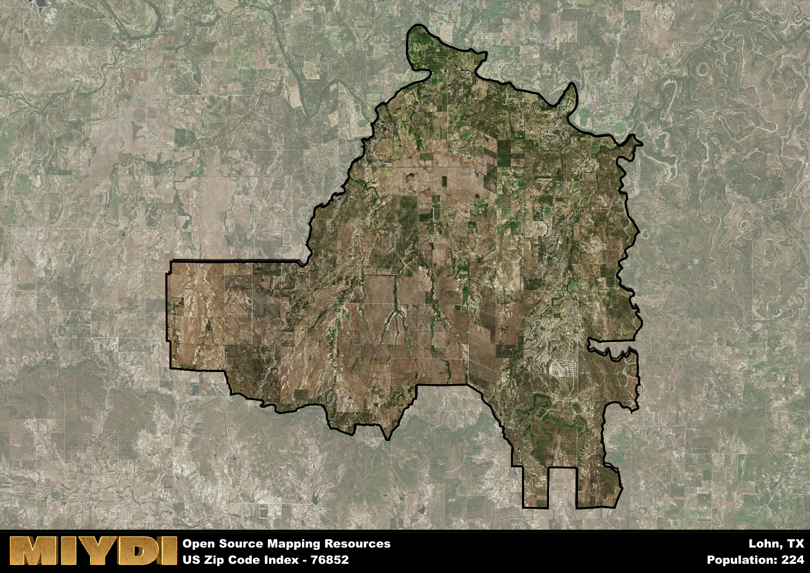

**Area Name:** Lohn

**Zip Code:** 76852

**State:** TX

# Lohn: A Historic and Vibrant Community in Central Texas  

Located in central Texas, the zip code 76852 area corresponds to the neighborhood of Lohn. Situated in McCulloch County, Lohn is surrounded by the towns of Brady to the north and Menard to the south. It is a rural community that thrives on its agricultural activities and close-knit community atmosphere. Lohn is approximately 120 miles northwest of Austin, the state capital, making it a part of the larger metropolitan context of central Texas.

Lohn has a rich historical narrative, dating back to its establishment in the late 1800s. The town was named after a local landowner, John S. Lohn, and quickly became a hub for farming and ranching in the region. Over the years, Lohn has experienced periods of growth and decline, but its resilient spirit has kept the community intact. Today, Lohn maintains its small-town charm while embracing modern developments that enhance the quality of life for its residents.

The current status of Lohn reflects a blend of tradition and progress. The economy is primarily driven by agriculture, with farming and ranching being the main sources of income for residents. Lohn offers essential services such as a post office, school, and local businesses that cater to the needs of the community. In terms of recreation, residents and visitors can enjoy outdoor activities like hunting, fishing, and hiking in the picturesque surroundings of central Texas. Lohn also boasts historic sites that showcase its past, adding to the cultural richness of the area.

# Lohn Demographics

The population of Lohn is 224.  
Lohn has a population density of 1.29 per square mile.  
The area of Lohn is 173.73 square miles.  

## Lohn AI and Census Variables

The values presented in this dataset for Lohn are AI-optimized, streamlined, and categorized into relevant buckets for enhanced utility in AI and mapping programs. These simplified values have been optimized to facilitate efficient analysis and integration into various technological applications, offering users accessible and actionable insights into demographics within the Lohn area.

| AI Variables for Lohn | Value |
|-------------|-------|
| Shape Area | 618693566.128906 |
| Shape Length | 170598.772950276 |

## How to use this free AI optimized Geo-Spatial Data for Lohn, TX

This data is made freely available under the Creative Commons license, allowing for unrestricted use for any purpose. Users can access static resources directly from GitHub or leverage more advanced functionalities by utilizing the GeoJSON files. All datasets originate from official government or private sector sources and are meticulously compiled into relevant datasets within QGIS. However, the versatility of the data ensures compatibility with any mapping application.

## Data Accuracy Disclaimer
It's important to note that the data provided here may contain errors or discrepancies and should be considered as 'close enough' for business applications and AI rather than a definitive source of truth. This data is aggregated from multiple sources, some of which publish information on wildly different intervals, leading to potential inconsistencies. Additionally, certain data points may not be corrected for Covid-related changes, further impacting accuracy. Moreover, the assumption that demographic trends are consistent throughout a region may lead to discrepancies, as trends often concentrate in areas of highest population density. As a result, dense areas may be slightly underrepresented, while rural areas may be slightly overrepresented, resulting in a more conservative dataset. Furthermore, the focus primarily on areas within US Major and Minor Statistical areas means that approximately 40 million Americans living outside of these areas may not be fully represented. Lastly, the historical background and area descriptions generated using AI are susceptible to potential mistakes, so users should exercise caution when interpreting the information provided.
