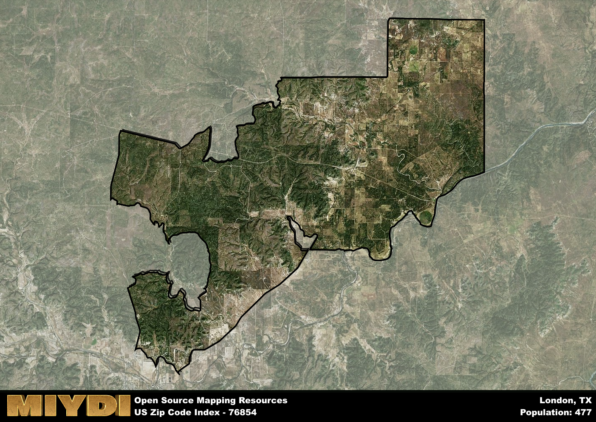

**Area Name:** London

**Zip Code:** 76854

**State:** TX

# London, TX (76854)

Located in central Texas, the zip code 76854 corresponds to the charming area of London. This neighborhood is situated within the larger metropolitan area of San Antonio, approximately 80 miles away. London is bordered by rolling hills and vast farmland, offering a peaceful retreat from the bustling city life. It is easily accessible via major highways, making it a convenient location for residents and visitors alike.

Historically, London was founded in the 19th century as a small farming community. The area experienced steady growth with the development of agriculture and ranching industries. The town was named after London, England, by early settlers who sought to create a sense of familiarity in their new home. Over the years, London has retained its rural charm while embracing modern amenities and services.

Today, London is a thriving community with a mix of residential neighborhoods, local businesses, and recreational opportunities. The area is known for its strong sense of community, with residents actively participating in local events and initiatives. London boasts a variety of outdoor activities, including hiking trails, parks, and fishing spots. Additionally, the neighborhood is home to historical sites that highlight its rich heritage. With a growing economy and a close-knit community, London offers a unique blend of small-town charm and modern conveniences.

# London Demographics

The population of London is 477.  
London has a population density of 3.2 per square mile.  
The area of London is 149.05 square miles.  

## London Income and Economic Data

These demographic numbers are sourced from IRS return data, providing comprehensive insights into the population dynamics and economic trends within London.

**Breakdown of return types for London**

The table offers insight into the composition of tax returns filed with the IRS, categorizing them into three main types. Single returns represent filings by individuals, joint returns by married couples, and head of household returns by individuals who qualify as heads of households, typically having dependents. This breakdown provides an understanding of the different filing statuses adopted by taxpayers when submitting their tax documentation.

| Return Types filed for London                              | Percentage          |
|----------------------------------------------------------|---------------------|
| Single Returns                                            | 0.43 |
| Joint Returns                                             | 0.5 |
| Head Household Returns                                    | 0 |

The income and economic data presented here is sourced from the IRS income brackets, utilized for categorizing tax returns by income levels. This table displays income ranges for both single filers and married couples, along with the corresponding number of returns and the percentage within each bracket, providing valuable insight into the distribution of taxes across various income groups.

| Bracket Name       | Single Filer Income Range | Married Couple Range | Number of Returns | Percentage of Returns |
|--------------------|----------------------------|----------------------|-------------------|-----------------------|
| 10% Bracket        | Up to $10,275              | Up to $20,550        | 60 | 0.43% |
| 12% Bracket        | $10,276 - $41,775          | $20,551 - $83,550    | 50 | 0.36% |
| 22% Bracket        | $41,776 - $89,075          | $83,551 - $178,150   | 0 | 0% |
| 24% Bracket        | $89,076 - $170,050         | $178,151 - $340,100  | 30 | 0.21% |
| 32% Bracket        | $170,051 - $215,950        | $340,101 - $431,900  | 0 | 0% |
| 35% Bracket        | $215,951 - $539,900        | $431,901 - $647,850  | 0 | 0% |

### Exploring Taxpayer Diversity: A Breakdown of Different Types of Tax Returns in London

The table offers insights into various types of tax returns filed, reflecting different aspects of taxpayer activities and demographics. Categories include charitable returns for donations, dependent returns for claimed dependents, educator population, elderly population, real estate returns, self-employment returns, student loan returns, and unemployment returns, providing valuable insights into taxpayer behavior and demographics.

| London Filing Types                    | Count | Percentage |
|--------------------------------------|-------|------------|
| Charitable Donations                 | 0 | 0% |
| Dependents Claimed                   | 0 | 0% |
| Educator Residents                   | 0 | 0% |
| Elderly Population                   | 70 | 0.5% |
| Farming Population                   | 40 | 0.286% |
| Real Estate Transactions             | 0 | 0% |
| Self-Employed Individuals            | 30 | 0.214% |
| Student Loan Cases                   | 0 | 0% |
| Unemployment Benefit Filings         | 0 | 0% |

## London AI and Census Variables

The values presented in this dataset for London are AI-optimized, streamlined, and categorized into relevant buckets for enhanced utility in AI and mapping programs. These simplified values have been optimized to facilitate efficient analysis and integration into various technological applications, offering users accessible and actionable insights into demographics within the London area.

| AI Variables for London | Value |
|-------------|-------|
| Shape Area | 523193988.09375 |
| Shape Length | 169557.539178965 |

## How to use this free AI optimized Geo-Spatial Data for London, TX

This data is made freely available under the Creative Commons license, allowing for unrestricted use for any purpose. Users can access static resources directly from GitHub or leverage more advanced functionalities by utilizing the GeoJSON files. All datasets originate from official government or private sector sources and are meticulously compiled into relevant datasets within QGIS. However, the versatility of the data ensures compatibility with any mapping application.

## Data Accuracy Disclaimer
It's important to note that the data provided here may contain errors or discrepancies and should be considered as 'close enough' for business applications and AI rather than a definitive source of truth. This data is aggregated from multiple sources, some of which publish information on wildly different intervals, leading to potential inconsistencies. Additionally, certain data points may not be corrected for Covid-related changes, further impacting accuracy. Moreover, the assumption that demographic trends are consistent throughout a region may lead to discrepancies, as trends often concentrate in areas of highest population density. As a result, dense areas may be slightly underrepresented, while rural areas may be slightly overrepresented, resulting in a more conservative dataset. Furthermore, the focus primarily on areas within US Major and Minor Statistical areas means that approximately 40 million Americans living outside of these areas may not be fully represented. Lastly, the historical background and area descriptions generated using AI are susceptible to potential mistakes, so users should exercise caution when interpreting the information provided.
