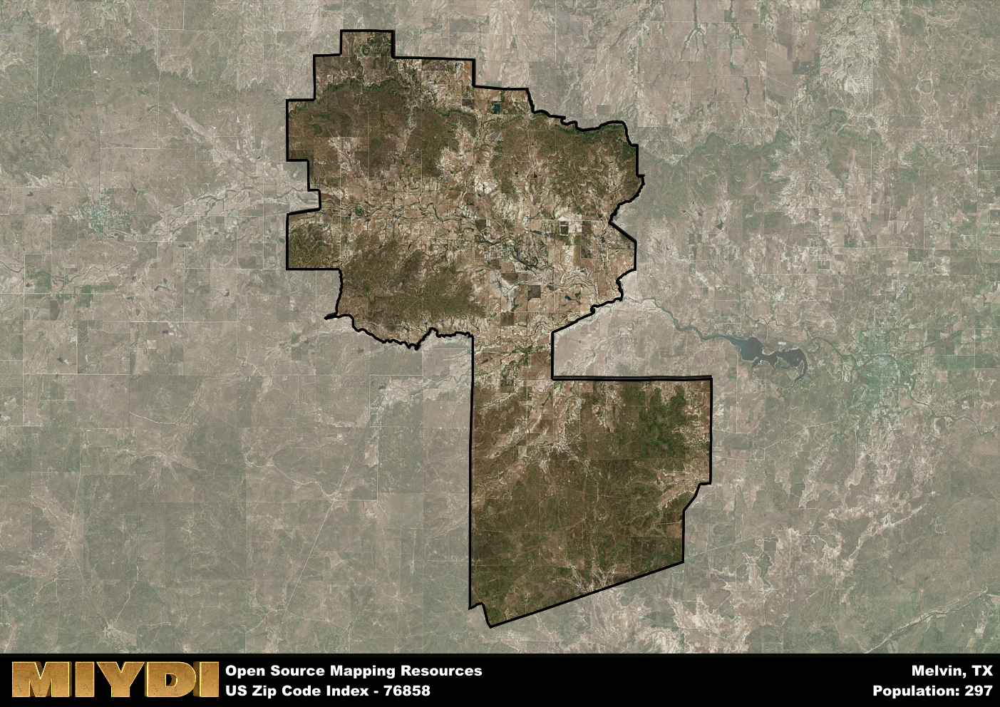

**Area Name:** Melvin

**Zip Code:** 76858

**State:** TX

# Melvin: A Historic Gem in Central Texas  

Located in central Texas, the zip code 76858 area corresponds to the charming town of Melvin. Nestled in McCulloch County, Melvin is surrounded by rolling hills and picturesque landscapes, offering a peaceful retreat from the bustling nearby cities. The town is situated within driving distance of larger population centers such as San Angelo and Austin, allowing residents to enjoy the tranquility of rural life while still having access to urban amenities.

Founded in the late 19th century, Melvin has a rich history dating back to its days as a trading post along the San Saba River. The town saw significant growth during the early 20th century with the arrival of the railroad, which facilitated the transportation of goods and people to and from the area. Today, Melvin retains much of its historic charm, with many well-preserved buildings and landmarks that harken back to its frontier past.

Present-day Melvin boasts a close-knit community that values its agricultural heritage and small-town atmosphere. The town's economy is primarily driven by ranching and farming, with local businesses catering to the needs of residents and visitors alike. Melvin offers various recreational opportunities, including fishing and hunting, as well as proximity to outdoor attractions such as Brady Lake. With its historic sites, friendly residents, and scenic surroundings, Melvin continues to be a hidden gem in the heart of Texas.

# Melvin Demographics

The population of Melvin is 297.  
Melvin has a population density of 1.5 per square mile.  
The area of Melvin is 198.46 square miles.  

## Melvin Income and Economic Data

These demographic numbers are sourced from IRS return data, providing comprehensive insights into the population dynamics and economic trends within Melvin.

**Breakdown of return types for Melvin**

The table offers insight into the composition of tax returns filed with the IRS, categorizing them into three main types. Single returns represent filings by individuals, joint returns by married couples, and head of household returns by individuals who qualify as heads of households, typically having dependents. This breakdown provides an understanding of the different filing statuses adopted by taxpayers when submitting their tax documentation.

| Return Types filed for Melvin                              | Percentage          |
|----------------------------------------------------------|---------------------|
| Single Returns                                            | 0.5 |
| Joint Returns                                             | 0.33 |
| Head Household Returns                                    | 0 |

The income and economic data presented here is sourced from the IRS income brackets, utilized for categorizing tax returns by income levels. This table displays income ranges for both single filers and married couples, along with the corresponding number of returns and the percentage within each bracket, providing valuable insight into the distribution of taxes across various income groups.

| Bracket Name       | Single Filer Income Range | Married Couple Range | Number of Returns | Percentage of Returns |
|--------------------|----------------------------|----------------------|-------------------|-----------------------|
| 10% Bracket        | Up to $10,275              | Up to $20,550        | 60 | 0.5% |
| 12% Bracket        | $10,276 - $41,775          | $20,551 - $83,550    | 30 | 0.25% |
| 22% Bracket        | $41,776 - $89,075          | $83,551 - $178,150   | 30 | 0.25% |
| 24% Bracket        | $89,076 - $170,050         | $178,151 - $340,100  | 0 | 0% |
| 32% Bracket        | $170,051 - $215,950        | $340,101 - $431,900  | 0 | 0% |
| 35% Bracket        | $215,951 - $539,900        | $431,901 - $647,850  | 0 | 0% |

### Exploring Taxpayer Diversity: A Breakdown of Different Types of Tax Returns in Melvin

The table offers insights into various types of tax returns filed, reflecting different aspects of taxpayer activities and demographics. Categories include charitable returns for donations, dependent returns for claimed dependents, educator population, elderly population, real estate returns, self-employment returns, student loan returns, and unemployment returns, providing valuable insights into taxpayer behavior and demographics.

| Melvin Filing Types                    | Count | Percentage |
|--------------------------------------|-------|------------|
| Charitable Donations                 | 0 | 0% |
| Dependents Claimed                   | 0 | 0% |
| Educator Residents                   | 0 | 0% |
| Elderly Population                   | 30 | 0.25% |
| Farming Population                   | 20 | 0.167% |
| Real Estate Transactions             | 0 | 0% |
| Self-Employed Individuals            | 0 | 0% |
| Student Loan Cases                   | 0 | 0% |
| Unemployment Benefit Filings         | 0 | 0% |

## Melvin AI and Census Variables

The values presented in this dataset for Melvin are AI-optimized, streamlined, and categorized into relevant buckets for enhanced utility in AI and mapping programs. These simplified values have been optimized to facilitate efficient analysis and integration into various technological applications, offering users accessible and actionable insights into demographics within the Melvin area.

| AI Variables for Melvin | Value |
|-------------|-------|
| Shape Area | 704206242.6875 |
| Shape Length | 167347.111828481 |

## How to use this free AI optimized Geo-Spatial Data for Melvin, TX

This data is made freely available under the Creative Commons license, allowing for unrestricted use for any purpose. Users can access static resources directly from GitHub or leverage more advanced functionalities by utilizing the GeoJSON files. All datasets originate from official government or private sector sources and are meticulously compiled into relevant datasets within QGIS. However, the versatility of the data ensures compatibility with any mapping application.

## Data Accuracy Disclaimer
It's important to note that the data provided here may contain errors or discrepancies and should be considered as 'close enough' for business applications and AI rather than a definitive source of truth. This data is aggregated from multiple sources, some of which publish information on wildly different intervals, leading to potential inconsistencies. Additionally, certain data points may not be corrected for Covid-related changes, further impacting accuracy. Moreover, the assumption that demographic trends are consistent throughout a region may lead to discrepancies, as trends often concentrate in areas of highest population density. As a result, dense areas may be slightly underrepresented, while rural areas may be slightly overrepresented, resulting in a more conservative dataset. Furthermore, the focus primarily on areas within US Major and Minor Statistical areas means that approximately 40 million Americans living outside of these areas may not be fully represented. Lastly, the historical background and area descriptions generated using AI are susceptible to potential mistakes, so users should exercise caution when interpreting the information provided.
