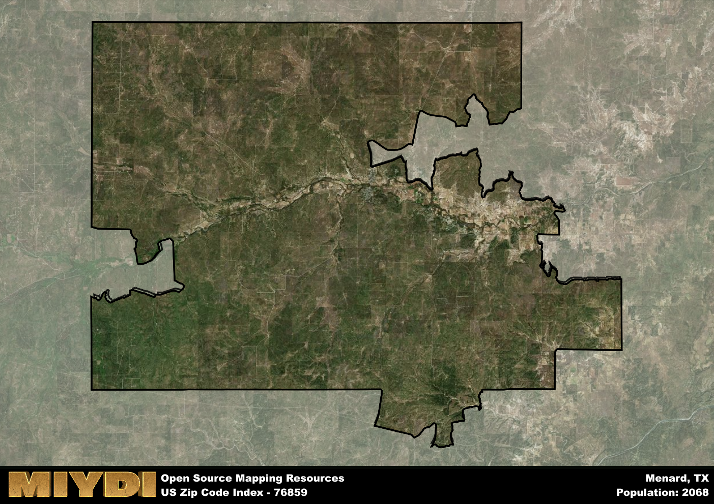

**Area Name:** Menard

**Zip Code:** 76859

**State:** TX

# Historic Charm and Economic Vitality in Menard, TX (76859)

Nestled in the heart of Texas, the zip code 76859 corresponds to the charming town of Menard. Situated in Menard County, this area is surrounded by rolling hills and picturesque landscapes, offering a peaceful retreat from the hustle and bustle of nearby cities. Menard is located approximately 60 miles southeast of San Angelo and serves as a gateway to the Texas Hill Country, making it a popular destination for outdoor enthusiasts and history buffs alike.

Menard has a rich historical heritage dating back to the 18th century when Spanish explorers first settled in the area. The town was officially established in 1858 and named after Michel Branamour Menard, a prominent figure in Texas history. Menard quickly grew into a bustling hub for ranching and agriculture, attracting settlers looking to make their mark in the Wild West. The town played a key role in the development of the region and has preserved many of its historic buildings and landmarks as a testament to its past.

Today, Menard continues to thrive as a tight-knit community with a strong emphasis on preserving its heritage while embracing modern progress. The town's economy is primarily driven by agriculture, ranching, and tourism, with local businesses catering to both residents and visitors. Menard offers a range of services, including schools, healthcare facilities, and recreational amenities such as parks and museums. The town is also home to several historic sites, including the Presidio de San Sabá and the Menard County Courthouse, which attract history enthusiasts from near and far. Menard's unique blend of historic charm and economic vitality makes it a truly special place to visit and call home in Texas.

# Menard Demographics

The population of Menard is 2068.  
Menard has a population density of 2.55 per square mile.  
The area of Menard is 809.91 square miles.  

## Menard Income and Economic Data

These demographic numbers are sourced from IRS return data, providing comprehensive insights into the population dynamics and economic trends within Menard.

**Breakdown of return types for Menard**

The table offers insight into the composition of tax returns filed with the IRS, categorizing them into three main types. Single returns represent filings by individuals, joint returns by married couples, and head of household returns by individuals who qualify as heads of households, typically having dependents. This breakdown provides an understanding of the different filing statuses adopted by taxpayers when submitting their tax documentation.

| Return Types filed for Menard                              | Percentage          |
|----------------------------------------------------------|---------------------|
| Single Returns                                            | 0.44 |
| Joint Returns                                             | 0.43 |
| Head Household Returns                                    | 0.11 |

The income and economic data presented here is sourced from the IRS income brackets, utilized for categorizing tax returns by income levels. This table displays income ranges for both single filers and married couples, along with the corresponding number of returns and the percentage within each bracket, providing valuable insight into the distribution of taxes across various income groups.

| Bracket Name       | Single Filer Income Range | Married Couple Range | Number of Returns | Percentage of Returns |
|--------------------|----------------------------|----------------------|-------------------|-----------------------|
| 10% Bracket        | Up to $10,275              | Up to $20,550        | 360 | 0.45% |
| 12% Bracket        | $10,276 - $41,775          | $20,551 - $83,550    | 200 | 0.25% |
| 22% Bracket        | $41,776 - $89,075          | $83,551 - $178,150   | 100 | 0.13% |
| 24% Bracket        | $89,076 - $170,050         | $178,151 - $340,100  | 50 | 0.06% |
| 32% Bracket        | $170,051 - $215,950        | $340,101 - $431,900  | 70 | 0.09% |
| 35% Bracket        | $215,951 - $539,900        | $431,901 - $647,850  | 20 | 0.03% |

### Exploring Taxpayer Diversity: A Breakdown of Different Types of Tax Returns in Menard

The table offers insights into various types of tax returns filed, reflecting different aspects of taxpayer activities and demographics. Categories include charitable returns for donations, dependent returns for claimed dependents, educator population, elderly population, real estate returns, self-employment returns, student loan returns, and unemployment returns, providing valuable insights into taxpayer behavior and demographics.

| Menard Filing Types                    | Count | Percentage |
|--------------------------------------|-------|------------|
| Charitable Donations                 | 0 | 0% |
| Dependents Claimed                   | 0 | 0% |
| Educator Residents                   | 0 | 0% |
| Elderly Population                   | 300 | 0.38% |
| Farming Population                   | 100 | 0.125% |
| Real Estate Transactions             | 0 | 0% |
| Self-Employed Individuals            | 200 | 0.25% |
| Student Loan Cases                   | 0 | 0% |
| Unemployment Benefit Filings         | 70 | 0.09% |

## Menard AI and Census Variables

The values presented in this dataset for Menard are AI-optimized, streamlined, and categorized into relevant buckets for enhanced utility in AI and mapping programs. These simplified values have been optimized to facilitate efficient analysis and integration into various technological applications, offering users accessible and actionable insights into demographics within the Menard area.

| AI Variables for Menard | Value |
|-------------|-------|
| Shape Area | 2857275617.11719 |
| Shape Length | 375440.677774028 |

## How to use this free AI optimized Geo-Spatial Data for Menard, TX

This data is made freely available under the Creative Commons license, allowing for unrestricted use for any purpose. Users can access static resources directly from GitHub or leverage more advanced functionalities by utilizing the GeoJSON files. All datasets originate from official government or private sector sources and are meticulously compiled into relevant datasets within QGIS. However, the versatility of the data ensures compatibility with any mapping application.

## Data Accuracy Disclaimer
It's important to note that the data provided here may contain errors or discrepancies and should be considered as 'close enough' for business applications and AI rather than a definitive source of truth. This data is aggregated from multiple sources, some of which publish information on wildly different intervals, leading to potential inconsistencies. Additionally, certain data points may not be corrected for Covid-related changes, further impacting accuracy. Moreover, the assumption that demographic trends are consistent throughout a region may lead to discrepancies, as trends often concentrate in areas of highest population density. As a result, dense areas may be slightly underrepresented, while rural areas may be slightly overrepresented, resulting in a more conservative dataset. Furthermore, the focus primarily on areas within US Major and Minor Statistical areas means that approximately 40 million Americans living outside of these areas may not be fully represented. Lastly, the historical background and area descriptions generated using AI are susceptible to potential mistakes, so users should exercise caution when interpreting the information provided.
