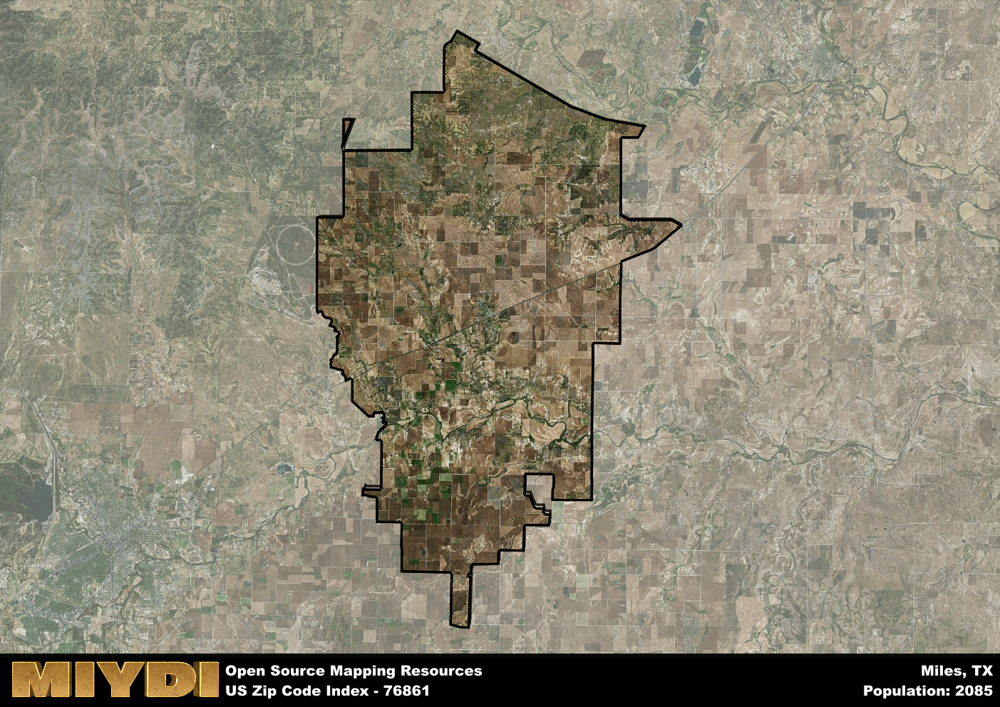

**Area Name:** Miles

**Zip Code:** 76861

**State:** TX

Miles is a part of the San Angelo - TX Metro Area, and makes up 1.61% of the Metro's population.  

# Miles, TX 76861: A Charming Neighborhood in West Texas  

Located in West Texas, the zip code 76861 area corresponds to the charming neighborhood of Miles. Situated within Runnels County, Miles is surrounded by the cities of San Angelo to the west and Abilene to the east, making it a part of the larger metropolitan context of the region. The neighborhood of Miles is known for its small-town feel and close-knit community, offering a peaceful and welcoming environment for residents and visitors alike.

Miles has a rich historical narrative that dates back to its establishment in the late 19th century. Originally settled as a railroad town, Miles experienced steady growth due to its strategic location along the railway line. Over the years, the neighborhood has maintained its agricultural roots while also embracing modern developments. The area was named after John T. Miles, a civil engineer who played a key role in the construction of the Texas and Pacific Railway that passed through the town.

Today, Miles continues to thrive as a vibrant community with a mix of residential and commercial spaces. The neighborhood is home to local businesses, schools, and churches, providing essential services to its residents. Miles also offers recreational amenities such as parks and outdoor spaces for leisure activities. Visitors can explore the historic sites in the area, including landmarks that showcase the neighborhood's past. With its strong sense of community and picturesque surroundings, Miles remains a hidden gem in West Texas.

# Miles Demographics

The population of Miles is 2085.  
Miles has a population density of 10.88 per square mile.  
The area of Miles is 191.55 square miles.  

## Miles Income and Economic Data

These demographic numbers are sourced from IRS return data, providing comprehensive insights into the population dynamics and economic trends within Miles.

**Breakdown of return types for Miles**

The table offers insight into the composition of tax returns filed with the IRS, categorizing them into three main types. Single returns represent filings by individuals, joint returns by married couples, and head of household returns by individuals who qualify as heads of households, typically having dependents. This breakdown provides an understanding of the different filing statuses adopted by taxpayers when submitting their tax documentation.

| Return Types filed for Miles                              | Percentage          |
|----------------------------------------------------------|---------------------|
| Single Returns                                            | 0.41 |
| Joint Returns                                             | 0.48 |
| Head Household Returns                                    | 0.09 |

The income and economic data presented here is sourced from the IRS income brackets, utilized for categorizing tax returns by income levels. This table displays income ranges for both single filers and married couples, along with the corresponding number of returns and the percentage within each bracket, providing valuable insight into the distribution of taxes across various income groups.

| Bracket Name       | Single Filer Income Range | Married Couple Range | Number of Returns | Percentage of Returns |
|--------------------|----------------------------|----------------------|-------------------|-----------------------|
| 10% Bracket        | Up to $10,275              | Up to $20,550        | 330 | 0.33% |
| 12% Bracket        | $10,276 - $41,775          | $20,551 - $83,550    | 240 | 0.24% |
| 22% Bracket        | $41,776 - $89,075          | $83,551 - $178,150   | 140 | 0.14% |
| 24% Bracket        | $89,076 - $170,050         | $178,151 - $340,100  | 90 | 0.09% |
| 32% Bracket        | $170,051 - $215,950        | $340,101 - $431,900  | 150 | 0.15% |
| 35% Bracket        | $215,951 - $539,900        | $431,901 - $647,850  | 40 | 0.04% |

### Exploring Taxpayer Diversity: A Breakdown of Different Types of Tax Returns in Miles

The table offers insights into various types of tax returns filed, reflecting different aspects of taxpayer activities and demographics. Categories include charitable returns for donations, dependent returns for claimed dependents, educator population, elderly population, real estate returns, self-employment returns, student loan returns, and unemployment returns, providing valuable insights into taxpayer behavior and demographics.

| Miles Filing Types                    | Count | Percentage |
|--------------------------------------|-------|------------|
| Charitable Donations                 | 0 | 0% |
| Dependents Claimed                   | 30 | 0.03% |
| Educator Residents                   | 40 | 0.04% |
| Elderly Population                   | 230 | 0.23% |
| Farming Population                   | 170 | 0.172% |
| Real Estate Transactions             | 0 | 0% |
| Self-Employed Individuals            | 170 | 0.172% |
| Student Loan Cases                   | 50 | 0.051% |
| Unemployment Benefit Filings         | 60 | 0.06% |

### Exploring Real Estate Trends: A Comprehensive Analysis of the Miles Area and its Neighbors

This table contains an in-depth examination of the real estate market in the Miles area. Sourced from trusted real estate market firms, this dataset provides a wealth of raw data detailing the local real estate landscape, along with comparative analyses juxtaposing the market dynamics with those of neighboring areas. Explore the intricacies of the Miles real estate market and gain valuable insights into its relationship with adjacent regions.

| Real Estate Data for Miles                       | Value    |
|------------------------------------------------|----------|
| Average Listing Price for Miles               | 511300 |
| Median Listing Price for Miles                | 420000 |
| Median Days on Market for Miles               | 128 |
| Median Listing Price per Square Foot for Miles| 32 |
| Median Square Feet for Miles                  | 2028 |
| Real Estate Prices to Income Ratio           | 188.61% |
| Price per Square Foot Ratio                  | 113.68% |
| Price Median Ratio                           | 101.06% |
| Market Sales Speed Ratio                     | 193.0% |

This table offers essential real estate data for the Miles area, including average and median listing prices, median days on market, and property size. It also presents ratio metrics as percentages, providing insights into how the local market compares to the surrounding region. A ratio of 100% signifies performance in line with the regional average, while values above or below indicate overperformance or underperformance, respectively, relative to expectations.

## Miles Sports and Recreation Data

#### Annual Youth Sports Spending for Miles

This table provides fundamental insights into the Sports and Recreation data for the Miles area, detailing the estimated annual expenditure on Youth Athletics. This includes estimated spending by the major consumer brackets. 
| Sports Spending for Miles| Value |
|-------------------------|-------|
| Athlete Spending Compared to the region | 21.99% |
| Total Youth Athlete Spending | 31,826 |
| Athletic Spending - Essential Focused Consumer | 9,142 |
| Athletic Spending - Typical Consumer | 8,844 |
| Athletic Spending - Affluent Consumers | 23,771 |

#### Youth Coaching Estimates for Miles

This table presents the estimated number of coaches for the Miles area, derived from comprehensive national coaching surveys and athletic participation rates by state. It offers valuable insights into the vital role of coaching personnel in fostering athletic development and facilitating sports participation within the local community.

| Coaching Data for Miles | Value |
|-------------|-------|
| Total Coaches | 34 |
| Paid Coaches | 9 |
| Volunteer Coaches | 25 |

#### Youth Athlete Participation for Miles

This table shows the estimated total number of youth athletes in the Miles area, sourced from comprehensive national coaching surveys and athletic participation rates by state.

| Total YA Athletes in Miles | Value |
|-------------|-------|
| Total High School Athletes | 52 |
| Total Youth Athletes | 156 |
| Total Young Adult Athletes | 104 |
| Total Athletes to Age 25 | 313 |

#### High School Age Athletes - Breakdown by Sport for Miles

This table shows insights regarding high school age estimated players by sport in the Miles area, derived from national and state-level athletic participation trends. 

| HS Players by Sport in Miles | Value |
|-------------|-------|
| Football Players | 12 |
| Basketball Players | 7 |
| Soccer Players | 6 |
| Volleyball Players | 4 |
| Baseball Players | 6 |
| Tennis Players | 3 |
| Track Athletes | 9 |
| Golf Players | 2 |
| Swimming Athletes | 2 |
| Wrestling Competitors | 2 |
| Lacrosse Players | 0 |

Estimating the number of younger athletes presents unique challenges due to their varied starting ages, typically beginning around six years old, and a gradual decline in participation rates as they age. Unlike high school-aged athletes, younger athletes are less likely to switch sports as they grow older, contributing to the stability of participation numbers within specific sports at younger ages.  

As a general trend, the total number of younger athletes is approximately three times the number of high school-aged athletes, underscoring the significant presence of youth athletes in sports programs and highlighting the importance of early engagement in athletic activities.

## Miles AI and Census Variables

The values presented in this dataset for Miles are AI-optimized, streamlined, and categorized into relevant buckets for enhanced utility in AI and mapping programs. These simplified values have been optimized to facilitate efficient analysis and integration into various technological applications, offering users accessible and actionable insights into demographics within the Miles area.

| AI Variables for Miles | Value |
|-------------|-------|
| Shape Area | 685991728.15625 |
| Shape Length | 159864.818086101 |
| CBSA Federal Processing Standard Code | 41660 |
| RE Price per Square Foot Ratio | 113.68% |
| RE Price Average Ratio | 97.01% |
| RE Speed Ratio | 193.0% |
| RE Income Ratio | 188.61% |
| Elderly Opportunity Flag | 2 |
| Farm Opportunity Flag | 6 |
| RE Affordability Index Flag | 4 |
| Income Bracket Flag | 5 |
| RE Income Flag | 5 |
| RE Median Square Footage Price Flag | 5 |
| RE Median Square Footage Size Flag | 5 |
| RE Activity Flag | 7 |
| Poverty Line Risk Flag | 5 |

## How to use this free AI optimized Geo-Spatial Data for Miles, TX

This data is made freely available under the Creative Commons license, allowing for unrestricted use for any purpose. Users can access static resources directly from GitHub or leverage more advanced functionalities by utilizing the GeoJSON files. All datasets originate from official government or private sector sources and are meticulously compiled into relevant datasets within QGIS. However, the versatility of the data ensures compatibility with any mapping application.

## Data Accuracy Disclaimer
It's important to note that the data provided here may contain errors or discrepancies and should be considered as 'close enough' for business applications and AI rather than a definitive source of truth. This data is aggregated from multiple sources, some of which publish information on wildly different intervals, leading to potential inconsistencies. Additionally, certain data points may not be corrected for Covid-related changes, further impacting accuracy. Moreover, the assumption that demographic trends are consistent throughout a region may lead to discrepancies, as trends often concentrate in areas of highest population density. As a result, dense areas may be slightly underrepresented, while rural areas may be slightly overrepresented, resulting in a more conservative dataset. Furthermore, the focus primarily on areas within US Major and Minor Statistical areas means that approximately 40 million Americans living outside of these areas may not be fully represented. Lastly, the historical background and area descriptions generated using AI are susceptible to potential mistakes, so users should exercise caution when interpreting the information provided.
