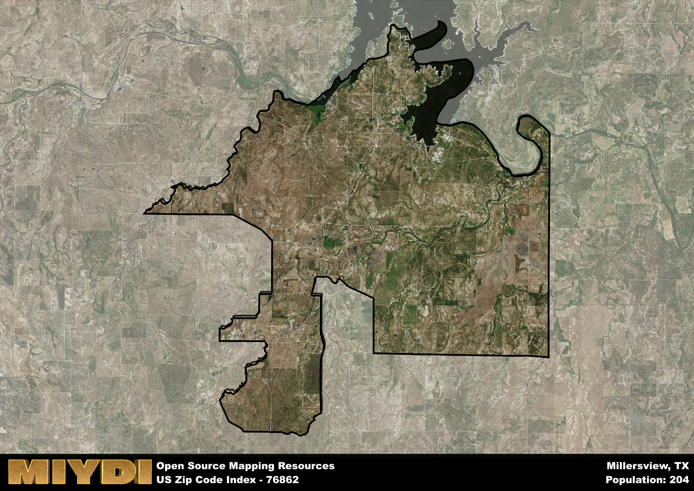

**Area Name:** Millersview

**Zip Code:** 76862

**State:** TX

# Millersview: A Charming Neighborhood in West Texas  
Located in the heart of West Texas, the zip code 76862 area corresponds to the peaceful neighborhood of Millersview. Situated along the banks of the Colorado River, Millersview is surrounded by vast expanses of ranchland and agricultural fields. The nearest major city, San Angelo, is approximately 50 miles to the east, providing residents with access to urban amenities while still enjoying the tranquility of rural life.

Originally settled in the late 19th century, Millersview was named after a prominent local family who owned a large ranch in the area. The community grew steadily as more families established homesteads along the river, drawn to the fertile soil and abundant water supply. Over the years, Millersview has maintained its agricultural roots, with many residents still engaged in farming and ranching. The area has also become a popular destination for outdoor enthusiasts, offering opportunities for fishing, boating, and hunting along the river.

Today, Millersview is a close-knit community that prides itself on its strong sense of community and connection to the land. The economy is primarily driven by agriculture, with local farmers producing crops such as cotton, wheat, and sorghum. Residents enjoy a range of neighborhood-specific services, including a small grocery store, post office, and community center. Outdoor recreation remains a key attraction, with the Colorado River providing ample opportunities for fishing and boating. Millersview also boasts several historic sites, including the original homestead of the Miller family, preserving the area's rich heritage for future generations.

# Millersview Demographics

The population of Millersview is 204.  
Millersview has a population density of 1.54 per square mile.  
The area of Millersview is 132.16 square miles.  

## Millersview AI and Census Variables

The values presented in this dataset for Millersview are AI-optimized, streamlined, and categorized into relevant buckets for enhanced utility in AI and mapping programs. These simplified values have been optimized to facilitate efficient analysis and integration into various technological applications, offering users accessible and actionable insights into demographics within the Millersview area.

| AI Variables for Millersview | Value |
|-------------|-------|
| Shape Area | 471653870.039063 |
| Shape Length | 164971.339924396 |

## How to use this free AI optimized Geo-Spatial Data for Millersview, TX

This data is made freely available under the Creative Commons license, allowing for unrestricted use for any purpose. Users can access static resources directly from GitHub or leverage more advanced functionalities by utilizing the GeoJSON files. All datasets originate from official government or private sector sources and are meticulously compiled into relevant datasets within QGIS. However, the versatility of the data ensures compatibility with any mapping application.

## Data Accuracy Disclaimer
It's important to note that the data provided here may contain errors or discrepancies and should be considered as 'close enough' for business applications and AI rather than a definitive source of truth. This data is aggregated from multiple sources, some of which publish information on wildly different intervals, leading to potential inconsistencies. Additionally, certain data points may not be corrected for Covid-related changes, further impacting accuracy. Moreover, the assumption that demographic trends are consistent throughout a region may lead to discrepancies, as trends often concentrate in areas of highest population density. As a result, dense areas may be slightly underrepresented, while rural areas may be slightly overrepresented, resulting in a more conservative dataset. Furthermore, the focus primarily on areas within US Major and Minor Statistical areas means that approximately 40 million Americans living outside of these areas may not be fully represented. Lastly, the historical background and area descriptions generated using AI are susceptible to potential mistakes, so users should exercise caution when interpreting the information provided.
