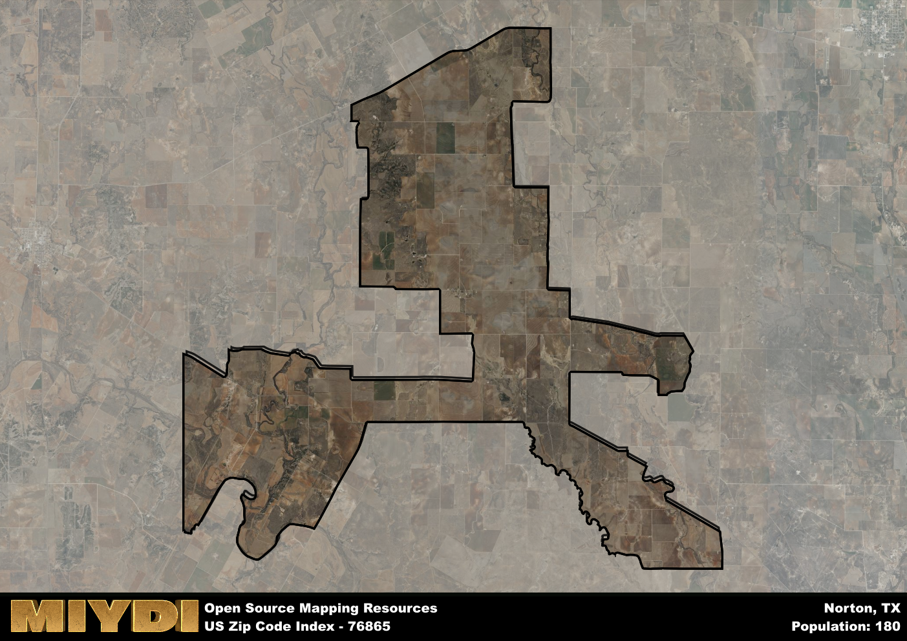

**Area Name:** Norton

**Zip Code:** 76865

**State:** TX

# Norton: A Historic Community in West Texas  

Norton, corresponding to the zip code 76865, is a small community located in West Texas. Bordered by vast plains and agricultural fields, Norton is situated within the larger region of Runnels County. The town is positioned approximately 20 miles northeast of the city of Ballinger and 30 miles southwest of the city of Abilene. Despite its rural setting, Norton remains connected to nearby population centers through major highways, allowing for easy access to urban amenities and services.

Established in the late 19th century, Norton has a rich historical background rooted in agriculture and ranching. The town's early settlers were drawn to the area for its fertile soil and abundant natural resources. Over the years, Norton experienced steady growth, becoming a hub for local farmers and ranchers. The community's name is believed to have originated from an early settler or prominent landowner in the area, although the exact origins remain unclear. Norton's history is marked by resilience and community spirit, evident in its well-preserved historic buildings and landmarks.

Today, Norton retains its agricultural heritage while also embracing modern developments. The town's economy is primarily driven by farming, ranching, and small businesses catering to the local community. Residents of Norton enjoy a close-knit neighborhood with access to essential services such as schools, healthcare facilities, and local businesses. For recreation, the area offers outdoor activities like hunting, fishing, and hiking in the surrounding countryside. Norton's charm lies in its blend of historical significance and contemporary rural living, making it a unique destination in West Texas.

# Norton Demographics

The population of Norton is 180.  
Norton has a population density of 3.19 per square mile.  
The area of Norton is 56.36 square miles.  

## Norton AI and Census Variables

The values presented in this dataset for Norton are AI-optimized, streamlined, and categorized into relevant buckets for enhanced utility in AI and mapping programs. These simplified values have been optimized to facilitate efficient analysis and integration into various technological applications, offering users accessible and actionable insights into demographics within the Norton area.

| AI Variables for Norton | Value |
|-------------|-------|
| Shape Area | 202947631.871094 |
| Shape Length | 134404.093328533 |

## How to use this free AI optimized Geo-Spatial Data for Norton, TX

This data is made freely available under the Creative Commons license, allowing for unrestricted use for any purpose. Users can access static resources directly from GitHub or leverage more advanced functionalities by utilizing the GeoJSON files. All datasets originate from official government or private sector sources and are meticulously compiled into relevant datasets within QGIS. However, the versatility of the data ensures compatibility with any mapping application.

## Data Accuracy Disclaimer
It's important to note that the data provided here may contain errors or discrepancies and should be considered as 'close enough' for business applications and AI rather than a definitive source of truth. This data is aggregated from multiple sources, some of which publish information on wildly different intervals, leading to potential inconsistencies. Additionally, certain data points may not be corrected for Covid-related changes, further impacting accuracy. Moreover, the assumption that demographic trends are consistent throughout a region may lead to discrepancies, as trends often concentrate in areas of highest population density. As a result, dense areas may be slightly underrepresented, while rural areas may be slightly overrepresented, resulting in a more conservative dataset. Furthermore, the focus primarily on areas within US Major and Minor Statistical areas means that approximately 40 million Americans living outside of these areas may not be fully represented. Lastly, the historical background and area descriptions generated using AI are susceptible to potential mistakes, so users should exercise caution when interpreting the information provided.
