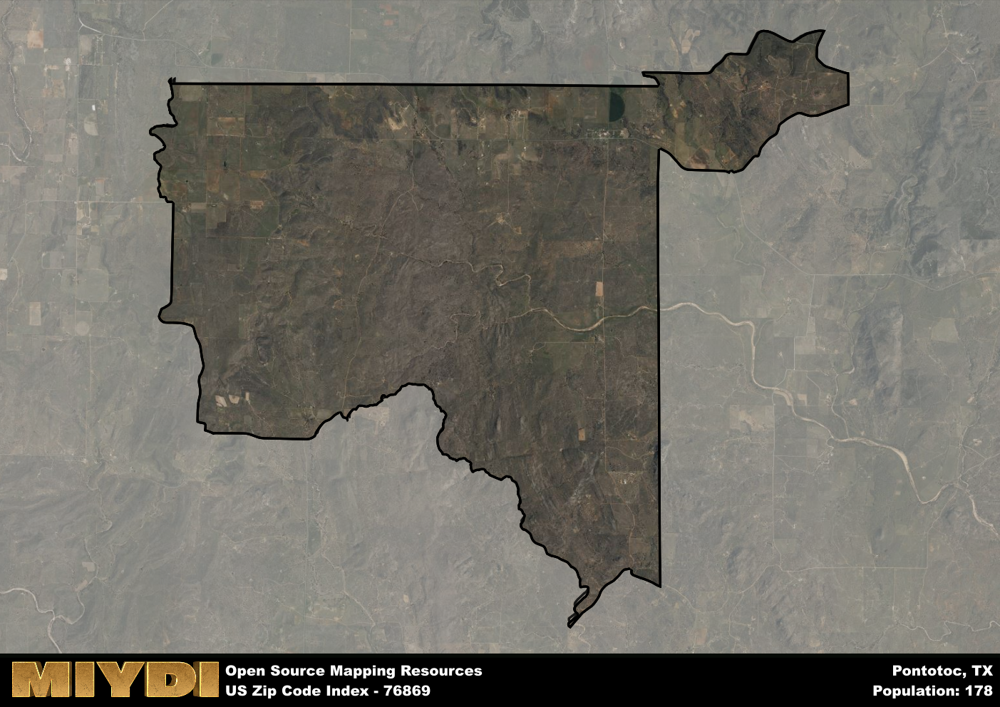

**Area Name:** Pontotoc

**Zip Code:** 76869

**State:** TX

# Discover the Charming Neighborhood of Pontotoc (Zip Code 76869)

Located in the heart of Texas, the zip code 76869 area, known as Pontotoc, encompasses a quaint neighborhood surrounded by rolling hills and lush farmland. Situated within close proximity to larger cities such as Austin and San Antonio, Pontotoc serves as a peaceful retreat for residents seeking a slower pace of life while still enjoying access to urban amenities. The zip code area is bordered by neighboring communities such as Mason to the north and Llano to the south, creating a cohesive network of towns within the region.

Pontotoc has a rich historical background dating back to its establishment in the mid-19th century. Originally settled by German immigrants, the area flourished due to its fertile soil and abundant natural resources. The town's name, Pontotoc, is derived from a Native American word meaning "land of hanging grapes," a nod to the bountiful vineyards that once thrived in the area. Over the years, Pontotoc has evolved into a close-knit community with a strong agricultural tradition, preserving its heritage while embracing modern developments.

Today, Pontotoc remains a charming neighborhood known for its agricultural prowess, particularly in grape cultivation and wine production. The area is dotted with family-owned vineyards and wineries, attracting visitors from near and far to sample the local vintages and enjoy the picturesque countryside. In addition to its agricultural offerings, Pontotoc boasts a variety of outdoor recreational activities, including hiking trails, fishing spots, and camping grounds. The town also features historic sites such as the Pontotoc Vineyard and the Pontotoc Chapel, adding to its cultural appeal within the larger urban fabric of central Texas.

# Pontotoc Demographics

The population of Pontotoc is 178.  
Pontotoc has a population density of 3.56 per square mile.  
The area of Pontotoc is 49.95 square miles.  

## Pontotoc AI and Census Variables

The values presented in this dataset for Pontotoc are AI-optimized, streamlined, and categorized into relevant buckets for enhanced utility in AI and mapping programs. These simplified values have been optimized to facilitate efficient analysis and integration into various technological applications, offering users accessible and actionable insights into demographics within the Pontotoc area.

| AI Variables for Pontotoc | Value |
|-------------|-------|
| Shape Area | 176185858.269531 |
| Shape Length | 79337.4987416101 |

## How to use this free AI optimized Geo-Spatial Data for Pontotoc, TX

This data is made freely available under the Creative Commons license, allowing for unrestricted use for any purpose. Users can access static resources directly from GitHub or leverage more advanced functionalities by utilizing the GeoJSON files. All datasets originate from official government or private sector sources and are meticulously compiled into relevant datasets within QGIS. However, the versatility of the data ensures compatibility with any mapping application.

## Data Accuracy Disclaimer
It's important to note that the data provided here may contain errors or discrepancies and should be considered as 'close enough' for business applications and AI rather than a definitive source of truth. This data is aggregated from multiple sources, some of which publish information on wildly different intervals, leading to potential inconsistencies. Additionally, certain data points may not be corrected for Covid-related changes, further impacting accuracy. Moreover, the assumption that demographic trends are consistent throughout a region may lead to discrepancies, as trends often concentrate in areas of highest population density. As a result, dense areas may be slightly underrepresented, while rural areas may be slightly overrepresented, resulting in a more conservative dataset. Furthermore, the focus primarily on areas within US Major and Minor Statistical areas means that approximately 40 million Americans living outside of these areas may not be fully represented. Lastly, the historical background and area descriptions generated using AI are susceptible to potential mistakes, so users should exercise caution when interpreting the information provided.
