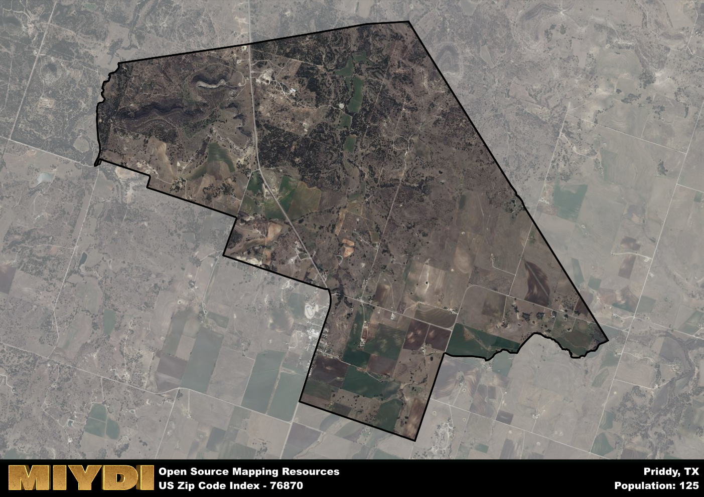

**Area Name:** Priddy

**Zip Code:** 76870

**State:** TX

# Priddy: A Charming Community in Central Texas

Located in central Texas, the zip code 76870 corresponds to the small community of Priddy. Situated within Mills County, Priddy is surrounded by the quaint towns of Goldthwaite to the west and Mullin to the east. Despite its rural setting, Priddy is within driving distance of larger cities such as Brownwood and Lampasas, making it a peaceful retreat from urban life while still remaining connected to essential amenities.

Priddy has a rich historical background, originally settled in the late 1800s by pioneers seeking fertile land for farming and ranching. The town was named after local landowner John Priddy, who played a significant role in the development of the community. Over the years, Priddy has maintained its small-town charm while adapting to modern times, attracting residents and visitors alike with its tranquil atmosphere and friendly community spirit.

Presently, Priddy is known for its agricultural heritage, with farming and ranching serving as the primary economic activities. The town offers essential services such as a post office, general store, and local restaurants, catering to the needs of its residents. Outdoor enthusiasts can enjoy the natural beauty of the area through hiking, fishing, and camping opportunities at nearby parks and recreational areas. Additionally, Priddy boasts a few historic landmarks, including old homesteads and buildings that provide a glimpse into its past.

# Priddy Demographics

The population of Priddy is 125.  
Priddy has a population density of 10.38 per square mile.  
The area of Priddy is 12.04 square miles.  

## Priddy Income and Economic Data

These demographic numbers are sourced from IRS return data, providing comprehensive insights into the population dynamics and economic trends within Priddy.

**Breakdown of return types for Priddy**

The table offers insight into the composition of tax returns filed with the IRS, categorizing them into three main types. Single returns represent filings by individuals, joint returns by married couples, and head of household returns by individuals who qualify as heads of households, typically having dependents. This breakdown provides an understanding of the different filing statuses adopted by taxpayers when submitting their tax documentation.

| Return Types filed for Priddy                              | Percentage          |
|----------------------------------------------------------|---------------------|
| Single Returns                                            | 0.45 |
| Joint Returns                                             | 0.45 |
| Head Household Returns                                    | 0 |

The income and economic data presented here is sourced from the IRS income brackets, utilized for categorizing tax returns by income levels. This table displays income ranges for both single filers and married couples, along with the corresponding number of returns and the percentage within each bracket, providing valuable insight into the distribution of taxes across various income groups.

| Bracket Name       | Single Filer Income Range | Married Couple Range | Number of Returns | Percentage of Returns |
|--------------------|----------------------------|----------------------|-------------------|-----------------------|
| 10% Bracket        | Up to $10,275              | Up to $20,550        | 40 | 0.36% |
| 12% Bracket        | $10,276 - $41,775          | $20,551 - $83,550    | 50 | 0.45% |
| 22% Bracket        | $41,776 - $89,075          | $83,551 - $178,150   | 0 | 0% |
| 24% Bracket        | $89,076 - $170,050         | $178,151 - $340,100  | 20 | 0.18% |
| 32% Bracket        | $170,051 - $215,950        | $340,101 - $431,900  | 0 | 0% |
| 35% Bracket        | $215,951 - $539,900        | $431,901 - $647,850  | 0 | 0% |

### Exploring Taxpayer Diversity: A Breakdown of Different Types of Tax Returns in Priddy

The table offers insights into various types of tax returns filed, reflecting different aspects of taxpayer activities and demographics. Categories include charitable returns for donations, dependent returns for claimed dependents, educator population, elderly population, real estate returns, self-employment returns, student loan returns, and unemployment returns, providing valuable insights into taxpayer behavior and demographics.

| Priddy Filing Types                    | Count | Percentage |
|--------------------------------------|-------|------------|
| Charitable Donations                 | 0 | 0% |
| Dependents Claimed                   | 0 | 0% |
| Educator Residents                   | 0 | 0% |
| Elderly Population                   | 30 | 0.27% |
| Farming Population                   | 30 | 0.273% |
| Real Estate Transactions             | 0 | 0% |
| Self-Employed Individuals            | 0 | 0% |
| Student Loan Cases                   | 0 | 0% |
| Unemployment Benefit Filings         | 0 | 0% |

## Priddy AI and Census Variables

The values presented in this dataset for Priddy are AI-optimized, streamlined, and categorized into relevant buckets for enhanced utility in AI and mapping programs. These simplified values have been optimized to facilitate efficient analysis and integration into various technological applications, offering users accessible and actionable insights into demographics within the Priddy area.

| AI Variables for Priddy | Value |
|-------------|-------|
| Shape Area | 43215433.4765625 |
| Shape Length | 32629.5360096418 |

## How to use this free AI optimized Geo-Spatial Data for Priddy, TX

This data is made freely available under the Creative Commons license, allowing for unrestricted use for any purpose. Users can access static resources directly from GitHub or leverage more advanced functionalities by utilizing the GeoJSON files. All datasets originate from official government or private sector sources and are meticulously compiled into relevant datasets within QGIS. However, the versatility of the data ensures compatibility with any mapping application.

## Data Accuracy Disclaimer
It's important to note that the data provided here may contain errors or discrepancies and should be considered as 'close enough' for business applications and AI rather than a definitive source of truth. This data is aggregated from multiple sources, some of which publish information on wildly different intervals, leading to potential inconsistencies. Additionally, certain data points may not be corrected for Covid-related changes, further impacting accuracy. Moreover, the assumption that demographic trends are consistent throughout a region may lead to discrepancies, as trends often concentrate in areas of highest population density. As a result, dense areas may be slightly underrepresented, while rural areas may be slightly overrepresented, resulting in a more conservative dataset. Furthermore, the focus primarily on areas within US Major and Minor Statistical areas means that approximately 40 million Americans living outside of these areas may not be fully represented. Lastly, the historical background and area descriptions generated using AI are susceptible to potential mistakes, so users should exercise caution when interpreting the information provided.
