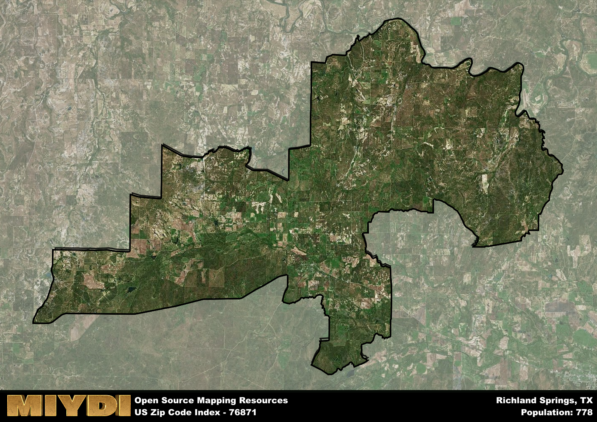

**Area Name:** Richland Springs

**Zip Code:** 76871

**State:** TX

# Richland Springs: A Historic Community in Central Texas  

Located in the heart of Central Texas, zip code 76871 belongs to the charming neighborhood of Richland Springs. Bordered by the Colorado River to the east and nestled among rolling hills, this area is about 25 miles southwest of the city of Brady. Richland Springs is a close-knit community that maintains its small-town charm while being part of the larger metropolitan area of Central Texas.

Richland Springs has a rich historical narrative that dates back to its founding in the late 19th century. Originally settled by pioneers drawn to the fertile land and abundant natural resources, the town grew steadily over the years. The area experienced a boom in the early 20th century with the discovery of oil, which brought wealth and prosperity to the community. Today, Richland Springs retains its historic character through well-preserved buildings and a strong sense of pride in its heritage.

Presently, Richland Springs is a thriving community with a diverse economy that includes agriculture, oil production, and small businesses. The neighborhood offers a range of services to its residents, including schools, shops, and restaurants. Outdoor enthusiasts can enjoy the natural beauty of the area through hiking, fishing, and camping opportunities. Richland Springs also boasts several historic sites, such as the Richland Springs Depot Museum, which showcases the town's colorful past.

# Richland Springs Demographics

The population of Richland Springs is 778.  
Richland Springs has a population density of 4.36 per square mile.  
The area of Richland Springs is 178.64 square miles.  

## Richland Springs Income and Economic Data

These demographic numbers are sourced from IRS return data, providing comprehensive insights into the population dynamics and economic trends within Richland Springs.

**Breakdown of return types for Richland Springs**

The table offers insight into the composition of tax returns filed with the IRS, categorizing them into three main types. Single returns represent filings by individuals, joint returns by married couples, and head of household returns by individuals who qualify as heads of households, typically having dependents. This breakdown provides an understanding of the different filing statuses adopted by taxpayers when submitting their tax documentation.

| Return Types filed for Richland Springs                              | Percentage          |
|----------------------------------------------------------|---------------------|
| Single Returns                                            | 0.41 |
| Joint Returns                                             | 0.47 |
| Head Household Returns                                    | 0.09 |

The income and economic data presented here is sourced from the IRS income brackets, utilized for categorizing tax returns by income levels. This table displays income ranges for both single filers and married couples, along with the corresponding number of returns and the percentage within each bracket, providing valuable insight into the distribution of taxes across various income groups.

| Bracket Name       | Single Filer Income Range | Married Couple Range | Number of Returns | Percentage of Returns |
|--------------------|----------------------------|----------------------|-------------------|-----------------------|
| 10% Bracket        | Up to $10,275              | Up to $20,550        | 120 | 0.35% |
| 12% Bracket        | $10,276 - $41,775          | $20,551 - $83,550    | 70 | 0.21% |
| 22% Bracket        | $41,776 - $89,075          | $83,551 - $178,150   | 50 | 0.15% |
| 24% Bracket        | $89,076 - $170,050         | $178,151 - $340,100  | 40 | 0.12% |
| 32% Bracket        | $170,051 - $215,950        | $340,101 - $431,900  | 60 | 0.18% |
| 35% Bracket        | $215,951 - $539,900        | $431,901 - $647,850  | 0 | 0% |

### Exploring Taxpayer Diversity: A Breakdown of Different Types of Tax Returns in Richland Springs

The table offers insights into various types of tax returns filed, reflecting different aspects of taxpayer activities and demographics. Categories include charitable returns for donations, dependent returns for claimed dependents, educator population, elderly population, real estate returns, self-employment returns, student loan returns, and unemployment returns, providing valuable insights into taxpayer behavior and demographics.

| Richland Springs Filing Types                    | Count | Percentage |
|--------------------------------------|-------|------------|
| Charitable Donations                 | 0 | 0% |
| Dependents Claimed                   | 0 | 0% |
| Educator Residents                   | 0 | 0% |
| Elderly Population                   | 130 | 0.38% |
| Farming Population                   | 90 | 0.265% |
| Real Estate Transactions             | 0 | 0% |
| Self-Employed Individuals            | 60 | 0.176% |
| Student Loan Cases                   | 0 | 0% |
| Unemployment Benefit Filings         | 30 | 0.09% |

## Richland Springs AI and Census Variables

The values presented in this dataset for Richland Springs are AI-optimized, streamlined, and categorized into relevant buckets for enhanced utility in AI and mapping programs. These simplified values have been optimized to facilitate efficient analysis and integration into various technological applications, offering users accessible and actionable insights into demographics within the Richland Springs area.

| AI Variables for Richland Springs | Value |
|-------------|-------|
| Shape Area | 635976470.867188 |
| Shape Length | 191138.488443478 |

## How to use this free AI optimized Geo-Spatial Data for Richland Springs, TX

This data is made freely available under the Creative Commons license, allowing for unrestricted use for any purpose. Users can access static resources directly from GitHub or leverage more advanced functionalities by utilizing the GeoJSON files. All datasets originate from official government or private sector sources and are meticulously compiled into relevant datasets within QGIS. However, the versatility of the data ensures compatibility with any mapping application.

## Data Accuracy Disclaimer
It's important to note that the data provided here may contain errors or discrepancies and should be considered as 'close enough' for business applications and AI rather than a definitive source of truth. This data is aggregated from multiple sources, some of which publish information on wildly different intervals, leading to potential inconsistencies. Additionally, certain data points may not be corrected for Covid-related changes, further impacting accuracy. Moreover, the assumption that demographic trends are consistent throughout a region may lead to discrepancies, as trends often concentrate in areas of highest population density. As a result, dense areas may be slightly underrepresented, while rural areas may be slightly overrepresented, resulting in a more conservative dataset. Furthermore, the focus primarily on areas within US Major and Minor Statistical areas means that approximately 40 million Americans living outside of these areas may not be fully represented. Lastly, the historical background and area descriptions generated using AI are susceptible to potential mistakes, so users should exercise caution when interpreting the information provided.
