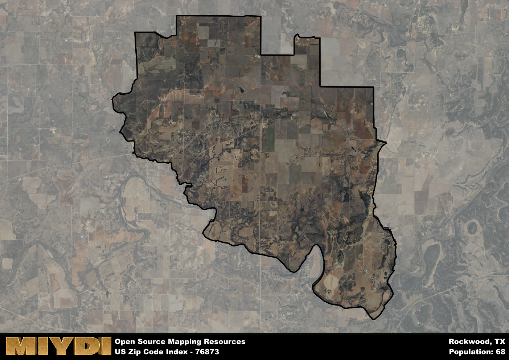

**Area Name:** Rockwood

**Zip Code:** 76873

**State:** TX

# Rockwood: A Hidden Gem in Central Texas

Located in central Texas, the zip code 76873 area is home to the charming community of Rockwood. Bordered by rolling hills and scenic countryside, Rockwood seamlessly integrates with nearby towns such as Brady and San Saba. As part of the larger metropolitan area, Rockwood offers a peaceful retreat from the hustle and bustle of city life while still providing easy access to urban amenities.

Rockwood has a rich historical narrative that dates back to its establishment as a trading post in the 1800s. Originally founded by settlers drawn to the area's fertile land and abundant natural resources, Rockwood quickly grew into a thriving community known for its agriculture and ranching industries. Over the years, Rockwood has maintained its small-town charm while embracing modern development, creating a unique blend of history and progress.

Today, Rockwood is a vibrant community with a strong emphasis on agriculture and outdoor recreation. The area is home to family-owned farms, ranches, and vineyards, showcasing the region's agricultural heritage. Residents and visitors alike can enjoy hiking, fishing, and hunting in the nearby parks and natural areas. Rockwood also boasts a variety of local businesses, including quaint shops, restaurants, and historic sites that celebrate the area's cultural heritage.

# Rockwood Demographics

The population of Rockwood is 68.  
Rockwood has a population density of 1.37 per square mile.  
The area of Rockwood is 49.76 square miles.  

## Rockwood AI and Census Variables

The values presented in this dataset for Rockwood are AI-optimized, streamlined, and categorized into relevant buckets for enhanced utility in AI and mapping programs. These simplified values have been optimized to facilitate efficient analysis and integration into various technological applications, offering users accessible and actionable insights into demographics within the Rockwood area.

| AI Variables for Rockwood | Value |
|-------------|-------|
| Shape Area | 177770805.363281 |
| Shape Length | 74506.3236485096 |

## How to use this free AI optimized Geo-Spatial Data for Rockwood, TX

This data is made freely available under the Creative Commons license, allowing for unrestricted use for any purpose. Users can access static resources directly from GitHub or leverage more advanced functionalities by utilizing the GeoJSON files. All datasets originate from official government or private sector sources and are meticulously compiled into relevant datasets within QGIS. However, the versatility of the data ensures compatibility with any mapping application.

## Data Accuracy Disclaimer
It's important to note that the data provided here may contain errors or discrepancies and should be considered as 'close enough' for business applications and AI rather than a definitive source of truth. This data is aggregated from multiple sources, some of which publish information on wildly different intervals, leading to potential inconsistencies. Additionally, certain data points may not be corrected for Covid-related changes, further impacting accuracy. Moreover, the assumption that demographic trends are consistent throughout a region may lead to discrepancies, as trends often concentrate in areas of highest population density. As a result, dense areas may be slightly underrepresented, while rural areas may be slightly overrepresented, resulting in a more conservative dataset. Furthermore, the focus primarily on areas within US Major and Minor Statistical areas means that approximately 40 million Americans living outside of these areas may not be fully represented. Lastly, the historical background and area descriptions generated using AI are susceptible to potential mistakes, so users should exercise caution when interpreting the information provided.
