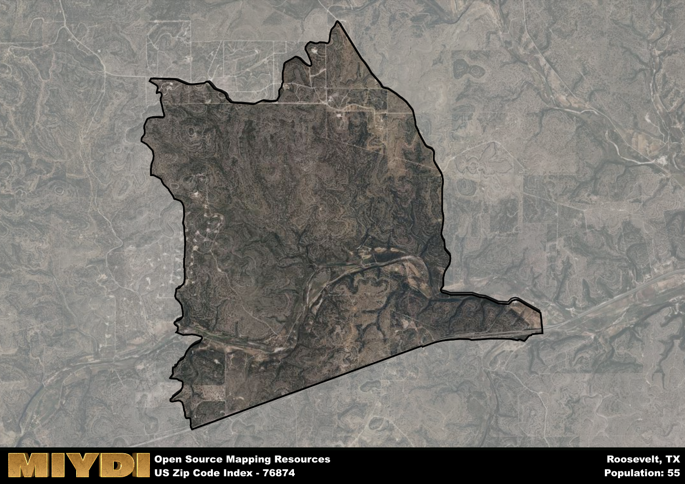

**Area Name:** Roosevelt

**Zip Code:** 76874

**State:** TX

# Roosevelt: A Historic and Vibrant Neighborhood in Texas  
Located in the heart of Texas, zip code 76874 encompasses the charming neighborhood of Roosevelt. Situated within the larger metropolitan area of San Angelo, Roosevelt is bordered by the towns of Miles to the north, Wall to the east, and Veribest to the south. This tight-knit community seamlessly integrates with its surrounding districts, offering a mix of rural tranquility and urban convenience to its residents.

Roosevelt has a rich historical narrative dating back to the early 1900s when the town was founded and named after President Theodore Roosevelt. Initially established as a farming community, Roosevelt experienced significant growth with the arrival of the railroad, attracting settlers and businesses to the area. Over the years, the town has preserved its heritage through historic buildings and landmarks, providing a glimpse into its storied past.

Today, Roosevelt thrives as a bustling community with a diverse economy that includes agriculture, small businesses, and local services. Residents and visitors alike can enjoy a range of recreational amenities such as parks, sports facilities, and community events. The neighborhood also boasts cultural attractions and historic sites that showcase its unique identity within the larger urban fabric of San Angelo. With its blend of history, community spirit, and modern conveniences, Roosevelt continues to be a sought-after destination for those seeking a balance of small-town charm and city amenities in Texas.

# Roosevelt Demographics

The population of Roosevelt is 55.  
Roosevelt has a population density of 2.5 per square mile.  
The area of Roosevelt is 22.03 square miles.  

## Roosevelt AI and Census Variables

The values presented in this dataset for Roosevelt are AI-optimized, streamlined, and categorized into relevant buckets for enhanced utility in AI and mapping programs. These simplified values have been optimized to facilitate efficient analysis and integration into various technological applications, offering users accessible and actionable insights into demographics within the Roosevelt area.

| AI Variables for Roosevelt | Value |
|-------------|-------|
| Shape Area | 77107611.8125 |
| Shape Length | 47293.3445434805 |

## How to use this free AI optimized Geo-Spatial Data for Roosevelt, TX

This data is made freely available under the Creative Commons license, allowing for unrestricted use for any purpose. Users can access static resources directly from GitHub or leverage more advanced functionalities by utilizing the GeoJSON files. All datasets originate from official government or private sector sources and are meticulously compiled into relevant datasets within QGIS. However, the versatility of the data ensures compatibility with any mapping application.

## Data Accuracy Disclaimer
It's important to note that the data provided here may contain errors or discrepancies and should be considered as 'close enough' for business applications and AI rather than a definitive source of truth. This data is aggregated from multiple sources, some of which publish information on wildly different intervals, leading to potential inconsistencies. Additionally, certain data points may not be corrected for Covid-related changes, further impacting accuracy. Moreover, the assumption that demographic trends are consistent throughout a region may lead to discrepancies, as trends often concentrate in areas of highest population density. As a result, dense areas may be slightly underrepresented, while rural areas may be slightly overrepresented, resulting in a more conservative dataset. Furthermore, the focus primarily on areas within US Major and Minor Statistical areas means that approximately 40 million Americans living outside of these areas may not be fully represented. Lastly, the historical background and area descriptions generated using AI are susceptible to potential mistakes, so users should exercise caution when interpreting the information provided.
