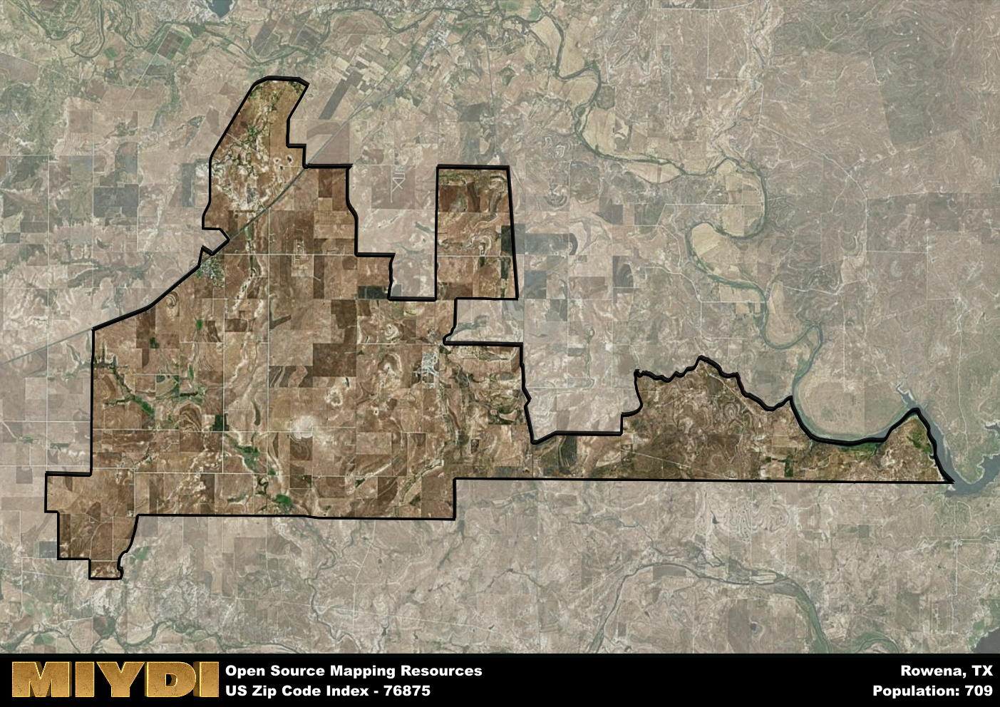

**Area Name:** Rowena

**Zip Code:** 76875

**State:** TX

# Rowena: A Historic and Vibrant Community in West Texas  

Located in West Texas, the zip code 76875 area corresponds to the charming community of Rowena. Bordered by miles of rolling plains and agricultural fields, Rowena is situated within close proximity to major cities such as San Angelo and Abilene. Despite its rural setting, Rowena is an integral part of the larger West Texas region, serving as a hub for agricultural activities and a close-knit community for its residents.

Rowena has a rich historical past, with roots dating back to the late 19th century when German immigrants settled in the area. The town was officially established in the early 1900s, and its growth was fueled by the arrival of the railroad. Over the years, Rowena has maintained its small-town charm while embracing modern developments. The town's name is derived from the poem "The Female Marine" by John Howard Payne, reflecting its unique cultural heritage.

Today, Rowena thrives as a vibrant community with a strong agricultural economy. The town is home to family-owned farms and ranches, as well as local businesses that cater to the needs of residents. Rowena also boasts a number of recreational amenities, including parks, community centers, and historic sites that celebrate its German heritage. With a close-knit community spirit and a commitment to preserving its history, Rowena remains a hidden gem in the heart of West Texas.

# Rowena Demographics

The population of Rowena is 709.  
Rowena has a population density of 8.53 per square mile.  
The area of Rowena is 83.09 square miles.  

## Rowena Income and Economic Data

These demographic numbers are sourced from IRS return data, providing comprehensive insights into the population dynamics and economic trends within Rowena.

**Breakdown of return types for Rowena**

The table offers insight into the composition of tax returns filed with the IRS, categorizing them into three main types. Single returns represent filings by individuals, joint returns by married couples, and head of household returns by individuals who qualify as heads of households, typically having dependents. This breakdown provides an understanding of the different filing statuses adopted by taxpayers when submitting their tax documentation.

| Return Types filed for Rowena                              | Percentage          |
|----------------------------------------------------------|---------------------|
| Single Returns                                            | 0.43 |
| Joint Returns                                             | 0.54 |
| Head Household Returns                                    | 0 |

The income and economic data presented here is sourced from the IRS income brackets, utilized for categorizing tax returns by income levels. This table displays income ranges for both single filers and married couples, along with the corresponding number of returns and the percentage within each bracket, providing valuable insight into the distribution of taxes across various income groups.

| Bracket Name       | Single Filer Income Range | Married Couple Range | Number of Returns | Percentage of Returns |
|--------------------|----------------------------|----------------------|-------------------|-----------------------|
| 10% Bracket        | Up to $10,275              | Up to $20,550        | 80 | 0.29% |
| 12% Bracket        | $10,276 - $41,775          | $20,551 - $83,550    | 70 | 0.25% |
| 22% Bracket        | $41,776 - $89,075          | $83,551 - $178,150   | 40 | 0.14% |
| 24% Bracket        | $89,076 - $170,050         | $178,151 - $340,100  | 30 | 0.11% |
| 32% Bracket        | $170,051 - $215,950        | $340,101 - $431,900  | 60 | 0.21% |
| 35% Bracket        | $215,951 - $539,900        | $431,901 - $647,850  | 0 | 0% |

### Exploring Taxpayer Diversity: A Breakdown of Different Types of Tax Returns in Rowena

The table offers insights into various types of tax returns filed, reflecting different aspects of taxpayer activities and demographics. Categories include charitable returns for donations, dependent returns for claimed dependents, educator population, elderly population, real estate returns, self-employment returns, student loan returns, and unemployment returns, providing valuable insights into taxpayer behavior and demographics.

| Rowena Filing Types                    | Count | Percentage |
|--------------------------------------|-------|------------|
| Charitable Donations                 | 0 | 0% |
| Dependents Claimed                   | 0 | 0% |
| Educator Residents                   | 0 | 0% |
| Elderly Population                   | 90 | 0.32% |
| Farming Population                   | 70 | 0.25% |
| Real Estate Transactions             | 0 | 0% |
| Self-Employed Individuals            | 60 | 0.214% |
| Student Loan Cases                   | 0 | 0% |
| Unemployment Benefit Filings         | 30 | 0.11% |

## Rowena AI and Census Variables

The values presented in this dataset for Rowena are AI-optimized, streamlined, and categorized into relevant buckets for enhanced utility in AI and mapping programs. These simplified values have been optimized to facilitate efficient analysis and integration into various technological applications, offering users accessible and actionable insights into demographics within the Rowena area.

| AI Variables for Rowena | Value |
|-------------|-------|
| Shape Area | 297639088.277344 |
| Shape Length | 144537.540337278 |

## How to use this free AI optimized Geo-Spatial Data for Rowena, TX

This data is made freely available under the Creative Commons license, allowing for unrestricted use for any purpose. Users can access static resources directly from GitHub or leverage more advanced functionalities by utilizing the GeoJSON files. All datasets originate from official government or private sector sources and are meticulously compiled into relevant datasets within QGIS. However, the versatility of the data ensures compatibility with any mapping application.

## Data Accuracy Disclaimer
It's important to note that the data provided here may contain errors or discrepancies and should be considered as 'close enough' for business applications and AI rather than a definitive source of truth. This data is aggregated from multiple sources, some of which publish information on wildly different intervals, leading to potential inconsistencies. Additionally, certain data points may not be corrected for Covid-related changes, further impacting accuracy. Moreover, the assumption that demographic trends are consistent throughout a region may lead to discrepancies, as trends often concentrate in areas of highest population density. As a result, dense areas may be slightly underrepresented, while rural areas may be slightly overrepresented, resulting in a more conservative dataset. Furthermore, the focus primarily on areas within US Major and Minor Statistical areas means that approximately 40 million Americans living outside of these areas may not be fully represented. Lastly, the historical background and area descriptions generated using AI are susceptible to potential mistakes, so users should exercise caution when interpreting the information provided.
