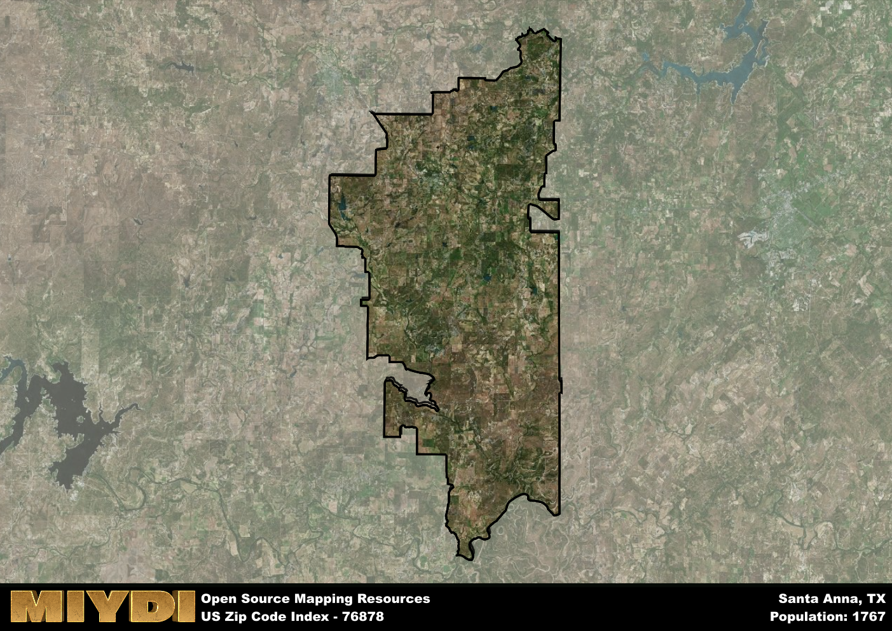

**Area Name:** Santa Anna

**Zip Code:** 76878

**State:** TX

Santa Anna is a part of the Brownwood - TX Micro Area, and makes up 3.53% of the Metro's population.  

# Santa Anna, TX 76878: A Charming Neighborhood in the Heart of Texas  

Located in the heart of Texas, zip code 76878 is home to the quaint and historic neighborhood of Santa Anna. Bordered by rolling hills and scenic landscapes, this area seamlessly integrates with the larger metropolitan context of Santa Anna, offering a peaceful retreat from the bustling city life. Situated within close proximity to major population centers, such as Brownwood and Coleman, Santa Anna provides residents with the perfect balance of small-town charm and modern convenience.

With a rich historical narrative, Santa Anna has played a significant role in the settlement and growth of Texas. Originally founded as a trading post in the mid-19th century, the area quickly flourished as pioneers and settlers flocked to its fertile lands. The neighborhood's name pays homage to the historic Battle of Santa Anna, a key event in Texas history. Over the years, Santa Anna has evolved into a close-knit community known for its friendly residents and strong sense of pride in its heritage.

Today, Santa Anna boasts a thriving economy supported by agriculture and small businesses. Residents enjoy a range of neighborhood-specific services, including local shops, restaurants, and schools. The area also offers a variety of recreational amenities, such as parks, hiking trails, and community events. Visitors can explore the town's historic sites, including the Santa Anna Depot Museum, which preserves the area's fascinating past. With its unique blend of history, culture, and natural beauty, Santa Anna remains a hidden gem within the larger urban fabric of Texas.

# Santa Anna Demographics

The population of Santa Anna is 1767.  
Santa Anna has a population density of 7.07 per square mile.  
The area of Santa Anna is 249.97 square miles.  

## Santa Anna Income and Economic Data

These demographic numbers are sourced from IRS return data, providing comprehensive insights into the population dynamics and economic trends within Santa Anna.

**Breakdown of return types for Santa Anna**

The table offers insight into the composition of tax returns filed with the IRS, categorizing them into three main types. Single returns represent filings by individuals, joint returns by married couples, and head of household returns by individuals who qualify as heads of households, typically having dependents. This breakdown provides an understanding of the different filing statuses adopted by taxpayers when submitting their tax documentation.

| Return Types filed for Santa Anna                              | Percentage          |
|----------------------------------------------------------|---------------------|
| Single Returns                                            | 0.44 |
| Joint Returns                                             | 0.43 |
| Head Household Returns                                    | 0.14 |

The income and economic data presented here is sourced from the IRS income brackets, utilized for categorizing tax returns by income levels. This table displays income ranges for both single filers and married couples, along with the corresponding number of returns and the percentage within each bracket, providing valuable insight into the distribution of taxes across various income groups.

| Bracket Name       | Single Filer Income Range | Married Couple Range | Number of Returns | Percentage of Returns |
|--------------------|----------------------------|----------------------|-------------------|-----------------------|
| 10% Bracket        | Up to $10,275              | Up to $20,550        | 290 | 0.41% |
| 12% Bracket        | $10,276 - $41,775          | $20,551 - $83,550    | 170 | 0.24% |
| 22% Bracket        | $41,776 - $89,075          | $83,551 - $178,150   | 90 | 0.13% |
| 24% Bracket        | $89,076 - $170,050         | $178,151 - $340,100  | 60 | 0.09% |
| 32% Bracket        | $170,051 - $215,950        | $340,101 - $431,900  | 70 | 0.1% |
| 35% Bracket        | $215,951 - $539,900        | $431,901 - $647,850  | 20 | 0.03% |

### Exploring Taxpayer Diversity: A Breakdown of Different Types of Tax Returns in Santa Anna

The table offers insights into various types of tax returns filed, reflecting different aspects of taxpayer activities and demographics. Categories include charitable returns for donations, dependent returns for claimed dependents, educator population, elderly population, real estate returns, self-employment returns, student loan returns, and unemployment returns, providing valuable insights into taxpayer behavior and demographics.

| Santa Anna Filing Types                    | Count | Percentage |
|--------------------------------------|-------|------------|
| Charitable Donations                 | 0 | 0% |
| Dependents Claimed                   | 0 | 0% |
| Educator Residents                   | 0 | 0% |
| Elderly Population                   | 220 | 0.31% |
| Farming Population                   | 110 | 0.157% |
| Real Estate Transactions             | 0 | 0% |
| Self-Employed Individuals            | 110 | 0.157% |
| Student Loan Cases                   | 30 | 0.043% |
| Unemployment Benefit Filings         | 80 | 0.11% |

### Exploring Real Estate Trends: A Comprehensive Analysis of the Santa Anna Area and its Neighbors

This table contains an in-depth examination of the real estate market in the Santa Anna area. Sourced from trusted real estate market firms, this dataset provides a wealth of raw data detailing the local real estate landscape, along with comparative analyses juxtaposing the market dynamics with those of neighboring areas. Explore the intricacies of the Santa Anna real estate market and gain valuable insights into its relationship with adjacent regions.

| Real Estate Data for Santa Anna                       | Value    |
|------------------------------------------------|----------|
| Average Listing Price for Santa Anna               | 1044436 |
| Median Listing Price for Santa Anna                | 672500 |
| Median Days on Market for Santa Anna               | 65 |
| Median Listing Price per Square Foot for Santa Anna| 80 |
| Median Square Feet for Santa Anna                  | 2009 |
| Real Estate Prices to Income Ratio           | 1034.45% |
| Price per Square Foot Ratio                  | 125.28% |
| Price Median Ratio                           | 165.81% |
| Market Sales Speed Ratio                     | 70.0% |

This table offers essential real estate data for the Santa Anna area, including average and median listing prices, median days on market, and property size. It also presents ratio metrics as percentages, providing insights into how the local market compares to the surrounding region. A ratio of 100% signifies performance in line with the regional average, while values above or below indicate overperformance or underperformance, respectively, relative to expectations.

## Santa Anna Sports and Recreation Data

#### Annual Youth Sports Spending for Santa Anna

This table provides fundamental insights into the Sports and Recreation data for the Santa Anna area, detailing the estimated annual expenditure on Youth Athletics. This includes estimated spending by the major consumer brackets. 
| Sports Spending for Santa Anna| Value |
|-------------------------|-------|
| Athlete Spending Compared to the region | 24.67% |
| Total Youth Athlete Spending | 23,973 |
| Athletic Spending - Essential Focused Consumer | 9,339 |
| Athletic Spending - Typical Consumer | 9,665 |
| Athletic Spending - Affluent Consumers | 4,912 |

#### Youth Coaching Estimates for Santa Anna

This table presents the estimated number of coaches for the Santa Anna area, derived from comprehensive national coaching surveys and athletic participation rates by state. It offers valuable insights into the vital role of coaching personnel in fostering athletic development and facilitating sports participation within the local community.

| Coaching Data for Santa Anna | Value |
|-------------|-------|
| Total Coaches | 29 |
| Paid Coaches | 7 |
| Volunteer Coaches | 21 |

#### Youth Athlete Participation for Santa Anna

This table shows the estimated total number of youth athletes in the Santa Anna area, sourced from comprehensive national coaching surveys and athletic participation rates by state.

| Total YA Athletes in Santa Anna | Value |
|-------------|-------|
| Total High School Athletes | 44 |
| Total Youth Athletes | 132 |
| Total Young Adult Athletes | 88 |
| Total Athletes to Age 25 | 265 |

#### High School Age Athletes - Breakdown by Sport for Santa Anna

This table shows insights regarding high school age estimated players by sport in the Santa Anna area, derived from national and state-level athletic participation trends. 

| HS Players by Sport in Santa Anna | Value |
|-------------|-------|
| Football Players | 10 |
| Basketball Players | 6 |
| Soccer Players | 5 |
| Volleyball Players | 3 |
| Baseball Players | 5 |
| Tennis Players | 3 |
| Track Athletes | 8 |
| Golf Players | 1 |
| Swimming Athletes | 1 |
| Wrestling Competitors | 1 |
| Lacrosse Players | 0 |

Estimating the number of younger athletes presents unique challenges due to their varied starting ages, typically beginning around six years old, and a gradual decline in participation rates as they age. Unlike high school-aged athletes, younger athletes are less likely to switch sports as they grow older, contributing to the stability of participation numbers within specific sports at younger ages.  

As a general trend, the total number of younger athletes is approximately three times the number of high school-aged athletes, underscoring the significant presence of youth athletes in sports programs and highlighting the importance of early engagement in athletic activities.

## Santa Anna AI and Census Variables

The values presented in this dataset for Santa Anna are AI-optimized, streamlined, and categorized into relevant buckets for enhanced utility in AI and mapping programs. These simplified values have been optimized to facilitate efficient analysis and integration into various technological applications, offering users accessible and actionable insights into demographics within the Santa Anna area.

| AI Variables for Santa Anna | Value |
|-------------|-------|
| Shape Area | 896277770.546875 |
| Shape Length | 207497.112675352 |
| CBSA Federal Processing Standard Code | 15220 |
| RE Price per Square Foot Ratio | 125.28% |
| RE Price Average Ratio | 204.59% |
| RE Speed Ratio | 70.0% |
| RE Income Ratio | 1034.45% |
| RE Affordability Index Flag | 7 |
| Income Bracket Flag | 2 |
| RE Income Flag | 7 |
| RE Median Square Footage Price Flag | 6 |
| RE Median Square Footage Size Flag | 5 |
| RE Activity Flag | 3 |
| Poverty Line Risk Flag | 1 |

## How to use this free AI optimized Geo-Spatial Data for Santa Anna, TX

This data is made freely available under the Creative Commons license, allowing for unrestricted use for any purpose. Users can access static resources directly from GitHub or leverage more advanced functionalities by utilizing the GeoJSON files. All datasets originate from official government or private sector sources and are meticulously compiled into relevant datasets within QGIS. However, the versatility of the data ensures compatibility with any mapping application.

## Data Accuracy Disclaimer
It's important to note that the data provided here may contain errors or discrepancies and should be considered as 'close enough' for business applications and AI rather than a definitive source of truth. This data is aggregated from multiple sources, some of which publish information on wildly different intervals, leading to potential inconsistencies. Additionally, certain data points may not be corrected for Covid-related changes, further impacting accuracy. Moreover, the assumption that demographic trends are consistent throughout a region may lead to discrepancies, as trends often concentrate in areas of highest population density. As a result, dense areas may be slightly underrepresented, while rural areas may be slightly overrepresented, resulting in a more conservative dataset. Furthermore, the focus primarily on areas within US Major and Minor Statistical areas means that approximately 40 million Americans living outside of these areas may not be fully represented. Lastly, the historical background and area descriptions generated using AI are susceptible to potential mistakes, so users should exercise caution when interpreting the information provided.
