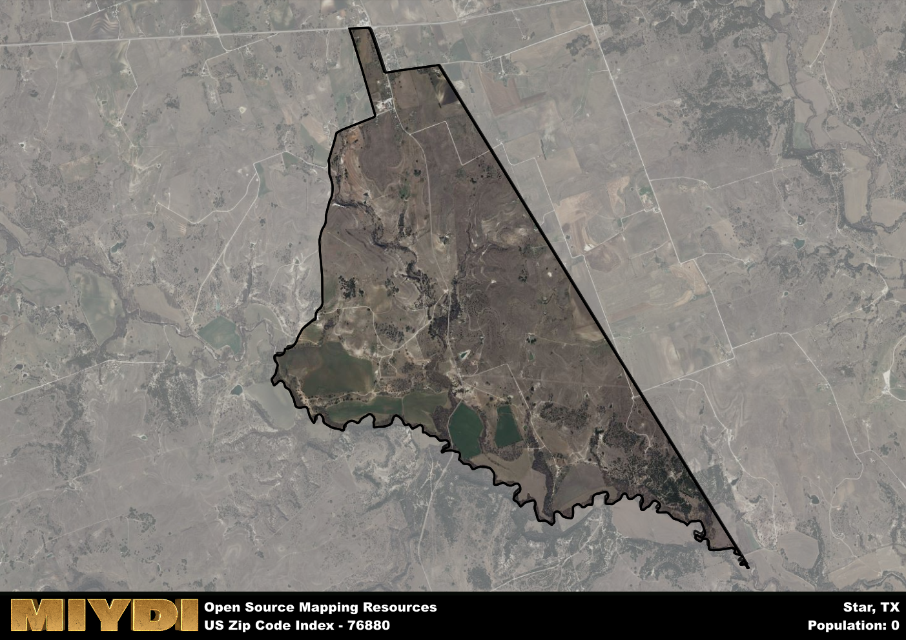

**Area Name:** Star

**Zip Code:** 76880

**State:** TX

Star is a part of the Killeen-Temple - TX Metro Area, and makes up  of the Metro's population.  

# Star, TX - Zip Code 76880

Star, TX, located within zip code 76880, is a charming neighborhood nestled in the heart of central Texas. Its boundaries are defined by rolling hills and lush greenery, offering residents a tranquil escape from the hustle and bustle of nearby cities. Star seamlessly integrates with the larger metropolitan area by providing a serene residential enclave while still being within convenient reach of major population centers for work and leisure.

The history of Star dates back to the early settlers who were drawn to the area for its fertile land and abundant natural resources. Over the years, the neighborhood grew into a close-knit community known for its friendly residents and strong sense of local pride. The name "Star" is said to have originated from the clear night skies that twinkle above the neighborhood, offering a sense of peace and tranquility to all who reside there.

Today, Star boasts a mix of residential and commercial spaces, with locally-owned businesses lining its main streets. The area is known for its vibrant farmers' market, where residents can purchase fresh produce and handmade goods. Additionally, Star is home to several parks and recreational amenities, making it a popular destination for outdoor enthusiasts. Visitors can also explore the area's rich history by visiting historic sites and landmarks that showcase the neighborhood's unique heritage.

# Star Demographics

The population of Star is 0.  
Star has a population density of 0 per square mile.  
The area of Star is 6.58 square miles.  

## Star AI and Census Variables

The values presented in this dataset for Star are AI-optimized, streamlined, and categorized into relevant buckets for enhanced utility in AI and mapping programs. These simplified values have been optimized to facilitate efficient analysis and integration into various technological applications, offering users accessible and actionable insights into demographics within the Star area.

| AI Variables for Star | Value |
|-------------|-------|
| Shape Area | 23466501.2929688 |
| Shape Length | 29652.4869890713 |
| CBSA Federal Processing Standard Code | 28660 |

## How to use this free AI optimized Geo-Spatial Data for Star, TX

This data is made freely available under the Creative Commons license, allowing for unrestricted use for any purpose. Users can access static resources directly from GitHub or leverage more advanced functionalities by utilizing the GeoJSON files. All datasets originate from official government or private sector sources and are meticulously compiled into relevant datasets within QGIS. However, the versatility of the data ensures compatibility with any mapping application.

## Data Accuracy Disclaimer
It's important to note that the data provided here may contain errors or discrepancies and should be considered as 'close enough' for business applications and AI rather than a definitive source of truth. This data is aggregated from multiple sources, some of which publish information on wildly different intervals, leading to potential inconsistencies. Additionally, certain data points may not be corrected for Covid-related changes, further impacting accuracy. Moreover, the assumption that demographic trends are consistent throughout a region may lead to discrepancies, as trends often concentrate in areas of highest population density. As a result, dense areas may be slightly underrepresented, while rural areas may be slightly overrepresented, resulting in a more conservative dataset. Furthermore, the focus primarily on areas within US Major and Minor Statistical areas means that approximately 40 million Americans living outside of these areas may not be fully represented. Lastly, the historical background and area descriptions generated using AI are susceptible to potential mistakes, so users should exercise caution when interpreting the information provided.
