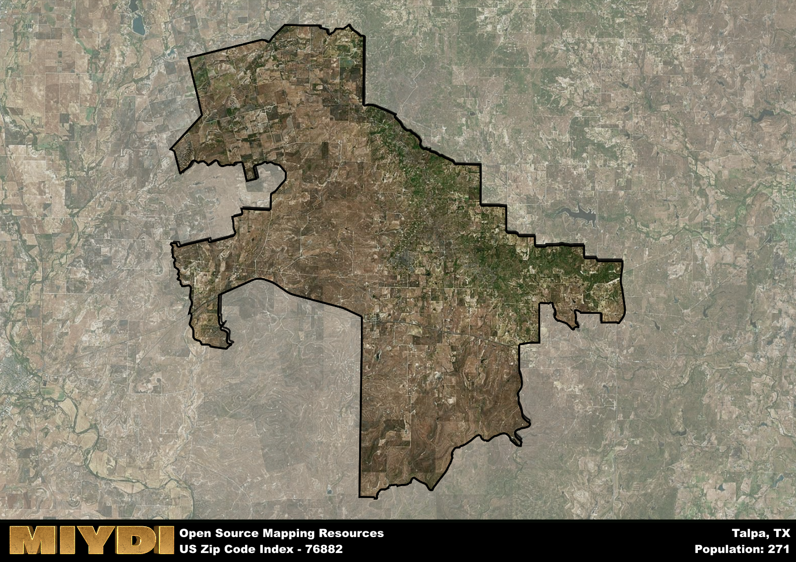

**Area Name:** Talpa

**Zip Code:** 76882

**State:** TX

# Talpa: A Quaint Neighborhood in Central Texas  
Located in central Texas, the zip code 76882 corresponds to the charming neighborhood of Talpa. Situated within the larger metropolitan area of Coleman, Talpa is bounded by rolling hills and open fields, providing a peaceful and picturesque setting for its residents. Despite its rural surroundings, Talpa is conveniently connected to nearby cities such as Abilene and San Angelo, making it an ideal place for those seeking a quiet retreat while still having access to urban amenities.

Talpa has a rich historical narrative dating back to its settlement in the late 19th century. Originally founded as a farming community, Talpa experienced steady growth with the arrival of the railroad, which facilitated the transportation of goods and people to and from the area. Over the years, Talpa has maintained its small-town charm while adapting to modern developments, creating a unique blend of history and progress that defines its identity today.

Today, Talpa boasts a mix of agricultural and residential areas, with farming and ranching playing a significant role in the local economy. Residents enjoy a close-knit community atmosphere, with local businesses, schools, and churches serving as focal points of social life. The neighborhood also offers various recreational opportunities, including parks, hiking trails, and community events that celebrate its cultural heritage. Talpa's historic sites, such as the old train depot and downtown square, provide a glimpse into its past while embodying its enduring spirit of resilience and community pride.

# Talpa Demographics

The population of Talpa is 271.  
Talpa has a population density of 1.76 per square mile.  
The area of Talpa is 153.87 square miles.  

## Talpa Income and Economic Data

These demographic numbers are sourced from IRS return data, providing comprehensive insights into the population dynamics and economic trends within Talpa.

**Breakdown of return types for Talpa**

The table offers insight into the composition of tax returns filed with the IRS, categorizing them into three main types. Single returns represent filings by individuals, joint returns by married couples, and head of household returns by individuals who qualify as heads of households, typically having dependents. This breakdown provides an understanding of the different filing statuses adopted by taxpayers when submitting their tax documentation.

| Return Types filed for Talpa                              | Percentage          |
|----------------------------------------------------------|---------------------|
| Single Returns                                            | 0.45 |
| Joint Returns                                             | 0.36 |
| Head Household Returns                                    | 0 |

The income and economic data presented here is sourced from the IRS income brackets, utilized for categorizing tax returns by income levels. This table displays income ranges for both single filers and married couples, along with the corresponding number of returns and the percentage within each bracket, providing valuable insight into the distribution of taxes across various income groups.

| Bracket Name       | Single Filer Income Range | Married Couple Range | Number of Returns | Percentage of Returns |
|--------------------|----------------------------|----------------------|-------------------|-----------------------|
| 10% Bracket        | Up to $10,275              | Up to $20,550        | 50 | 0.45% |
| 12% Bracket        | $10,276 - $41,775          | $20,551 - $83,550    | 30 | 0.27% |
| 22% Bracket        | $41,776 - $89,075          | $83,551 - $178,150   | 30 | 0.27% |
| 24% Bracket        | $89,076 - $170,050         | $178,151 - $340,100  | 0 | 0% |
| 32% Bracket        | $170,051 - $215,950        | $340,101 - $431,900  | 0 | 0% |
| 35% Bracket        | $215,951 - $539,900        | $431,901 - $647,850  | 0 | 0% |

### Exploring Taxpayer Diversity: A Breakdown of Different Types of Tax Returns in Talpa

The table offers insights into various types of tax returns filed, reflecting different aspects of taxpayer activities and demographics. Categories include charitable returns for donations, dependent returns for claimed dependents, educator population, elderly population, real estate returns, self-employment returns, student loan returns, and unemployment returns, providing valuable insights into taxpayer behavior and demographics.

| Talpa Filing Types                    | Count | Percentage |
|--------------------------------------|-------|------------|
| Charitable Donations                 | 0 | 0% |
| Dependents Claimed                   | 0 | 0% |
| Educator Residents                   | 0 | 0% |
| Elderly Population                   | 50 | 0.45% |
| Farming Population                   | 20 | 0.182% |
| Real Estate Transactions             | 0 | 0% |
| Self-Employed Individuals            | 20 | 0.182% |
| Student Loan Cases                   | 0 | 0% |
| Unemployment Benefit Filings         | 0 | 0% |

## Talpa AI and Census Variables

The values presented in this dataset for Talpa are AI-optimized, streamlined, and categorized into relevant buckets for enhanced utility in AI and mapping programs. These simplified values have been optimized to facilitate efficient analysis and integration into various technological applications, offering users accessible and actionable insights into demographics within the Talpa area.

| AI Variables for Talpa | Value |
|-------------|-------|
| Shape Area | 553569588.074219 |
| Shape Length | 171418.12559173 |

## How to use this free AI optimized Geo-Spatial Data for Talpa, TX

This data is made freely available under the Creative Commons license, allowing for unrestricted use for any purpose. Users can access static resources directly from GitHub or leverage more advanced functionalities by utilizing the GeoJSON files. All datasets originate from official government or private sector sources and are meticulously compiled into relevant datasets within QGIS. However, the versatility of the data ensures compatibility with any mapping application.

## Data Accuracy Disclaimer
It's important to note that the data provided here may contain errors or discrepancies and should be considered as 'close enough' for business applications and AI rather than a definitive source of truth. This data is aggregated from multiple sources, some of which publish information on wildly different intervals, leading to potential inconsistencies. Additionally, certain data points may not be corrected for Covid-related changes, further impacting accuracy. Moreover, the assumption that demographic trends are consistent throughout a region may lead to discrepancies, as trends often concentrate in areas of highest population density. As a result, dense areas may be slightly underrepresented, while rural areas may be slightly overrepresented, resulting in a more conservative dataset. Furthermore, the focus primarily on areas within US Major and Minor Statistical areas means that approximately 40 million Americans living outside of these areas may not be fully represented. Lastly, the historical background and area descriptions generated using AI are susceptible to potential mistakes, so users should exercise caution when interpreting the information provided.
