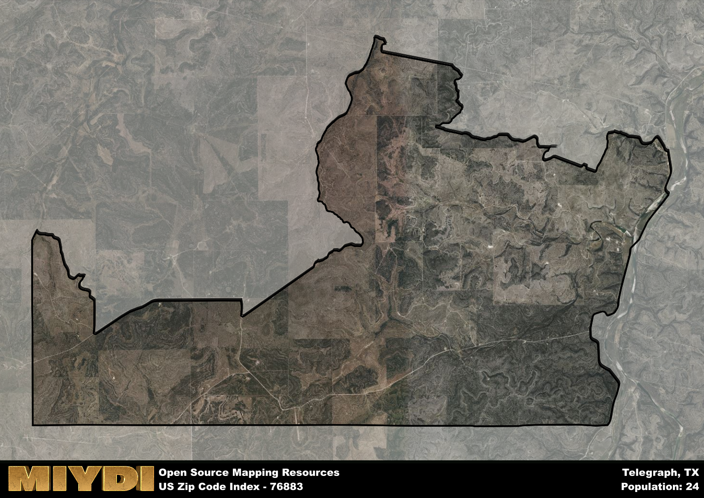

**Area Name:** Telegraph

**Zip Code:** 76883

**State:** TX

# Telegraph: A Charming Neighborhood in Central Texas  

Located within the heart of Central Texas, the zip code 76883 corresponds to the quaint neighborhood of Telegraph. Bordered by rolling hills and vast ranch lands, Telegraph seamlessly integrates with nearby towns such as Mason and Brady. This rural area serves as a peaceful retreat from the hustle and bustle of larger cities, offering a serene environment for residents to enjoy.

Telegraph has a rich historical narrative, tracing its roots back to the early settlement days of Texas. Established in the mid-1800s, the area flourished as a hub for telegraph communication, hence its name. Over the years, Telegraph has maintained its small-town charm while adapting to modern times. Residents take pride in their deep connection to the land and the sense of community that defines the neighborhood.

Today, Telegraph thrives as a close-knit community with a focus on agriculture and ranching. Local businesses cater to the needs of residents, providing essential services and a few charming shops and eateries. Outdoor enthusiasts can explore the surrounding natural beauty through hiking trails and fishing spots. The area also boasts historical sites that offer a glimpse into its past, preserving the heritage that makes Telegraph a unique gem in Central Texas.

# Telegraph Demographics

The population of Telegraph is 24.  
Telegraph has a population density of 0.39 per square mile.  
The area of Telegraph is 61.02 square miles.  

## Telegraph AI and Census Variables

The values presented in this dataset for Telegraph are AI-optimized, streamlined, and categorized into relevant buckets for enhanced utility in AI and mapping programs. These simplified values have been optimized to facilitate efficient analysis and integration into various technological applications, offering users accessible and actionable insights into demographics within the Telegraph area.

| AI Variables for Telegraph | Value |
|-------------|-------|
| Shape Area | 212848664.007813 |
| Shape Length | 93884.5164328642 |

## How to use this free AI optimized Geo-Spatial Data for Telegraph, TX

This data is made freely available under the Creative Commons license, allowing for unrestricted use for any purpose. Users can access static resources directly from GitHub or leverage more advanced functionalities by utilizing the GeoJSON files. All datasets originate from official government or private sector sources and are meticulously compiled into relevant datasets within QGIS. However, the versatility of the data ensures compatibility with any mapping application.

## Data Accuracy Disclaimer
It's important to note that the data provided here may contain errors or discrepancies and should be considered as 'close enough' for business applications and AI rather than a definitive source of truth. This data is aggregated from multiple sources, some of which publish information on wildly different intervals, leading to potential inconsistencies. Additionally, certain data points may not be corrected for Covid-related changes, further impacting accuracy. Moreover, the assumption that demographic trends are consistent throughout a region may lead to discrepancies, as trends often concentrate in areas of highest population density. As a result, dense areas may be slightly underrepresented, while rural areas may be slightly overrepresented, resulting in a more conservative dataset. Furthermore, the focus primarily on areas within US Major and Minor Statistical areas means that approximately 40 million Americans living outside of these areas may not be fully represented. Lastly, the historical background and area descriptions generated using AI are susceptible to potential mistakes, so users should exercise caution when interpreting the information provided.
