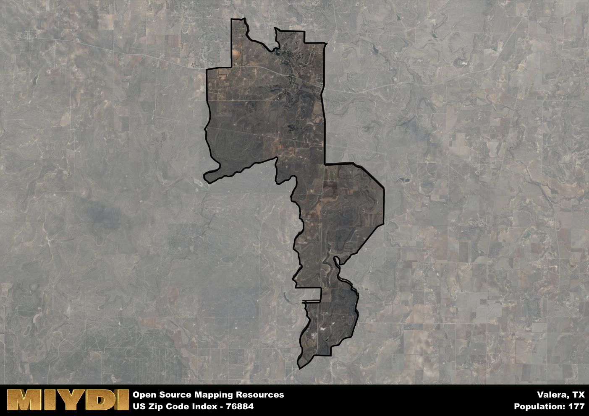

**Area Name:** Valera

**Zip Code:** 76884

**State:** TX

# Valera: A Charming Neighborhood in West Texas  
Valera, located within the 76884 zip code, is a quaint neighborhood nestled in the heart of West Texas. Bordered by rolling hills and vast expanses of farmland, Valera seamlessly integrates with the surrounding rural communities, such as Coleman and Santa Anna. Despite its rural setting, Valera is just a short drive away from larger cities like Abilene, allowing residents to enjoy the peace and quiet of small-town life while still having access to urban amenities.

Originally settled in the late 19th century, Valera was founded by pioneers looking to establish a farming community in the region. Over the years, the area experienced steady growth thanks to the fertile soil and abundance of natural resources. The neighborhood was officially named Valera in honor of a prominent local landowner. Today, Valera maintains its agricultural roots, with many residents still working in farming and ranching. The community prides itself on its tight-knit atmosphere and rich history, which is celebrated through annual festivals and events.

Present-day Valera boasts a thriving agricultural economy, with farms producing a variety of crops and livestock. The neighborhood is home to several local businesses, including family-owned shops and restaurants that cater to residents and visitors alike. In addition to its economic activities, Valera offers a range of recreational amenities, such as parks, hiking trails, and fishing spots. History buffs can explore the area's historic sites, including old farmhouses and the local museum, which showcases artifacts from Valera's pioneering days. With its peaceful surroundings and strong sense of community, Valera is a hidden gem in West Texas.

# Valera Demographics

The population of Valera is 177.  
Valera has a population density of 6.36 per square mile.  
The area of Valera is 27.84 square miles.  

## Valera AI and Census Variables

The values presented in this dataset for Valera are AI-optimized, streamlined, and categorized into relevant buckets for enhanced utility in AI and mapping programs. These simplified values have been optimized to facilitate efficient analysis and integration into various technological applications, offering users accessible and actionable insights into demographics within the Valera area.

| AI Variables for Valera | Value |
|-------------|-------|
| Shape Area | 99937478.7617188 |
| Shape Length | 75270.2233010818 |

## How to use this free AI optimized Geo-Spatial Data for Valera, TX

This data is made freely available under the Creative Commons license, allowing for unrestricted use for any purpose. Users can access static resources directly from GitHub or leverage more advanced functionalities by utilizing the GeoJSON files. All datasets originate from official government or private sector sources and are meticulously compiled into relevant datasets within QGIS. However, the versatility of the data ensures compatibility with any mapping application.

## Data Accuracy Disclaimer
It's important to note that the data provided here may contain errors or discrepancies and should be considered as 'close enough' for business applications and AI rather than a definitive source of truth. This data is aggregated from multiple sources, some of which publish information on wildly different intervals, leading to potential inconsistencies. Additionally, certain data points may not be corrected for Covid-related changes, further impacting accuracy. Moreover, the assumption that demographic trends are consistent throughout a region may lead to discrepancies, as trends often concentrate in areas of highest population density. As a result, dense areas may be slightly underrepresented, while rural areas may be slightly overrepresented, resulting in a more conservative dataset. Furthermore, the focus primarily on areas within US Major and Minor Statistical areas means that approximately 40 million Americans living outside of these areas may not be fully represented. Lastly, the historical background and area descriptions generated using AI are susceptible to potential mistakes, so users should exercise caution when interpreting the information provided.
