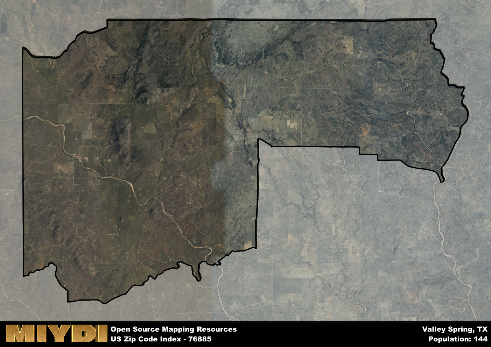

**Area Name:** Valley Spring

**Zip Code:** 76885

**State:** TX

# Valley Spring: A Charming Zip Code in Texas Hill Country  

Valley Spring, corresponding to the zip code 76885, is located in the picturesque Texas Hill Country region. The area is bordered by rolling hills, lush forests, and pristine rivers, making it a peaceful retreat for residents and visitors alike. Valley Spring seamlessly integrates with neighboring communities such as Mason to the west and Llano to the east, offering easy access to the amenities of larger urban centers while maintaining its rural charm.

The history of Valley Spring dates back to the mid-19th century when settlers were drawn to the area for its fertile land and abundant natural resources. The community grew steadily as agriculture became the primary industry, with ranching and farming playing a significant role in shaping the local economy. The name "Valley Spring" is said to have originated from a natural spring located in the heart of the neighborhood, providing a vital water source for early inhabitants and symbolizing the resilience and resourcefulness of the community.

Today, Valley Spring thrives as a close-knit neighborhood with a strong sense of community pride. The area boasts a mix of small businesses, including local shops and restaurants, that cater to residents and tourists alike. Outdoor enthusiasts can enjoy a variety of recreational activities such as hiking, fishing, and camping in the surrounding natural beauty. Additionally, Valley Spring is home to several historic sites that offer a glimpse into the area's past, preserving its rich heritage for future generations to appreciate.

# Valley Spring Demographics

The population of Valley Spring is 144.  
Valley Spring has a population density of 1.39 per square mile.  
The area of Valley Spring is 103.61 square miles.  

## Valley Spring AI and Census Variables

The values presented in this dataset for Valley Spring are AI-optimized, streamlined, and categorized into relevant buckets for enhanced utility in AI and mapping programs. These simplified values have been optimized to facilitate efficient analysis and integration into various technological applications, offering users accessible and actionable insights into demographics within the Valley Spring area.

| AI Variables for Valley Spring | Value |
|-------------|-------|
| Shape Area | 365361582.234375 |
| Shape Length | 101413.070277146 |

## How to use this free AI optimized Geo-Spatial Data for Valley Spring, TX

This data is made freely available under the Creative Commons license, allowing for unrestricted use for any purpose. Users can access static resources directly from GitHub or leverage more advanced functionalities by utilizing the GeoJSON files. All datasets originate from official government or private sector sources and are meticulously compiled into relevant datasets within QGIS. However, the versatility of the data ensures compatibility with any mapping application.

## Data Accuracy Disclaimer
It's important to note that the data provided here may contain errors or discrepancies and should be considered as 'close enough' for business applications and AI rather than a definitive source of truth. This data is aggregated from multiple sources, some of which publish information on wildly different intervals, leading to potential inconsistencies. Additionally, certain data points may not be corrected for Covid-related changes, further impacting accuracy. Moreover, the assumption that demographic trends are consistent throughout a region may lead to discrepancies, as trends often concentrate in areas of highest population density. As a result, dense areas may be slightly underrepresented, while rural areas may be slightly overrepresented, resulting in a more conservative dataset. Furthermore, the focus primarily on areas within US Major and Minor Statistical areas means that approximately 40 million Americans living outside of these areas may not be fully represented. Lastly, the historical background and area descriptions generated using AI are susceptible to potential mistakes, so users should exercise caution when interpreting the information provided.
