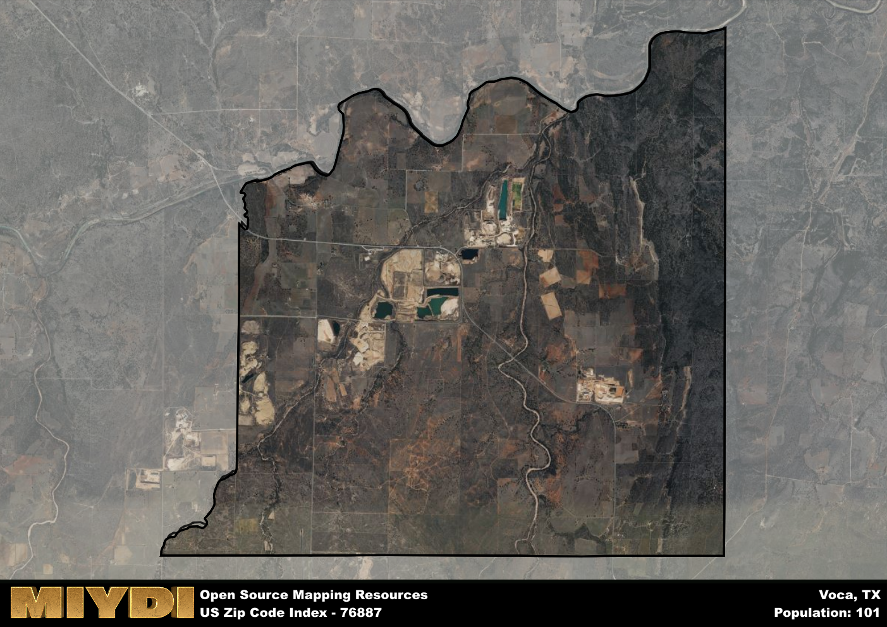

**Area Name:** Voca

**Zip Code:** 76887

**State:** TX

# Voca: A Rural Gem in Central Texas  

Located in central Texas, the zip code 76887 area of Voca is a rural community nestled within the rolling hills of McCulloch County. The boundaries of Voca are defined by vast farmlands and ranches, with the closest major population center being Brady, approximately 20 miles to the south. Voca maintains its small-town charm while being integrated into the larger fabric of the central Texas region through its agricultural contributions and proximity to nearby cities.

Founded in the late 19th century, Voca has a rich history rooted in agriculture and ranching. The area was originally settled by pioneers drawn to the fertile land and natural water sources. Over the years, Voca grew into a tight-knit community centered around farming and ranching activities. The name "Voca" is believed to have Native American origins, reflecting the area's history and cultural heritage.

Today, Voca remains a close-knit community with a focus on agriculture and ranching. The area boasts a thriving farming economy, with crops such as cotton, corn, and wheat being cultivated in the fertile soil. Residents of Voca enjoy a peaceful rural lifestyle, with access to local services such as a community center, post office, and small businesses. Outdoor enthusiasts can explore the nearby Colorado River for fishing and recreational activities, while history buffs can visit the historic sites that dot the area, showcasing Voca's rich past.

# Voca Demographics

The population of Voca is 101.  
Voca has a population density of 2.44 per square mile.  
The area of Voca is 41.45 square miles.  

## Voca AI and Census Variables

The values presented in this dataset for Voca are AI-optimized, streamlined, and categorized into relevant buckets for enhanced utility in AI and mapping programs. These simplified values have been optimized to facilitate efficient analysis and integration into various technological applications, offering users accessible and actionable insights into demographics within the Voca area.

| AI Variables for Voca | Value |
|-------------|-------|
| Shape Area | 146519752.109375 |
| Shape Length | 57194.9872792412 |

## How to use this free AI optimized Geo-Spatial Data for Voca, TX

This data is made freely available under the Creative Commons license, allowing for unrestricted use for any purpose. Users can access static resources directly from GitHub or leverage more advanced functionalities by utilizing the GeoJSON files. All datasets originate from official government or private sector sources and are meticulously compiled into relevant datasets within QGIS. However, the versatility of the data ensures compatibility with any mapping application.

## Data Accuracy Disclaimer
It's important to note that the data provided here may contain errors or discrepancies and should be considered as 'close enough' for business applications and AI rather than a definitive source of truth. This data is aggregated from multiple sources, some of which publish information on wildly different intervals, leading to potential inconsistencies. Additionally, certain data points may not be corrected for Covid-related changes, further impacting accuracy. Moreover, the assumption that demographic trends are consistent throughout a region may lead to discrepancies, as trends often concentrate in areas of highest population density. As a result, dense areas may be slightly underrepresented, while rural areas may be slightly overrepresented, resulting in a more conservative dataset. Furthermore, the focus primarily on areas within US Major and Minor Statistical areas means that approximately 40 million Americans living outside of these areas may not be fully represented. Lastly, the historical background and area descriptions generated using AI are susceptible to potential mistakes, so users should exercise caution when interpreting the information provided.
