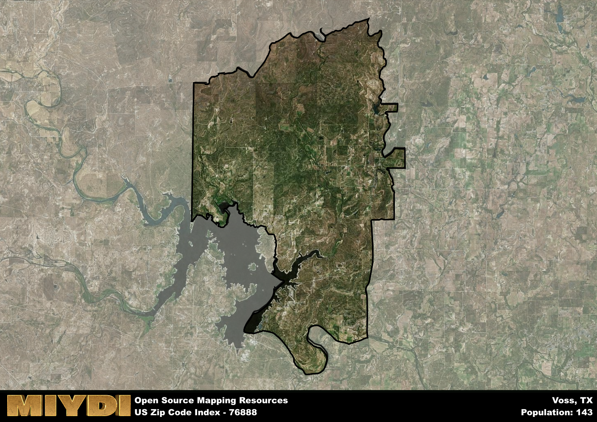

**Area Name:** Voss

**Zip Code:** 76888

**State:** TX

# Voss: A Quaint Community in Central Texas  

Located in central Texas, the zip code 76888 area encompasses the small community of Voss. Situated within Coleman County, Voss is surrounded by vast stretches of rural land, with the nearest major city being Abilene, approximately 60 miles to the northwest. Despite its rural setting, Voss is well-connected to neighboring towns and cities through a network of highways, making it a peaceful yet accessible place to reside.

Originally settled in the late 19th century, Voss was named after a prominent local ranching family. Over the years, the community grew around agriculture and ranching, with its economy closely tied to the land. Voss experienced periods of prosperity and decline, but its tight-knit community persevered, preserving its rich history and heritage. Today, Voss remains a close community where residents take pride in their roots and work together to maintain the area's unique charm.

Presently, Voss is a quiet residential area with a small commercial district catering to the needs of its residents. The economy is primarily driven by agriculture, with many residents involved in farming and ranching. The community takes pride in its local schools and churches, which serve as focal points for social gatherings and events. Voss also boasts recreational amenities such as parks and community centers, allowing residents to enjoy the beautiful Texas landscape. With its rich history and strong sense of community, Voss continues to be a hidden gem in the heart of central Texas.

# Voss Demographics

The population of Voss is 143.  
Voss has a population density of 1.27 per square mile.  
The area of Voss is 112.66 square miles.  

## Voss AI and Census Variables

The values presented in this dataset for Voss are AI-optimized, streamlined, and categorized into relevant buckets for enhanced utility in AI and mapping programs. These simplified values have been optimized to facilitate efficient analysis and integration into various technological applications, offering users accessible and actionable insights into demographics within the Voss area.

| AI Variables for Voss | Value |
|-------------|-------|
| Shape Area | 403507914.410156 |
| Shape Length | 129289.74988574 |

## How to use this free AI optimized Geo-Spatial Data for Voss, TX

This data is made freely available under the Creative Commons license, allowing for unrestricted use for any purpose. Users can access static resources directly from GitHub or leverage more advanced functionalities by utilizing the GeoJSON files. All datasets originate from official government or private sector sources and are meticulously compiled into relevant datasets within QGIS. However, the versatility of the data ensures compatibility with any mapping application.

## Data Accuracy Disclaimer
It's important to note that the data provided here may contain errors or discrepancies and should be considered as 'close enough' for business applications and AI rather than a definitive source of truth. This data is aggregated from multiple sources, some of which publish information on wildly different intervals, leading to potential inconsistencies. Additionally, certain data points may not be corrected for Covid-related changes, further impacting accuracy. Moreover, the assumption that demographic trends are consistent throughout a region may lead to discrepancies, as trends often concentrate in areas of highest population density. As a result, dense areas may be slightly underrepresented, while rural areas may be slightly overrepresented, resulting in a more conservative dataset. Furthermore, the focus primarily on areas within US Major and Minor Statistical areas means that approximately 40 million Americans living outside of these areas may not be fully represented. Lastly, the historical background and area descriptions generated using AI are susceptible to potential mistakes, so users should exercise caution when interpreting the information provided.
