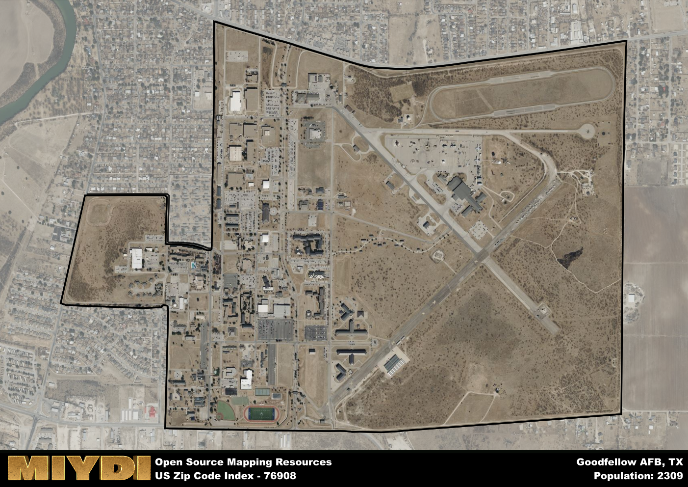

**Area Name:** Goodfellow AFB

**Zip Code:** 76908

**State:** TX

Goodfellow AFB is a part of the San Angelo - TX Metro Area, and makes up  of the Metro's population.  

# Goodfellow AFB: A Neighborhood Snapshot of 76908

Located in San Angelo, Texas, the zip code 76908 encompasses the area around Goodfellow Air Force Base. Situated in the northern part of the city, this neighborhood is closely connected to the downtown area of San Angelo and serves as a vital part of the city's infrastructure. The base is a significant employer in the region, attracting military personnel and their families to the area.

The history of Goodfellow AFB dates back to its establishment during World War II as a training facility for the Army Air Corps. Over the years, the base has expanded its operations and now serves as a training center for multiple branches of the military, including the Air Force, Army, Navy, and Marines. The base has played a crucial role in the development of intelligence, surveillance, and reconnaissance capabilities for the armed forces.

Today, the area around Goodfellow AFB is a thriving community with a mix of military personnel, civilians, and businesses. The base contributes significantly to the local economy, providing jobs and supporting various businesses in the area. Residents enjoy access to a range of amenities, including parks, schools, and shopping centers. The neighborhood's proximity to the Concho River offers opportunities for outdoor recreation, while historic sites like the Fort Concho National Historic Landmark provide a glimpse into the area's past.

# Goodfellow AFB Demographics

The population of Goodfellow AFB is 2309.  
Goodfellow AFB has a population density of 1366.27 per square mile.  
The area of Goodfellow AFB is 1.69 square miles.  

## Goodfellow AFB AI and Census Variables

The values presented in this dataset for Goodfellow AFB are AI-optimized, streamlined, and categorized into relevant buckets for enhanced utility in AI and mapping programs. These simplified values have been optimized to facilitate efficient analysis and integration into various technological applications, offering users accessible and actionable insights into demographics within the Goodfellow AFB area.

| AI Variables for Goodfellow AFB | Value |
|-------------|-------|
| Shape Area | 6020905.3203125 |
| Shape Length | 11808.1973004921 |
| CBSA Federal Processing Standard Code | 41660 |

## How to use this free AI optimized Geo-Spatial Data for Goodfellow AFB, TX

This data is made freely available under the Creative Commons license, allowing for unrestricted use for any purpose. Users can access static resources directly from GitHub or leverage more advanced functionalities by utilizing the GeoJSON files. All datasets originate from official government or private sector sources and are meticulously compiled into relevant datasets within QGIS. However, the versatility of the data ensures compatibility with any mapping application.

## Data Accuracy Disclaimer
It's important to note that the data provided here may contain errors or discrepancies and should be considered as 'close enough' for business applications and AI rather than a definitive source of truth. This data is aggregated from multiple sources, some of which publish information on wildly different intervals, leading to potential inconsistencies. Additionally, certain data points may not be corrected for Covid-related changes, further impacting accuracy. Moreover, the assumption that demographic trends are consistent throughout a region may lead to discrepancies, as trends often concentrate in areas of highest population density. As a result, dense areas may be slightly underrepresented, while rural areas may be slightly overrepresented, resulting in a more conservative dataset. Furthermore, the focus primarily on areas within US Major and Minor Statistical areas means that approximately 40 million Americans living outside of these areas may not be fully represented. Lastly, the historical background and area descriptions generated using AI are susceptible to potential mistakes, so users should exercise caution when interpreting the information provided.
