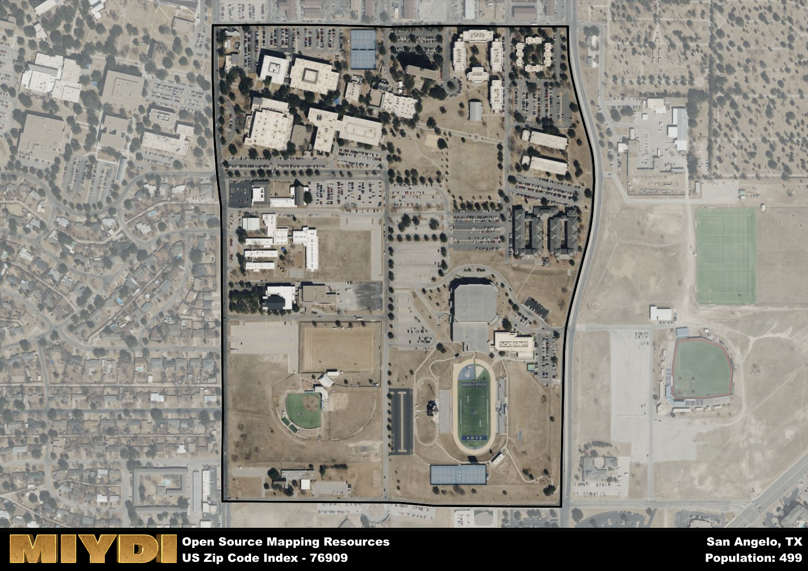

**Area Name:** San Angelo

**Zip Code:** 76909

**State:** TX

San Angelo is a part of the San Angelo - TX Metro Area, and makes up  of the Metro's population.  

# San Angelo: A Vibrant Community in Zip Code 76909

Located in the heart of San Angelo, zip code 76909 encompasses a diverse and thriving neighborhood within the larger metropolitan area. Bordered by major thoroughfares and neighboring districts, this zip code seamlessly integrates with the surrounding communities, offering easy access to downtown San Angelo and nearby amenities. As part of the urban fabric, 76909 plays a vital role in the economic and cultural landscape of the region.

The history of zip code 76909 is rich and storied, reflecting the resilience and pioneering spirit of its early settlers. Originally established as a small settlement along the Concho River, the area experienced rapid growth during the oil boom of the early 20th century. Over the years, 76909 has evolved into a dynamic neighborhood known for its welcoming community, historic architecture, and vibrant cultural scene. Today, the area stands as a testament to its past while embracing the opportunities of the present.

Present-day 76909 is a bustling hub of activity, with a diverse array of economic, recreational, and cultural offerings for residents and visitors alike. From local businesses and restaurants to parks and entertainment venues, the neighborhood boasts a vibrant atmosphere that reflects its unique identity. Residents can enjoy a variety of amenities, including shopping centers, schools, and historic landmarks that showcase the area's rich heritage. With a strong sense of community and a commitment to growth and innovation, zip code 76909 continues to thrive as a dynamic and welcoming neighborhood in San Angelo.

# San Angelo Demographics

The population of San Angelo is 499.  
San Angelo has a population density of 2079.17 per square mile.  
The area of San Angelo is 0.24 square miles.  

## San Angelo AI and Census Variables

The values presented in this dataset for San Angelo are AI-optimized, streamlined, and categorized into relevant buckets for enhanced utility in AI and mapping programs. These simplified values have been optimized to facilitate efficient analysis and integration into various technological applications, offering users accessible and actionable insights into demographics within the San Angelo area.

| AI Variables for San Angelo | Value |
|-------------|-------|
| Shape Area | 844735.75 |
| Shape Length | 3696.70406289296 |
| CBSA Federal Processing Standard Code | 41660 |

## How to use this free AI optimized Geo-Spatial Data for San Angelo, TX

This data is made freely available under the Creative Commons license, allowing for unrestricted use for any purpose. Users can access static resources directly from GitHub or leverage more advanced functionalities by utilizing the GeoJSON files. All datasets originate from official government or private sector sources and are meticulously compiled into relevant datasets within QGIS. However, the versatility of the data ensures compatibility with any mapping application.

## Data Accuracy Disclaimer
It's important to note that the data provided here may contain errors or discrepancies and should be considered as 'close enough' for business applications and AI rather than a definitive source of truth. This data is aggregated from multiple sources, some of which publish information on wildly different intervals, leading to potential inconsistencies. Additionally, certain data points may not be corrected for Covid-related changes, further impacting accuracy. Moreover, the assumption that demographic trends are consistent throughout a region may lead to discrepancies, as trends often concentrate in areas of highest population density. As a result, dense areas may be slightly underrepresented, while rural areas may be slightly overrepresented, resulting in a more conservative dataset. Furthermore, the focus primarily on areas within US Major and Minor Statistical areas means that approximately 40 million Americans living outside of these areas may not be fully represented. Lastly, the historical background and area descriptions generated using AI are susceptible to potential mistakes, so users should exercise caution when interpreting the information provided.
