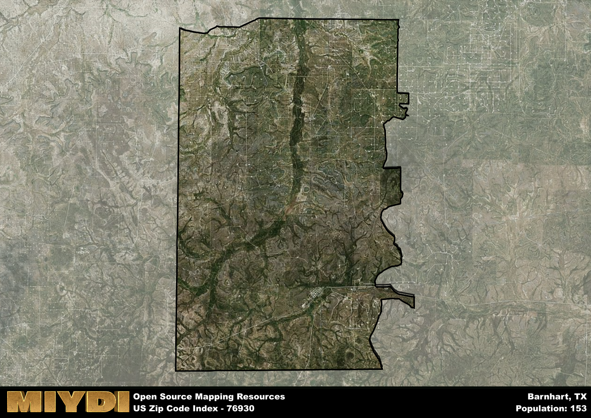

**Area Name:** Barnhart

**Zip Code:** 76930

**State:** TX

Barnhart is a part of the San Angelo - TX Metro Area, and makes up  of the Metro's population.  

# Barnhart: A Charming Community in West Texas

Located in West Texas, the zip code area 76930 encompasses the small community of Barnhart. Situated within Irion County, Barnhart is surrounded by vast stretches of desert landscape, with the nearest major city being San Angelo, approximately 50 miles to the northeast. Despite its remote location, Barnhart serves as a close-knit residential area for those seeking a quiet and peaceful lifestyle away from the hustle and bustle of urban centers.

Barnhart has a rich historical narrative that dates back to the early 1900s when the town was established as a railroad stop along the Kansas City, Mexico, and Orient Railway. Originally a hub for cattle ranching and agriculture, Barnhart experienced significant growth during the oil boom of the mid-20th century. The town's economy thrived with the discovery of oil reserves in the region, attracting new residents and businesses to the area. Today, Barnhart retains its small-town charm while honoring its past through local events and historical landmarks.

Presently, Barnhart is a residential community with a focus on agriculture and oil production. The town offers essential services such as schools, grocery stores, and healthcare facilities to meet the needs of its residents. Outdoor enthusiasts can enjoy recreational activities such as hunting, fishing, and hiking in the surrounding natural landscapes. Additionally, Barnhart is home to historic sites that showcase the town's heritage, making it a unique destination within West Texas for those seeking a glimpse into the region's past.

# Barnhart Demographics

The population of Barnhart is 153.  
Barnhart has a population density of 1.1 per square mile.  
The area of Barnhart is 138.75 square miles.  

## Barnhart AI and Census Variables

The values presented in this dataset for Barnhart are AI-optimized, streamlined, and categorized into relevant buckets for enhanced utility in AI and mapping programs. These simplified values have been optimized to facilitate efficient analysis and integration into various technological applications, offering users accessible and actionable insights into demographics within the Barnhart area.

| AI Variables for Barnhart | Value |
|-------------|-------|
| Shape Area | 492592658.070313 |
| Shape Length | 107556.9036569 |
| CBSA Federal Processing Standard Code | 41660 |

## How to use this free AI optimized Geo-Spatial Data for Barnhart, TX

This data is made freely available under the Creative Commons license, allowing for unrestricted use for any purpose. Users can access static resources directly from GitHub or leverage more advanced functionalities by utilizing the GeoJSON files. All datasets originate from official government or private sector sources and are meticulously compiled into relevant datasets within QGIS. However, the versatility of the data ensures compatibility with any mapping application.

## Data Accuracy Disclaimer
It's important to note that the data provided here may contain errors or discrepancies and should be considered as 'close enough' for business applications and AI rather than a definitive source of truth. This data is aggregated from multiple sources, some of which publish information on wildly different intervals, leading to potential inconsistencies. Additionally, certain data points may not be corrected for Covid-related changes, further impacting accuracy. Moreover, the assumption that demographic trends are consistent throughout a region may lead to discrepancies, as trends often concentrate in areas of highest population density. As a result, dense areas may be slightly underrepresented, while rural areas may be slightly overrepresented, resulting in a more conservative dataset. Furthermore, the focus primarily on areas within US Major and Minor Statistical areas means that approximately 40 million Americans living outside of these areas may not be fully represented. Lastly, the historical background and area descriptions generated using AI are susceptible to potential mistakes, so users should exercise caution when interpreting the information provided.
