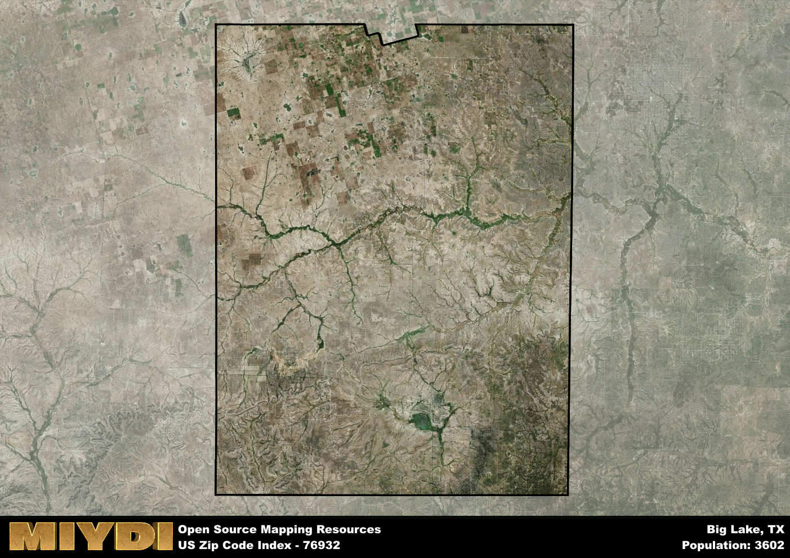

**Area Name:** Big Lake

**Zip Code:** 76932

**State:** TX

Big Lake is a part of the San Angelo - TX Metro Area, and makes up 2.79% of the Metro's population.  

# Big Lake: A Charming Community in West Texas

Located in Reagan County, the zip code 76932 corresponds to the quaint town of Big Lake in West Texas. Surrounded by vast expanses of desert landscape, Big Lake is a small but vibrant community that serves as the county seat. It is situated approximately 70 miles southeast of Midland and about 95 miles southwest of San Angelo. The town is well-connected by State Highway 137, which runs through its center, providing access to neighboring cities and major transportation routes.

Big Lake has a rich history dating back to the late 19th century when it was founded as a ranching and farming community. The town experienced a boom in the early 1920s with the discovery of oil in the area, leading to a period of rapid growth and development. Big Lake earned its name from the sizable lake that once existed nearby but has since dried up. Today, the town retains its small-town charm while embracing its oil heritage, with many residents still employed in the industry.

Presently, Big Lake is a thriving community with a mix of residential neighborhoods, local businesses, and essential services. The economy is primarily driven by oil and gas production, providing employment opportunities for the town's residents. Big Lake offers a range of amenities, including parks, schools, and recreational facilities for its residents to enjoy. The town also boasts a few historic sites, such as the Reagan County Courthouse, which add to its unique character and appeal.

# Big Lake Demographics

The population of Big Lake is 3602.  
Big Lake has a population density of 3.08 per square mile.  
The area of Big Lake is 1170.84 square miles.  

## Big Lake Income and Economic Data

These demographic numbers are sourced from IRS return data, providing comprehensive insights into the population dynamics and economic trends within Big Lake.

**Breakdown of return types for Big Lake**

The table offers insight into the composition of tax returns filed with the IRS, categorizing them into three main types. Single returns represent filings by individuals, joint returns by married couples, and head of household returns by individuals who qualify as heads of households, typically having dependents. This breakdown provides an understanding of the different filing statuses adopted by taxpayers when submitting their tax documentation.

| Return Types filed for Big Lake                              | Percentage          |
|----------------------------------------------------------|---------------------|
| Single Returns                                            | 0.37 |
| Joint Returns                                             | 0.43 |
| Head Household Returns                                    | 0.17 |

The income and economic data presented here is sourced from the IRS income brackets, utilized for categorizing tax returns by income levels. This table displays income ranges for both single filers and married couples, along with the corresponding number of returns and the percentage within each bracket, providing valuable insight into the distribution of taxes across various income groups.

| Bracket Name       | Single Filer Income Range | Married Couple Range | Number of Returns | Percentage of Returns |
|--------------------|----------------------------|----------------------|-------------------|-----------------------|
| 10% Bracket        | Up to $10,275              | Up to $20,550        | 460 | 0.31% |
| 12% Bracket        | $10,276 - $41,775          | $20,551 - $83,550    | 400 | 0.27% |
| 22% Bracket        | $41,776 - $89,075          | $83,551 - $178,150   | 250 | 0.17% |
| 24% Bracket        | $89,076 - $170,050         | $178,151 - $340,100  | 150 | 0.1% |
| 32% Bracket        | $170,051 - $215,950        | $340,101 - $431,900  | 180 | 0.12% |
| 35% Bracket        | $215,951 - $539,900        | $431,901 - $647,850  | 50 | 0.03% |

### Exploring Taxpayer Diversity: A Breakdown of Different Types of Tax Returns in Big Lake

The table offers insights into various types of tax returns filed, reflecting different aspects of taxpayer activities and demographics. Categories include charitable returns for donations, dependent returns for claimed dependents, educator population, elderly population, real estate returns, self-employment returns, student loan returns, and unemployment returns, providing valuable insights into taxpayer behavior and demographics.

| Big Lake Filing Types                    | Count | Percentage |
|--------------------------------------|-------|------------|
| Charitable Donations                 | 30 | 0.02% |
| Dependents Claimed                   | 0 | 0% |
| Educator Residents                   | 50 | 0.034% |
| Elderly Population                   | 250 | 0.17% |
| Farming Population                   | 80 | 0.054% |
| Real Estate Transactions             | 20 | 0.013% |
| Self-Employed Individuals            | 190 | 0.128% |
| Student Loan Cases                   | 50 | 0.034% |
| Unemployment Benefit Filings         | 280 | 0.19% |

### Exploring Real Estate Trends: A Comprehensive Analysis of the Big Lake Area and its Neighbors

This table contains an in-depth examination of the real estate market in the Big Lake area. Sourced from trusted real estate market firms, this dataset provides a wealth of raw data detailing the local real estate landscape, along with comparative analyses juxtaposing the market dynamics with those of neighboring areas. Explore the intricacies of the Big Lake real estate market and gain valuable insights into its relationship with adjacent regions.

| Real Estate Data for Big Lake                       | Value    |
|------------------------------------------------|----------|
| Average Listing Price for Big Lake               | 155140 |
| Median Listing Price for Big Lake                | 125000 |
| Median Days on Market for Big Lake               | 79 |
| Median Listing Price per Square Foot for Big Lake| 4 |
| Median Square Feet for Big Lake                  | 1700 |
| Real Estate Prices to Income Ratio           | 75.34% |
| Price per Square Foot Ratio                  | 36.26% |
| Price Median Ratio                           | 30.08% |
| Market Sales Speed Ratio                     | 119.1% |

This table offers essential real estate data for the Big Lake area, including average and median listing prices, median days on market, and property size. It also presents ratio metrics as percentages, providing insights into how the local market compares to the surrounding region. A ratio of 100% signifies performance in line with the regional average, while values above or below indicate overperformance or underperformance, respectively, relative to expectations.

## Big Lake Sports and Recreation Data

#### Annual Youth Sports Spending for Big Lake

This table provides fundamental insights into the Sports and Recreation data for the Big Lake area, detailing the estimated annual expenditure on Youth Athletics. This includes estimated spending by the major consumer brackets. 
| Sports Spending for Big Lake| Value |
|-------------------------|-------|
| Athlete Spending Compared to the region | 28.61% |
| Total Youth Athlete Spending | 61,905 |
| Athletic Spending - Essential Focused Consumer | 4,754 |
| Athletic Spending - Typical Consumer | 53,800 |
| Athletic Spending - Affluent Consumers | 23,232 |

#### Youth Coaching Estimates for Big Lake

This table presents the estimated number of coaches for the Big Lake area, derived from comprehensive national coaching surveys and athletic participation rates by state. It offers valuable insights into the vital role of coaching personnel in fostering athletic development and facilitating sports participation within the local community.

| Coaching Data for Big Lake | Value |
|-------------|-------|
| Total Coaches | 59 |
| Paid Coaches | 15 |
| Volunteer Coaches | 44 |

#### Youth Athlete Participation for Big Lake

This table shows the estimated total number of youth athletes in the Big Lake area, sourced from comprehensive national coaching surveys and athletic participation rates by state.

| Total YA Athletes in Big Lake | Value |
|-------------|-------|
| Total High School Athletes | 90 |
| Total Youth Athletes | 270 |
| Total Young Adult Athletes | 180 |
| Total Athletes to Age 25 | 540 |

#### High School Age Athletes - Breakdown by Sport for Big Lake

This table shows insights regarding high school age estimated players by sport in the Big Lake area, derived from national and state-level athletic participation trends. 

| HS Players by Sport in Big Lake | Value |
|-------------|-------|
| Football Players | 21 |
| Basketball Players | 13 |
| Soccer Players | 10 |
| Volleyball Players | 6 |
| Baseball Players | 11 |
| Tennis Players | 5 |
| Track Athletes | 15 |
| Golf Players | 3 |
| Swimming Athletes | 3 |
| Wrestling Competitors | 3 |
| Lacrosse Players | 0 |

Estimating the number of younger athletes presents unique challenges due to their varied starting ages, typically beginning around six years old, and a gradual decline in participation rates as they age. Unlike high school-aged athletes, younger athletes are less likely to switch sports as they grow older, contributing to the stability of participation numbers within specific sports at younger ages.  

As a general trend, the total number of younger athletes is approximately three times the number of high school-aged athletes, underscoring the significant presence of youth athletes in sports programs and highlighting the importance of early engagement in athletic activities.

## Big Lake AI and Census Variables

The values presented in this dataset for Big Lake are AI-optimized, streamlined, and categorized into relevant buckets for enhanced utility in AI and mapping programs. These simplified values have been optimized to facilitate efficient analysis and integration into various technological applications, offering users accessible and actionable insights into demographics within the Big Lake area.

| AI Variables for Big Lake | Value |
|-------------|-------|
| Shape Area | 4172116799.70703 |
| Shape Length | 266946.382522882 |
| CBSA Federal Processing Standard Code | 41660 |
| RE Price per Square Foot Ratio | 36.26% |
| RE Price Average Ratio | 29.43% |
| RE Speed Ratio | 119.1% |
| RE Income Ratio | 75.34% |
| Single Opportunity Flag | 1 |
| Single Parent Risk Flag | 3 |
| Elderly Opportunity Flag | 1 |
| Farm Opportunity Flag | 3 |
| Unemployment Risk | 7 |
| Educator Opportunity Flag | 7 |
| RE Affordability Index Flag | 1 |
| Income Bracket Flag | 3 |
| RE Income Flag | 2 |
| RE Median Square Footage Price Flag | 1 |
| RE Median Square Footage Size Flag | 3 |
| RE Activity Flag | 6 |
| Poverty Line Risk Flag | 4 |

## How to use this free AI optimized Geo-Spatial Data for Big Lake, TX

This data is made freely available under the Creative Commons license, allowing for unrestricted use for any purpose. Users can access static resources directly from GitHub or leverage more advanced functionalities by utilizing the GeoJSON files. All datasets originate from official government or private sector sources and are meticulously compiled into relevant datasets within QGIS. However, the versatility of the data ensures compatibility with any mapping application.

## Data Accuracy Disclaimer
It's important to note that the data provided here may contain errors or discrepancies and should be considered as 'close enough' for business applications and AI rather than a definitive source of truth. This data is aggregated from multiple sources, some of which publish information on wildly different intervals, leading to potential inconsistencies. Additionally, certain data points may not be corrected for Covid-related changes, further impacting accuracy. Moreover, the assumption that demographic trends are consistent throughout a region may lead to discrepancies, as trends often concentrate in areas of highest population density. As a result, dense areas may be slightly underrepresented, while rural areas may be slightly overrepresented, resulting in a more conservative dataset. Furthermore, the focus primarily on areas within US Major and Minor Statistical areas means that approximately 40 million Americans living outside of these areas may not be fully represented. Lastly, the historical background and area descriptions generated using AI are susceptible to potential mistakes, so users should exercise caution when interpreting the information provided.
