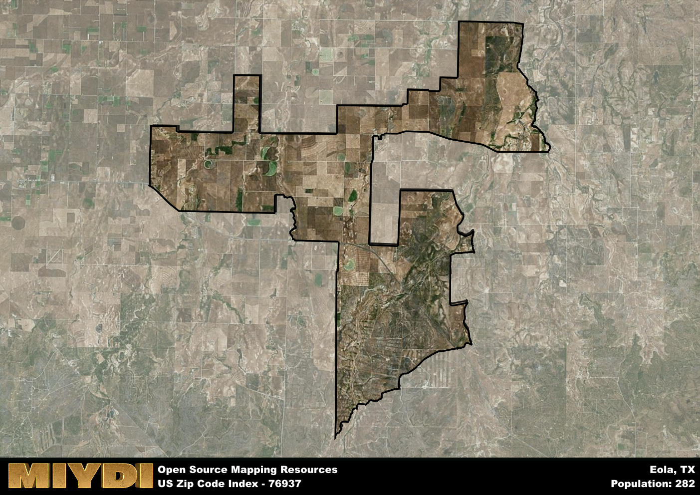

**Area Name:** Eola

**Zip Code:** 76937

**State:** TX

Eola is a part of the San Angelo - TX Metro Area, and makes up  of the Metro's population.  

# Eola: A Charming Community in West Texas

Located in West Texas, the zip code 76937 area is situated in the charming neighborhood of Eola. Eola is surrounded by vast stretches of farmland and ranches, creating a peaceful rural setting. While it maintains its small-town feel, Eola is conveniently located near major cities such as San Angelo, providing residents with easy access to urban amenities and services.

Eola has a rich historical background, originally established as a farming community in the late 19th century. The town experienced growth with the arrival of the railroad, which facilitated the transportation of agricultural goods to other parts of the state. Over the years, Eola has retained its agricultural roots while diversifying its economy to include small businesses and services that cater to the local community.

Today, Eola offers residents a close-knit community atmosphere with a range of neighborhood-specific services and recreational amenities. The area is known for its picturesque landscapes, perfect for outdoor activities such as hiking, fishing, and birdwatching. Eola also boasts a number of historic sites, including old farmhouses and buildings that showcase the town's past. With a strong sense of community pride and a focus on preserving its heritage, Eola continues to thrive as a unique and inviting place to call home in West Texas.

# Eola Demographics

The population of Eola is 282.  
Eola has a population density of 3.83 per square mile.  
The area of Eola is 73.58 square miles.  

## Eola Income and Economic Data

These demographic numbers are sourced from IRS return data, providing comprehensive insights into the population dynamics and economic trends within Eola.

**Breakdown of return types for Eola**

The table offers insight into the composition of tax returns filed with the IRS, categorizing them into three main types. Single returns represent filings by individuals, joint returns by married couples, and head of household returns by individuals who qualify as heads of households, typically having dependents. This breakdown provides an understanding of the different filing statuses adopted by taxpayers when submitting their tax documentation.

| Return Types filed for Eola                              | Percentage          |
|----------------------------------------------------------|---------------------|
| Single Returns                                            | 0.45 |
| Joint Returns                                             | 0.36 |
| Head Household Returns                                    | 0 |

The income and economic data presented here is sourced from the IRS income brackets, utilized for categorizing tax returns by income levels. This table displays income ranges for both single filers and married couples, along with the corresponding number of returns and the percentage within each bracket, providing valuable insight into the distribution of taxes across various income groups.

| Bracket Name       | Single Filer Income Range | Married Couple Range | Number of Returns | Percentage of Returns |
|--------------------|----------------------------|----------------------|-------------------|-----------------------|
| 10% Bracket        | Up to $10,275              | Up to $20,550        | 40 | 0.36% |
| 12% Bracket        | $10,276 - $41,775          | $20,551 - $83,550    | 40 | 0.36% |
| 22% Bracket        | $41,776 - $89,075          | $83,551 - $178,150   | 0 | 0% |
| 24% Bracket        | $89,076 - $170,050         | $178,151 - $340,100  | 30 | 0.27% |
| 32% Bracket        | $170,051 - $215,950        | $340,101 - $431,900  | 0 | 0% |
| 35% Bracket        | $215,951 - $539,900        | $431,901 - $647,850  | 0 | 0% |

### Exploring Taxpayer Diversity: A Breakdown of Different Types of Tax Returns in Eola

The table offers insights into various types of tax returns filed, reflecting different aspects of taxpayer activities and demographics. Categories include charitable returns for donations, dependent returns for claimed dependents, educator population, elderly population, real estate returns, self-employment returns, student loan returns, and unemployment returns, providing valuable insights into taxpayer behavior and demographics.

| Eola Filing Types                    | Count | Percentage |
|--------------------------------------|-------|------------|
| Charitable Donations                 | 0 | 0% |
| Dependents Claimed                   | 0 | 0% |
| Educator Residents                   | 0 | 0% |
| Elderly Population                   | 30 | 0.27% |
| Farming Population                   | 20 | 0.182% |
| Real Estate Transactions             | 0 | 0% |
| Self-Employed Individuals            | 0 | 0% |
| Student Loan Cases                   | 0 | 0% |
| Unemployment Benefit Filings         | 0 | 0% |

## Eola AI and Census Variables

The values presented in this dataset for Eola are AI-optimized, streamlined, and categorized into relevant buckets for enhanced utility in AI and mapping programs. These simplified values have been optimized to facilitate efficient analysis and integration into various technological applications, offering users accessible and actionable insights into demographics within the Eola area.

| AI Variables for Eola | Value |
|-------------|-------|
| Shape Area | 262187837 |
| Shape Length | 147421.310866082 |
| CBSA Federal Processing Standard Code | 41660 |

## How to use this free AI optimized Geo-Spatial Data for Eola, TX

This data is made freely available under the Creative Commons license, allowing for unrestricted use for any purpose. Users can access static resources directly from GitHub or leverage more advanced functionalities by utilizing the GeoJSON files. All datasets originate from official government or private sector sources and are meticulously compiled into relevant datasets within QGIS. However, the versatility of the data ensures compatibility with any mapping application.

## Data Accuracy Disclaimer
It's important to note that the data provided here may contain errors or discrepancies and should be considered as 'close enough' for business applications and AI rather than a definitive source of truth. This data is aggregated from multiple sources, some of which publish information on wildly different intervals, leading to potential inconsistencies. Additionally, certain data points may not be corrected for Covid-related changes, further impacting accuracy. Moreover, the assumption that demographic trends are consistent throughout a region may lead to discrepancies, as trends often concentrate in areas of highest population density. As a result, dense areas may be slightly underrepresented, while rural areas may be slightly overrepresented, resulting in a more conservative dataset. Furthermore, the focus primarily on areas within US Major and Minor Statistical areas means that approximately 40 million Americans living outside of these areas may not be fully represented. Lastly, the historical background and area descriptions generated using AI are susceptible to potential mistakes, so users should exercise caution when interpreting the information provided.
