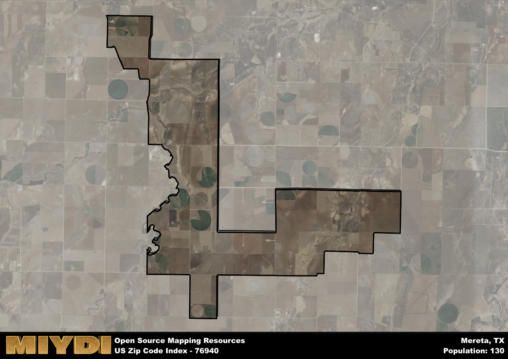

**Area Name:** Mereta

**Zip Code:** 76940

**State:** TX

Mereta is a part of the San Angelo - TX Metro Area, and makes up  of the Metro's population.  

# Mereta: A Charming Neighborhood in West Texas

Located in West Texas, the zip code area 76940 corresponds to the small, close-knit community of Mereta. Situated within Tom Green County, Mereta is surrounded by vast open spaces and rolling hills, offering residents a quiet and peaceful setting. The area is located approximately 15 miles southwest of San Angelo, a major city in the region, providing easy access to urban amenities while maintaining a rural atmosphere.

Mereta has a rich historical narrative, dating back to its establishment in the late 19th century. Originally a stop along the Kansas City, Mexico and Orient Railway, the area grew as a hub for cattle ranching and agriculture. The community was named after Mary and Etta, two local women who played significant roles in the early development of the town. Over the years, Mereta has maintained its small-town charm while adapting to the changing economic landscape of the region.

Today, Mereta continues to thrive as a close-knit community with a focus on agriculture and ranching. The area is home to local businesses, farms, and ranches that contribute to the region's economy. Residents enjoy a range of recreational activities, including fishing and hunting in the nearby Concho River. Mereta also boasts a strong sense of community, with regular events and gatherings that celebrate the area's rich history and culture. Visitors to Mereta can explore historic sites such as the original railway depot and enjoy the natural beauty of the surrounding countryside.

# Mereta Demographics

The population of Mereta is 130.  
Mereta has a population density of 8.12 per square mile.  
The area of Mereta is 16.01 square miles.  

## Mereta AI and Census Variables

The values presented in this dataset for Mereta are AI-optimized, streamlined, and categorized into relevant buckets for enhanced utility in AI and mapping programs. These simplified values have been optimized to facilitate efficient analysis and integration into various technological applications, offering users accessible and actionable insights into demographics within the Mereta area.

| AI Variables for Mereta | Value |
|-------------|-------|
| Shape Area | 57161440.8320313 |
| Shape Length | 63232.5620666461 |
| CBSA Federal Processing Standard Code | 41660 |

## How to use this free AI optimized Geo-Spatial Data for Mereta, TX

This data is made freely available under the Creative Commons license, allowing for unrestricted use for any purpose. Users can access static resources directly from GitHub or leverage more advanced functionalities by utilizing the GeoJSON files. All datasets originate from official government or private sector sources and are meticulously compiled into relevant datasets within QGIS. However, the versatility of the data ensures compatibility with any mapping application.

## Data Accuracy Disclaimer
It's important to note that the data provided here may contain errors or discrepancies and should be considered as 'close enough' for business applications and AI rather than a definitive source of truth. This data is aggregated from multiple sources, some of which publish information on wildly different intervals, leading to potential inconsistencies. Additionally, certain data points may not be corrected for Covid-related changes, further impacting accuracy. Moreover, the assumption that demographic trends are consistent throughout a region may lead to discrepancies, as trends often concentrate in areas of highest population density. As a result, dense areas may be slightly underrepresented, while rural areas may be slightly overrepresented, resulting in a more conservative dataset. Furthermore, the focus primarily on areas within US Major and Minor Statistical areas means that approximately 40 million Americans living outside of these areas may not be fully represented. Lastly, the historical background and area descriptions generated using AI are susceptible to potential mistakes, so users should exercise caution when interpreting the information provided.
