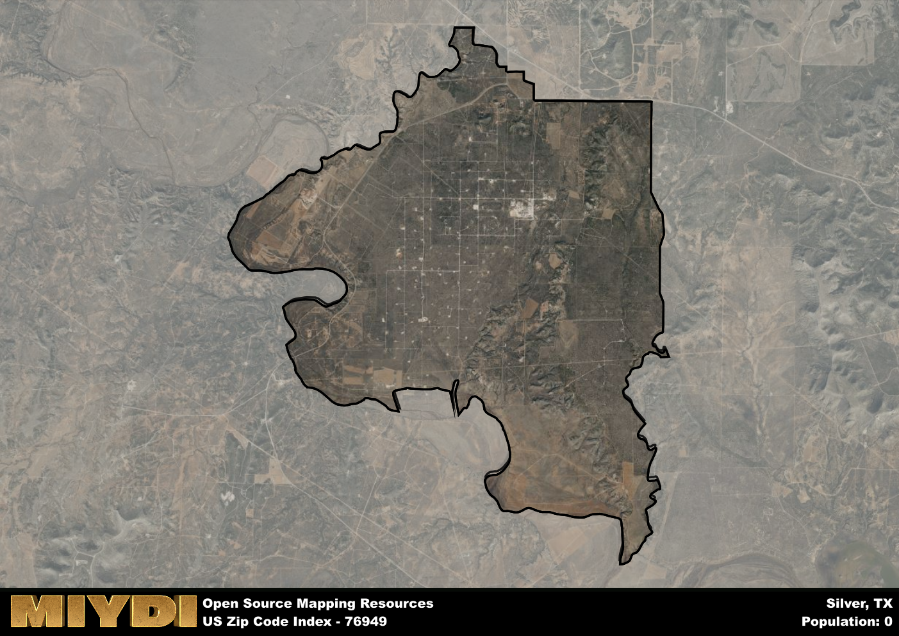

**Area Name:** Silver

**Zip Code:** 76949

**State:** TX

# Silver: A Historic Neighborhood in West Texas  
Located in the heart of West Texas, the zip code 76949 corresponds to the charming neighborhood of Silver. Bordered by the city of San Angelo to the east and the vast expanse of the West Texas desert to the west, Silver seamlessly integrates into the larger urban fabric while maintaining its unique character and identity. The neighborhood is known for its tight-knit community and picturesque surroundings, making it a desirable place to live for both locals and newcomers alike.

Silver has a rich historical narrative that dates back to its establishment in the early 19th century. Originally a small settlement along a cattle trail, Silver quickly grew into a bustling town fueled by the discovery of silver deposits in the nearby hills. The town flourished during the silver mining boom, attracting settlers from far and wide seeking their fortunes. Today, remnants of this mining heritage can still be seen in the historic buildings and landmarks that dot the neighborhood, serving as a reminder of Silver's storied past.

Despite its historical roots, Silver is a vibrant and modern neighborhood with a diverse range of economic activities and amenities. From quaint local shops and restaurants to well-maintained parks and recreational facilities, Silver offers residents a high quality of life in a picturesque setting. The neighborhood is also home to several cultural and historic sites, including the Silver Mining Museum and the Old Town Hall, which showcase the area's rich heritage. With a strong sense of community and a thriving local economy, Silver continues to be a sought-after destination for those looking to experience the best of West Texas living.

# Silver Demographics

The population of Silver is 0.  
Silver has a population density of 0 per square mile.  
The area of Silver is 24.03 square miles.  

## Silver AI and Census Variables

The values presented in this dataset for Silver are AI-optimized, streamlined, and categorized into relevant buckets for enhanced utility in AI and mapping programs. These simplified values have been optimized to facilitate efficient analysis and integration into various technological applications, offering users accessible and actionable insights into demographics within the Silver area.

| AI Variables for Silver | Value |
|-------------|-------|
| Shape Area | 86875027.875 |
| Shape Length | 57395.6498956604 |

## How to use this free AI optimized Geo-Spatial Data for Silver, TX

This data is made freely available under the Creative Commons license, allowing for unrestricted use for any purpose. Users can access static resources directly from GitHub or leverage more advanced functionalities by utilizing the GeoJSON files. All datasets originate from official government or private sector sources and are meticulously compiled into relevant datasets within QGIS. However, the versatility of the data ensures compatibility with any mapping application.

## Data Accuracy Disclaimer
It's important to note that the data provided here may contain errors or discrepancies and should be considered as 'close enough' for business applications and AI rather than a definitive source of truth. This data is aggregated from multiple sources, some of which publish information on wildly different intervals, leading to potential inconsistencies. Additionally, certain data points may not be corrected for Covid-related changes, further impacting accuracy. Moreover, the assumption that demographic trends are consistent throughout a region may lead to discrepancies, as trends often concentrate in areas of highest population density. As a result, dense areas may be slightly underrepresented, while rural areas may be slightly overrepresented, resulting in a more conservative dataset. Furthermore, the focus primarily on areas within US Major and Minor Statistical areas means that approximately 40 million Americans living outside of these areas may not be fully represented. Lastly, the historical background and area descriptions generated using AI are susceptible to potential mistakes, so users should exercise caution when interpreting the information provided.
