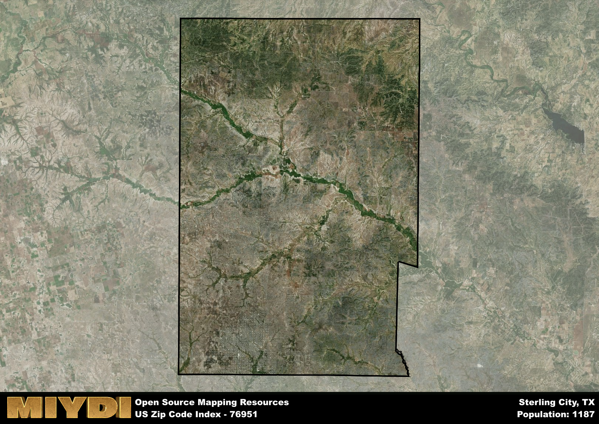

**Area Name:** Sterling City

**Zip Code:** 76951

**State:** TX

Sterling City is a part of the San Angelo - TX Metro Area, and makes up  of the Metro's population.  

# Sterling City: A Hidden Gem in West Texas  

Located in the heart of West Texas, Sterling City is a quaint community within the zip code 76951. Bordered by rolling plains and vast fields, this area is surrounded by the small towns of Water Valley, Silver, and Carlsbad. While it is a rural area, Sterling City also maintains close ties with San Angelo, the nearest major city, for economic and social purposes. The zip code 76951 serves as a vital link between the rural landscape of West Texas and the urban center of San Angelo.

Sterling City has a rich history dating back to the early 20th century when it was founded as a farming and ranching community. The town experienced a period of growth during the oil boom in the 1950s, attracting new residents and businesses. Despite facing economic challenges in subsequent decades, Sterling City has preserved its small-town charm and strong sense of community. The name "Sterling" was chosen to reflect the town's reputation for quality and excellence in agriculture.

Presently, Sterling City thrives as a hub for agriculture and oil production in West Texas. The town offers essential services such as a post office, schools, and local businesses to meet the needs of its residents. Recreational opportunities abound with nearby hunting grounds, fishing spots, and hiking trails, making it an ideal destination for outdoor enthusiasts. Sterling City also boasts historical sites like the Sterling County Courthouse and the Pioneer Memorial Museum, showcasing the town's heritage and culture. This hidden gem in West Texas continues to attract visitors seeking a peaceful retreat amidst the vast expanse of the Lone Star State.

# Sterling City Demographics

The population of Sterling City is 1187.  
Sterling City has a population density of 1.21 per square mile.  
The area of Sterling City is 978.04 square miles.  

## Sterling City Income and Economic Data

These demographic numbers are sourced from IRS return data, providing comprehensive insights into the population dynamics and economic trends within Sterling City.

**Breakdown of return types for Sterling City**

The table offers insight into the composition of tax returns filed with the IRS, categorizing them into three main types. Single returns represent filings by individuals, joint returns by married couples, and head of household returns by individuals who qualify as heads of households, typically having dependents. This breakdown provides an understanding of the different filing statuses adopted by taxpayers when submitting their tax documentation.

| Return Types filed for Sterling City                              | Percentage          |
|----------------------------------------------------------|---------------------|
| Single Returns                                            | 0.38 |
| Joint Returns                                             | 0.51 |
| Head Household Returns                                    | 0.11 |

The income and economic data presented here is sourced from the IRS income brackets, utilized for categorizing tax returns by income levels. This table displays income ranges for both single filers and married couples, along with the corresponding number of returns and the percentage within each bracket, providing valuable insight into the distribution of taxes across various income groups.

| Bracket Name       | Single Filer Income Range | Married Couple Range | Number of Returns | Percentage of Returns |
|--------------------|----------------------------|----------------------|-------------------|-----------------------|
| 10% Bracket        | Up to $10,275              | Up to $20,550        | 160 | 0.29% |
| 12% Bracket        | $10,276 - $41,775          | $20,551 - $83,550    | 110 | 0.2% |
| 22% Bracket        | $41,776 - $89,075          | $83,551 - $178,150   | 90 | 0.16% |
| 24% Bracket        | $89,076 - $170,050         | $178,151 - $340,100  | 60 | 0.11% |
| 32% Bracket        | $170,051 - $215,950        | $340,101 - $431,900  | 90 | 0.16% |
| 35% Bracket        | $215,951 - $539,900        | $431,901 - $647,850  | 40 | 0.07% |

### Exploring Taxpayer Diversity: A Breakdown of Different Types of Tax Returns in Sterling City

The table offers insights into various types of tax returns filed, reflecting different aspects of taxpayer activities and demographics. Categories include charitable returns for donations, dependent returns for claimed dependents, educator population, elderly population, real estate returns, self-employment returns, student loan returns, and unemployment returns, providing valuable insights into taxpayer behavior and demographics.

| Sterling City Filing Types                    | Count | Percentage |
|--------------------------------------|-------|------------|
| Charitable Donations                 | 0 | 0% |
| Dependents Claimed                   | 0 | 0% |
| Educator Residents                   | 0 | 0% |
| Elderly Population                   | 130 | 0.24% |
| Farming Population                   | 70 | 0.127% |
| Real Estate Transactions             | 0 | 0% |
| Self-Employed Individuals            | 90 | 0.164% |
| Student Loan Cases                   | 0 | 0% |
| Unemployment Benefit Filings         | 50 | 0.09% |

## Sterling City AI and Census Variables

The values presented in this dataset for Sterling City are AI-optimized, streamlined, and categorized into relevant buckets for enhanced utility in AI and mapping programs. These simplified values have been optimized to facilitate efficient analysis and integration into various technological applications, offering users accessible and actionable insights into demographics within the Sterling City area.

| AI Variables for Sterling City | Value |
|-------------|-------|
| Shape Area | 3518402971.73828 |
| Shape Length | 251058.448618063 |
| CBSA Federal Processing Standard Code | 41660 |

## How to use this free AI optimized Geo-Spatial Data for Sterling City, TX

This data is made freely available under the Creative Commons license, allowing for unrestricted use for any purpose. Users can access static resources directly from GitHub or leverage more advanced functionalities by utilizing the GeoJSON files. All datasets originate from official government or private sector sources and are meticulously compiled into relevant datasets within QGIS. However, the versatility of the data ensures compatibility with any mapping application.

## Data Accuracy Disclaimer
It's important to note that the data provided here may contain errors or discrepancies and should be considered as 'close enough' for business applications and AI rather than a definitive source of truth. This data is aggregated from multiple sources, some of which publish information on wildly different intervals, leading to potential inconsistencies. Additionally, certain data points may not be corrected for Covid-related changes, further impacting accuracy. Moreover, the assumption that demographic trends are consistent throughout a region may lead to discrepancies, as trends often concentrate in areas of highest population density. As a result, dense areas may be slightly underrepresented, while rural areas may be slightly overrepresented, resulting in a more conservative dataset. Furthermore, the focus primarily on areas within US Major and Minor Statistical areas means that approximately 40 million Americans living outside of these areas may not be fully represented. Lastly, the historical background and area descriptions generated using AI are susceptible to potential mistakes, so users should exercise caution when interpreting the information provided.
