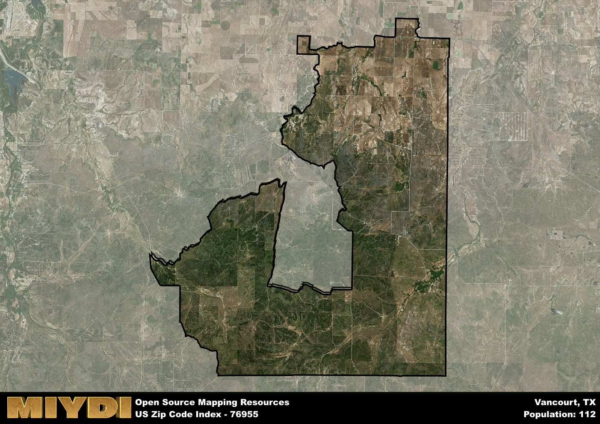

**Area Name:** Vancourt

**Zip Code:** 76955

**State:** TX

Vancourt is a part of the San Angelo - TX Metro Area, and makes up  of the Metro's population.  

# Vancourt: A Historic and Vibrant Community in West Texas

Located in West Texas, zip code 76955 encompasses the charming neighborhood of Vancourt. Situated within Tom Green County, Vancourt is surrounded by the natural beauty of the region, with the city of San Angelo just a short drive away. The area is well-connected by major highways, providing easy access to neighboring towns and cities, making it a desirable residential area for those seeking a peaceful small-town atmosphere with proximity to urban amenities.

Vancourt has a rich historical background, dating back to its early settlement by pioneers in the late 19th century. The community was named after an early settler, James Van Court, who played a significant role in the area's development. Over the years, Vancourt grew into a thriving agricultural hub, with farming and ranching as the primary economic activities. The area also witnessed the construction of churches, schools, and community centers, shaping its identity as a close-knit and resilient community.

Today, Vancourt maintains its strong sense of community while embracing modern amenities and services. The neighborhood supports a mix of agricultural and commercial enterprises, contributing to its economic vitality. Residents enjoy access to local shops, restaurants, and recreational facilities, enhancing their quality of life. Additionally, Vancourt is home to historic sites and cultural landmarks that showcase its unique heritage, attracting visitors and preserving the area's legacy for future generations.

# Vancourt Demographics

The population of Vancourt is 112.  
Vancourt has a population density of 0.67 per square mile.  
The area of Vancourt is 166.54 square miles.  

## Vancourt AI and Census Variables

The values presented in this dataset for Vancourt are AI-optimized, streamlined, and categorized into relevant buckets for enhanced utility in AI and mapping programs. These simplified values have been optimized to facilitate efficient analysis and integration into various technological applications, offering users accessible and actionable insights into demographics within the Vancourt area.

| AI Variables for Vancourt | Value |
|-------------|-------|
| Shape Area | 591370913.804688 |
| Shape Length | 176108.774183718 |
| CBSA Federal Processing Standard Code | 41660 |

## How to use this free AI optimized Geo-Spatial Data for Vancourt, TX

This data is made freely available under the Creative Commons license, allowing for unrestricted use for any purpose. Users can access static resources directly from GitHub or leverage more advanced functionalities by utilizing the GeoJSON files. All datasets originate from official government or private sector sources and are meticulously compiled into relevant datasets within QGIS. However, the versatility of the data ensures compatibility with any mapping application.

## Data Accuracy Disclaimer
It's important to note that the data provided here may contain errors or discrepancies and should be considered as 'close enough' for business applications and AI rather than a definitive source of truth. This data is aggregated from multiple sources, some of which publish information on wildly different intervals, leading to potential inconsistencies. Additionally, certain data points may not be corrected for Covid-related changes, further impacting accuracy. Moreover, the assumption that demographic trends are consistent throughout a region may lead to discrepancies, as trends often concentrate in areas of highest population density. As a result, dense areas may be slightly underrepresented, while rural areas may be slightly overrepresented, resulting in a more conservative dataset. Furthermore, the focus primarily on areas within US Major and Minor Statistical areas means that approximately 40 million Americans living outside of these areas may not be fully represented. Lastly, the historical background and area descriptions generated using AI are susceptible to potential mistakes, so users should exercise caution when interpreting the information provided.
