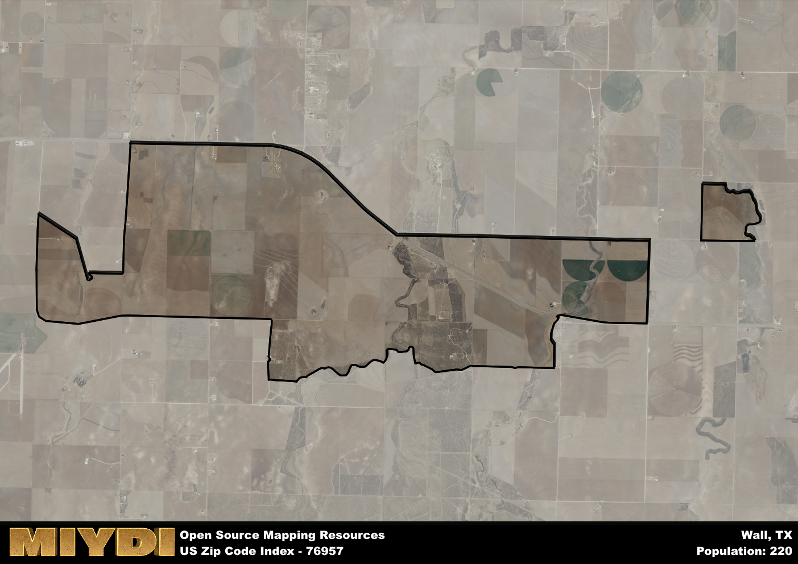

**Area Name:** Wall

**Zip Code:** 76957

**State:** TX

Wall is a part of the San Angelo - TX Metro Area, and makes up  of the Metro's population.  

# Wall, Texas: A Charming Community in the Heart of West Texas

Located in the heart of West Texas, zip code 76957 encompasses the charming community of Wall. Situated just east of San Angelo, Wall is a small, close-knit neighborhood that boasts a peaceful rural setting while still being within driving distance of major population centers and cities like Midland and Odessa. The area is known for its vast open spaces, rolling hills, and agricultural landscapes, making it an ideal retreat for those seeking a quiet and serene lifestyle.

Founded in the late 19th century, Wall has a rich historical narrative that dates back to the days of early settlers and pioneers in Texas. The community was named after a local landowner and has since grown into a vibrant and thriving rural community. Over the years, Wall has seen periods of growth and development, with agriculture playing a significant role in shaping the area's economy. Today, the community prides itself on its strong sense of community, with residents actively involved in local events and initiatives that promote the area's heritage and traditions.

Presently, Wall is a bustling community that offers a range of neighborhood-specific services and amenities. The area is home to family-owned businesses, farms, and ranches that contribute to the local economy. Residents and visitors alike can enjoy recreational activities such as hiking, fishing, and hunting in the surrounding natural landscapes. Additionally, Wall is known for its friendly atmosphere and welcoming community spirit, making it a desirable place to live and visit in West Texas.

# Wall Demographics

The population of Wall is 220.  
Wall has a population density of 19.01 per square mile.  
The area of Wall is 11.57 square miles.  

## Wall Income and Economic Data

These demographic numbers are sourced from IRS return data, providing comprehensive insights into the population dynamics and economic trends within Wall.

**Breakdown of return types for Wall**

The table offers insight into the composition of tax returns filed with the IRS, categorizing them into three main types. Single returns represent filings by individuals, joint returns by married couples, and head of household returns by individuals who qualify as heads of households, typically having dependents. This breakdown provides an understanding of the different filing statuses adopted by taxpayers when submitting their tax documentation.

| Return Types filed for Wall                              | Percentage          |
|----------------------------------------------------------|---------------------|
| Single Returns                                            | 0.28 |
| Joint Returns                                             | 0.72 |
| Head Household Returns                                    | 0 |

The income and economic data presented here is sourced from the IRS income brackets, utilized for categorizing tax returns by income levels. This table displays income ranges for both single filers and married couples, along with the corresponding number of returns and the percentage within each bracket, providing valuable insight into the distribution of taxes across various income groups.

| Bracket Name       | Single Filer Income Range | Married Couple Range | Number of Returns | Percentage of Returns |
|--------------------|----------------------------|----------------------|-------------------|-----------------------|
| 10% Bracket        | Up to $10,275              | Up to $20,550        | 40 | 0.22% |
| 12% Bracket        | $10,276 - $41,775          | $20,551 - $83,550    | 40 | 0.22% |
| 22% Bracket        | $41,776 - $89,075          | $83,551 - $178,150   | 0 | 0% |
| 24% Bracket        | $89,076 - $170,050         | $178,151 - $340,100  | 0 | 0% |
| 32% Bracket        | $170,051 - $215,950        | $340,101 - $431,900  | 60 | 0.33% |
| 35% Bracket        | $215,951 - $539,900        | $431,901 - $647,850  | 40 | 0.22% |

### Exploring Taxpayer Diversity: A Breakdown of Different Types of Tax Returns in Wall

The table offers insights into various types of tax returns filed, reflecting different aspects of taxpayer activities and demographics. Categories include charitable returns for donations, dependent returns for claimed dependents, educator population, elderly population, real estate returns, self-employment returns, student loan returns, and unemployment returns, providing valuable insights into taxpayer behavior and demographics.

| Wall Filing Types                    | Count | Percentage |
|--------------------------------------|-------|------------|
| Charitable Donations                 | 30 | 0.167% |
| Dependents Claimed                   | 20 | 0.111% |
| Educator Residents                   | 0 | 0% |
| Elderly Population                   | 30 | 0.17% |
| Farming Population                   | 30 | 0.167% |
| Real Estate Transactions             | 30 | 0.167% |
| Self-Employed Individuals            | 40 | 0.222% |
| Student Loan Cases                   | 0 | 0% |
| Unemployment Benefit Filings         | 0 | 0% |

## Wall AI and Census Variables

The values presented in this dataset for Wall are AI-optimized, streamlined, and categorized into relevant buckets for enhanced utility in AI and mapping programs. These simplified values have been optimized to facilitate efficient analysis and integration into various technological applications, offering users accessible and actionable insights into demographics within the Wall area.

| AI Variables for Wall | Value |
|-------------|-------|
| Shape Area | 41202511.4453125 |
| Shape Length | 44176.8978168264 |
| CBSA Federal Processing Standard Code | 41660 |

## How to use this free AI optimized Geo-Spatial Data for Wall, TX

This data is made freely available under the Creative Commons license, allowing for unrestricted use for any purpose. Users can access static resources directly from GitHub or leverage more advanced functionalities by utilizing the GeoJSON files. All datasets originate from official government or private sector sources and are meticulously compiled into relevant datasets within QGIS. However, the versatility of the data ensures compatibility with any mapping application.

## Data Accuracy Disclaimer
It's important to note that the data provided here may contain errors or discrepancies and should be considered as 'close enough' for business applications and AI rather than a definitive source of truth. This data is aggregated from multiple sources, some of which publish information on wildly different intervals, leading to potential inconsistencies. Additionally, certain data points may not be corrected for Covid-related changes, further impacting accuracy. Moreover, the assumption that demographic trends are consistent throughout a region may lead to discrepancies, as trends often concentrate in areas of highest population density. As a result, dense areas may be slightly underrepresented, while rural areas may be slightly overrepresented, resulting in a more conservative dataset. Furthermore, the focus primarily on areas within US Major and Minor Statistical areas means that approximately 40 million Americans living outside of these areas may not be fully represented. Lastly, the historical background and area descriptions generated using AI are susceptible to potential mistakes, so users should exercise caution when interpreting the information provided.
