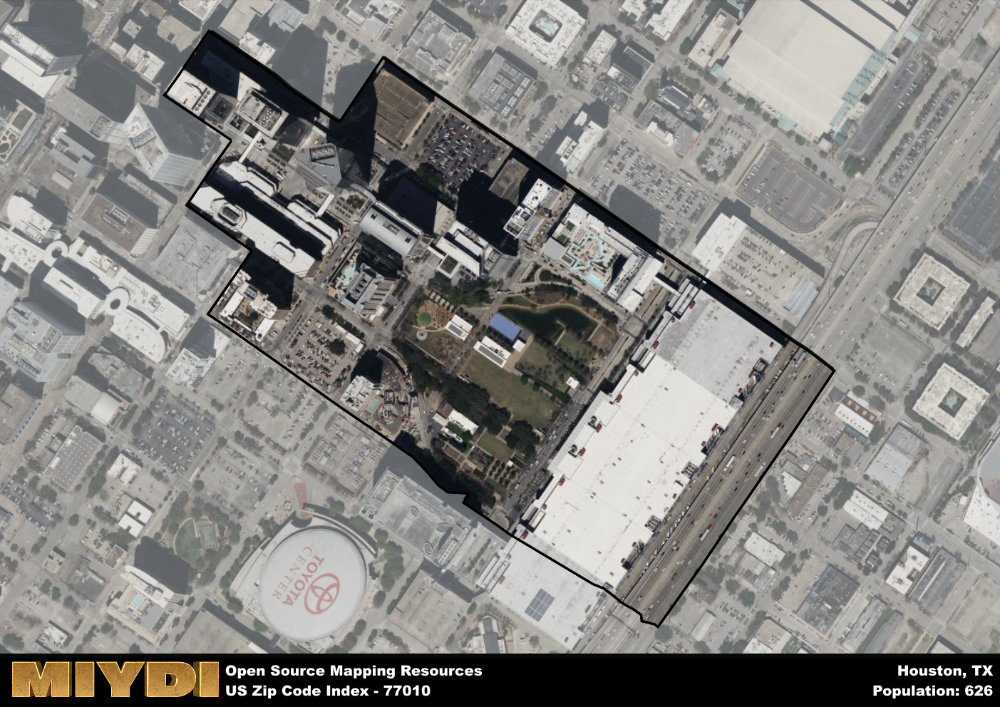

**Area Name:** Houston

**Zip Code:** 77010

**State:** TX

Houston is a part of the Houston-The Woodlands-Sugar Land - TX Metro Area, and makes up  of the Metro's population.  

# Vibrant Urban Living in Houston's 77010 Zip Code

Located in the heart of downtown Houston, the 77010 zip code encompasses the bustling neighborhood of Central Business District. Bordered by major thoroughfares like Smith Street, Louisiana Street, and Buffalo Bayou, this area seamlessly integrates with surrounding districts such as Midtown, Fourth Ward, and EaDo. As part of the larger metropolitan context of Houston, the Central Business District serves as a hub for commerce, culture, and entertainment, with easy access to major corporate headquarters, theaters, and sports arenas.

The Central Business District has a rich historical narrative that dates back to the early 19th century when Houston was founded. Originally a hub for trading and commerce, the area quickly grew into a center for finance and industry, attracting businesses and residents alike. Over the years, the neighborhood underwent various transformations, including the construction of iconic skyscrapers like the JPMorgan Chase Tower and the Wells Fargo Plaza, solidifying its status as a dynamic urban core within Houston.

Today, the 77010 zip code is a vibrant and thriving community that offers a mix of residential, commercial, and recreational opportunities. From luxury high-rise apartments to trendy restaurants and bars, the Central Business District caters to a diverse population of professionals, tourists, and residents. In addition to its bustling business scene, the area boasts green spaces like Discovery Green Park, cultural attractions such as the Houston Theater District, and historic sites like Market Square Park, making it a truly unique and dynamic part of Houston's urban fabric.

# Houston Demographics

The population of Houston is 626.  
Houston has a population density of 5216.67 per square mile.  
The area of Houston is 0.12 square miles.  

## Houston Income and Economic Data

These demographic numbers are sourced from IRS return data, providing comprehensive insights into the population dynamics and economic trends within Houston.

**Breakdown of return types for Houston**

The table offers insight into the composition of tax returns filed with the IRS, categorizing them into three main types. Single returns represent filings by individuals, joint returns by married couples, and head of household returns by individuals who qualify as heads of households, typically having dependents. This breakdown provides an understanding of the different filing statuses adopted by taxpayers when submitting their tax documentation.

| Return Types filed for Houston                              | Percentage          |
|----------------------------------------------------------|---------------------|
| Single Returns                                            | 0.48 |
| Joint Returns                                             | 0.41 |
| Head Household Returns                                    | 0 |

The income and economic data presented here is sourced from the IRS income brackets, utilized for categorizing tax returns by income levels. This table displays income ranges for both single filers and married couples, along with the corresponding number of returns and the percentage within each bracket, providing valuable insight into the distribution of taxes across various income groups.

| Bracket Name       | Single Filer Income Range | Married Couple Range | Number of Returns | Percentage of Returns |
|--------------------|----------------------------|----------------------|-------------------|-----------------------|
| 10% Bracket        | Up to $10,275              | Up to $20,550        | 20 | 0.07% |
| 12% Bracket        | $10,276 - $41,775          | $20,551 - $83,550    | 30 | 0.1% |
| 22% Bracket        | $41,776 - $89,075          | $83,551 - $178,150   | 40 | 0.14% |
| 24% Bracket        | $89,076 - $170,050         | $178,151 - $340,100  | 0 | 0% |
| 32% Bracket        | $170,051 - $215,950        | $340,101 - $431,900  | 60 | 0.21% |
| 35% Bracket        | $215,951 - $539,900        | $431,901 - $647,850  | 140 | 0.48% |

### Exploring Taxpayer Diversity: A Breakdown of Different Types of Tax Returns in Houston

The table offers insights into various types of tax returns filed, reflecting different aspects of taxpayer activities and demographics. Categories include charitable returns for donations, dependent returns for claimed dependents, educator population, elderly population, real estate returns, self-employment returns, student loan returns, and unemployment returns, providing valuable insights into taxpayer behavior and demographics.

| Houston Filing Types                    | Count | Percentage |
|--------------------------------------|-------|------------|
| Charitable Donations                 | 50 | 0.172% |
| Dependents Claimed                   | 0 | 0% |
| Educator Residents                   | 0 | 0% |
| Elderly Population                   | 90 | 0.31% |
| Farming Population                   | 0 | 0% |
| Real Estate Transactions             | 40 | 0.138% |
| Self-Employed Individuals            | 70 | 0.241% |
| Student Loan Cases                   | 0 | 0% |
| Unemployment Benefit Filings         | 0 | 0% |

## Houston AI and Census Variables

The values presented in this dataset for Houston are AI-optimized, streamlined, and categorized into relevant buckets for enhanced utility in AI and mapping programs. These simplified values have been optimized to facilitate efficient analysis and integration into various technological applications, offering users accessible and actionable insights into demographics within the Houston area.

| AI Variables for Houston | Value |
|-------------|-------|
| Shape Area | 421554.109375 |
| Shape Length | 3055.812639213 |
| CBSA Federal Processing Standard Code | 26420 |

## How to use this free AI optimized Geo-Spatial Data for Houston, TX

This data is made freely available under the Creative Commons license, allowing for unrestricted use for any purpose. Users can access static resources directly from GitHub or leverage more advanced functionalities by utilizing the GeoJSON files. All datasets originate from official government or private sector sources and are meticulously compiled into relevant datasets within QGIS. However, the versatility of the data ensures compatibility with any mapping application.

## Data Accuracy Disclaimer
It's important to note that the data provided here may contain errors or discrepancies and should be considered as 'close enough' for business applications and AI rather than a definitive source of truth. This data is aggregated from multiple sources, some of which publish information on wildly different intervals, leading to potential inconsistencies. Additionally, certain data points may not be corrected for Covid-related changes, further impacting accuracy. Moreover, the assumption that demographic trends are consistent throughout a region may lead to discrepancies, as trends often concentrate in areas of highest population density. As a result, dense areas may be slightly underrepresented, while rural areas may be slightly overrepresented, resulting in a more conservative dataset. Furthermore, the focus primarily on areas within US Major and Minor Statistical areas means that approximately 40 million Americans living outside of these areas may not be fully represented. Lastly, the historical background and area descriptions generated using AI are susceptible to potential mistakes, so users should exercise caution when interpreting the information provided.
