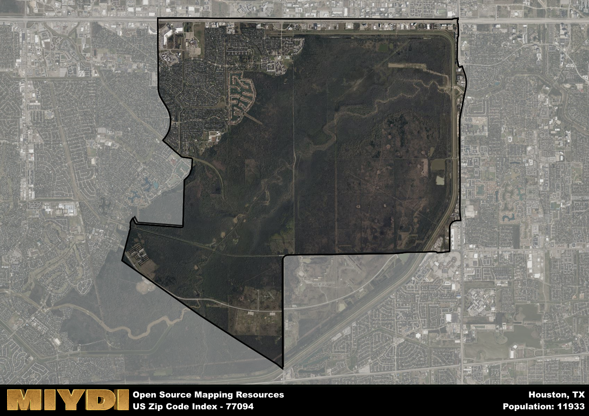

**Area Name:** Houston

**Zip Code:** 77094

**State:** TX

Houston is a part of the Houston-The Woodlands-Sugar Land - TX Metro Area, and makes up  of the Metro's population.  

# Exploring the Vibrant Neighborhood of Energy Corridor in Houston, TX

Located in the western part of Houston, the zip code area 77094 encompasses the bustling neighborhood known as Energy Corridor. Bordered by Interstate 10 to the north and Buffalo Bayou to the south, this area seamlessly integrates with nearby districts such as Memorial and Westchase. As part of the larger Houston metropolitan area, Energy Corridor serves as a hub for energy companies and corporate offices, attracting a diverse population of residents and visitors.

Energy Corridor has a rich historical background, initially developed in the 1970s as a response to the booming oil industry in Houston. Over the years, the neighborhood has expanded to include a mix of residential, commercial, and recreational spaces. The area's name pays homage to its strong connection to the energy sector, with many major companies establishing headquarters or offices in the region. This growth has transformed Energy Corridor into a dynamic and thriving community with a unique identity.

Today, Energy Corridor is a vibrant and bustling neighborhood offering a wide range of amenities and services. From upscale shopping centers and dining establishments to well-maintained parks and green spaces, residents and visitors alike can enjoy a high quality of life in this area. The neighborhood is also home to several cultural and historic sites, showcasing the rich heritage of Houston. With a strong emphasis on economic development and community engagement, Energy Corridor continues to evolve as a sought-after destination within the greater Houston area.

# Houston Demographics

The population of Houston is 11933.  
Houston has a population density of 692.57 per square mile.  
The area of Houston is 17.23 square miles.  

## Houston Income and Economic Data

These demographic numbers are sourced from IRS return data, providing comprehensive insights into the population dynamics and economic trends within Houston.

**Breakdown of return types for Houston**

The table offers insight into the composition of tax returns filed with the IRS, categorizing them into three main types. Single returns represent filings by individuals, joint returns by married couples, and head of household returns by individuals who qualify as heads of households, typically having dependents. This breakdown provides an understanding of the different filing statuses adopted by taxpayers when submitting their tax documentation.

| Return Types filed for Houston                              | Percentage          |
|----------------------------------------------------------|---------------------|
| Single Returns                                            | 0.4 |
| Joint Returns                                             | 0.52 |
| Head Household Returns                                    | 0.07 |

The income and economic data presented here is sourced from the IRS income brackets, utilized for categorizing tax returns by income levels. This table displays income ranges for both single filers and married couples, along with the corresponding number of returns and the percentage within each bracket, providing valuable insight into the distribution of taxes across various income groups.

| Bracket Name       | Single Filer Income Range | Married Couple Range | Number of Returns | Percentage of Returns |
|--------------------|----------------------------|----------------------|-------------------|-----------------------|
| 10% Bracket        | Up to $10,275              | Up to $20,550        | 1130 | 0.22% |
| 12% Bracket        | $10,276 - $41,775          | $20,551 - $83,550    | 730 | 0.14% |
| 22% Bracket        | $41,776 - $89,075          | $83,551 - $178,150   | 500 | 0.1% |
| 24% Bracket        | $89,076 - $170,050         | $178,151 - $340,100  | 370 | 0.07% |
| 32% Bracket        | $170,051 - $215,950        | $340,101 - $431,900  | 1090 | 0.21% |
| 35% Bracket        | $215,951 - $539,900        | $431,901 - $647,850  | 1280 | 0.25% |

### Exploring Taxpayer Diversity: A Breakdown of Different Types of Tax Returns in Houston

The table offers insights into various types of tax returns filed, reflecting different aspects of taxpayer activities and demographics. Categories include charitable returns for donations, dependent returns for claimed dependents, educator population, elderly population, real estate returns, self-employment returns, student loan returns, and unemployment returns, providing valuable insights into taxpayer behavior and demographics.

| Houston Filing Types                    | Count | Percentage |
|--------------------------------------|-------|------------|
| Charitable Donations                 | 650 | 0.127% |
| Dependents Claimed                   | 280 | 0.055% |
| Educator Residents                   | 130 | 0.025% |
| Elderly Population                   | 1390 | 0.27% |
| Farming Population                   | 50 | 0.01% |
| Real Estate Transactions             | 680 | 0.133% |
| Self-Employed Individuals            | 840 | 0.165% |
| Student Loan Cases                   | 190 | 0.037% |
| Unemployment Benefit Filings         | 790 | 0.15% |

## Houston AI and Census Variables

The values presented in this dataset for Houston are AI-optimized, streamlined, and categorized into relevant buckets for enhanced utility in AI and mapping programs. These simplified values have been optimized to facilitate efficient analysis and integration into various technological applications, offering users accessible and actionable insights into demographics within the Houston area.

| AI Variables for Houston | Value |
|-------------|-------|
| Shape Area | 59399284.515625 |
| Shape Length | 37197.3859174785 |
| CBSA Federal Processing Standard Code | 26420 |

## How to use this free AI optimized Geo-Spatial Data for Houston, TX

This data is made freely available under the Creative Commons license, allowing for unrestricted use for any purpose. Users can access static resources directly from GitHub or leverage more advanced functionalities by utilizing the GeoJSON files. All datasets originate from official government or private sector sources and are meticulously compiled into relevant datasets within QGIS. However, the versatility of the data ensures compatibility with any mapping application.

## Data Accuracy Disclaimer
It's important to note that the data provided here may contain errors or discrepancies and should be considered as 'close enough' for business applications and AI rather than a definitive source of truth. This data is aggregated from multiple sources, some of which publish information on wildly different intervals, leading to potential inconsistencies. Additionally, certain data points may not be corrected for Covid-related changes, further impacting accuracy. Moreover, the assumption that demographic trends are consistent throughout a region may lead to discrepancies, as trends often concentrate in areas of highest population density. As a result, dense areas may be slightly underrepresented, while rural areas may be slightly overrepresented, resulting in a more conservative dataset. Furthermore, the focus primarily on areas within US Major and Minor Statistical areas means that approximately 40 million Americans living outside of these areas may not be fully represented. Lastly, the historical background and area descriptions generated using AI are susceptible to potential mistakes, so users should exercise caution when interpreting the information provided.
