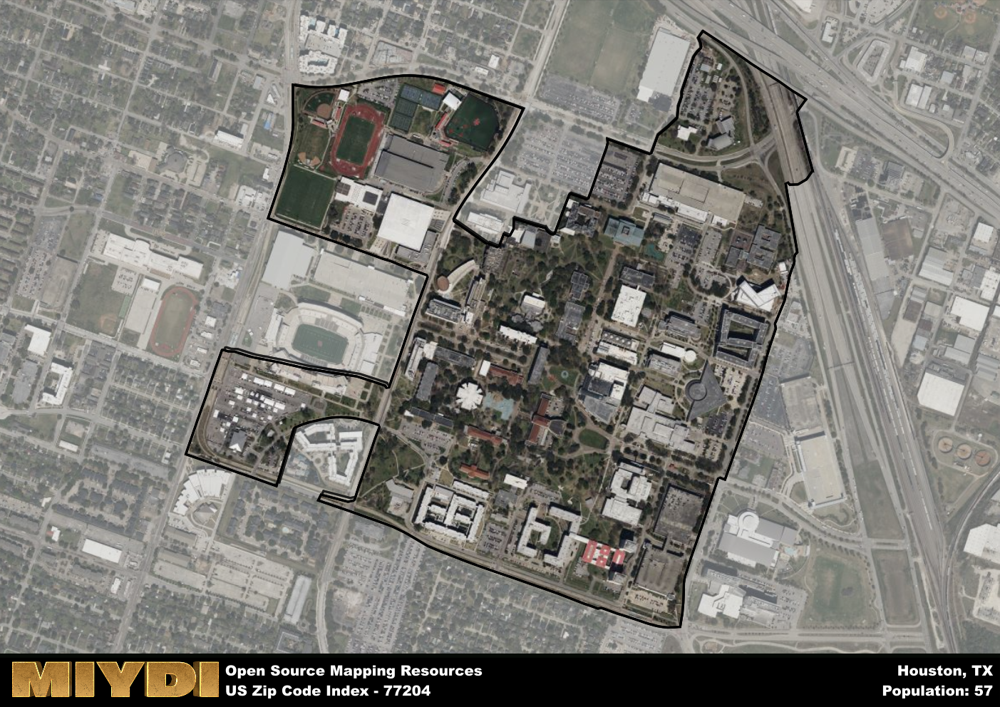

**Area Name:** Houston

**Zip Code:** 77204

**State:** TX

Houston is a part of the Houston-The Woodlands-Sugar Land - TX Metro Area, and makes up  of the Metro's population.  

# Hidden Gem in Houston: Zip Code 77204  
Zip code 77204 encompasses the University of Houston campus, located in the heart of Houston, Texas. Bordered by Interstate 45 to the west and Cullen Boulevard to the east, this area is seamlessly integrated into the Greater Houston metropolitan area. As a vibrant educational hub, the University of Houston plays a key role in shaping the academic and cultural landscape of the region.

The history of zip code 77204 is deeply intertwined with the growth of the University of Houston. Founded in 1927, the university has evolved into a prestigious institution known for its diverse student body and innovative research programs. Over the years, the campus has expanded to include state-of-the-art facilities and renowned academic departments, attracting students and scholars from around the world. Today, zip code 77204 stands as a symbol of academic excellence and intellectual curiosity.

Presently, zip code 77204 boasts a dynamic mix of academic buildings, student dormitories, and recreational facilities. The area is home to a bustling student population, with a plethora of dining options, bookstores, and green spaces for relaxation. Additionally, the University of Houston campus hosts various cultural events, art exhibitions, and sports games throughout the year, enriching the local community and fostering a sense of pride among residents. Zip code 77204 is not just an educational center but a vibrant neighborhood where learning and creativity thrive.

# Houston Demographics

The population of Houston is 57.  
Houston has a population density of 123.91 per square mile.  
The area of Houston is 0.46 square miles.  

## Houston AI and Census Variables

The values presented in this dataset for Houston are AI-optimized, streamlined, and categorized into relevant buckets for enhanced utility in AI and mapping programs. These simplified values have been optimized to facilitate efficient analysis and integration into various technological applications, offering users accessible and actionable insights into demographics within the Houston area.

| AI Variables for Houston | Value |
|-------------|-------|
| Shape Area | 1595122.83203125 |
| Shape Length | 8392.12623378617 |
| CBSA Federal Processing Standard Code | 26420 |

## How to use this free AI optimized Geo-Spatial Data for Houston, TX

This data is made freely available under the Creative Commons license, allowing for unrestricted use for any purpose. Users can access static resources directly from GitHub or leverage more advanced functionalities by utilizing the GeoJSON files. All datasets originate from official government or private sector sources and are meticulously compiled into relevant datasets within QGIS. However, the versatility of the data ensures compatibility with any mapping application.

## Data Accuracy Disclaimer
It's important to note that the data provided here may contain errors or discrepancies and should be considered as 'close enough' for business applications and AI rather than a definitive source of truth. This data is aggregated from multiple sources, some of which publish information on wildly different intervals, leading to potential inconsistencies. Additionally, certain data points may not be corrected for Covid-related changes, further impacting accuracy. Moreover, the assumption that demographic trends are consistent throughout a region may lead to discrepancies, as trends often concentrate in areas of highest population density. As a result, dense areas may be slightly underrepresented, while rural areas may be slightly overrepresented, resulting in a more conservative dataset. Furthermore, the focus primarily on areas within US Major and Minor Statistical areas means that approximately 40 million Americans living outside of these areas may not be fully represented. Lastly, the historical background and area descriptions generated using AI are susceptible to potential mistakes, so users should exercise caution when interpreting the information provided.
