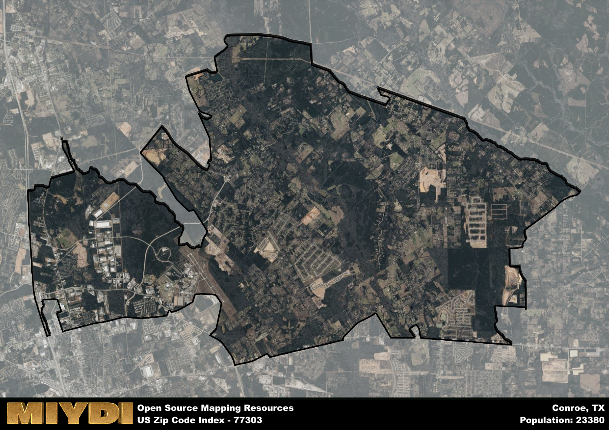

**Area Name:** Conroe

**Zip Code:** 77303

**State:** TX

Conroe is a part of the Houston-The Woodlands-Sugar Land - TX Metro Area, and makes up  of the Metro's population.  

# Conroe, TX 77303: A Historical and Vibrant Neighborhood in Greater Houston  

Located in the heart of Montgomery County, the zip code 77303 encompasses the lively neighborhood of Conroe, Texas. Bordered by Willis to the north, Cut and Shoot to the east, and the city of Conroe to the south, this area is an integral part of the Greater Houston metropolitan region. With its proximity to major highways like Interstate 45 and State Highway 105, Conroe 77303 serves as a gateway to the natural beauty of the Sam Houston National Forest and Lake Conroe, while also offering easy access to the amenities of downtown Houston.

Established in the late 19th century, the area now known as Conroe 77303 was initially a hub for lumber and oil industries. Named after Isaac Conroe, a Union Calvary officer, the neighborhood flourished as a commercial center due to its strategic location along the railroad. Over the years, Conroe has evolved into a vibrant residential community with a rich cultural heritage. The area still retains its historical charm with well-preserved buildings and landmarks that showcase its past while embracing modern development and growth.

Today, Conroe 77303 thrives as a diverse and thriving neighborhood within the Greater Houston area. The local economy is driven by a mix of industries, including healthcare, education, and retail. Residents and visitors alike can enjoy a range of recreational activities, from hiking and fishing in the nearby National Forest to attending concerts at the Crighton Theatre. The neighborhood also boasts a variety of dining options, shopping centers, and community events that contribute to its dynamic atmosphere. With its blend of historical significance and modern amenities, Conroe 77303 continues to be a sought-after destination for those looking to experience the best of Texas living.

# Conroe Demographics

The population of Conroe is 23380.  
Conroe has a population density of 379.24 per square mile.  
The area of Conroe is 61.65 square miles.  

## Conroe Income and Economic Data

These demographic numbers are sourced from IRS return data, providing comprehensive insights into the population dynamics and economic trends within Conroe.

**Breakdown of return types for Conroe**

The table offers insight into the composition of tax returns filed with the IRS, categorizing them into three main types. Single returns represent filings by individuals, joint returns by married couples, and head of household returns by individuals who qualify as heads of households, typically having dependents. This breakdown provides an understanding of the different filing statuses adopted by taxpayers when submitting their tax documentation.

| Return Types filed for Conroe                              | Percentage          |
|----------------------------------------------------------|---------------------|
| Single Returns                                            | 0.43 |
| Joint Returns                                             | 0.39 |
| Head Household Returns                                    | 0.16 |

The income and economic data presented here is sourced from the IRS income brackets, utilized for categorizing tax returns by income levels. This table displays income ranges for both single filers and married couples, along with the corresponding number of returns and the percentage within each bracket, providing valuable insight into the distribution of taxes across various income groups.

| Bracket Name       | Single Filer Income Range | Married Couple Range | Number of Returns | Percentage of Returns |
|--------------------|----------------------------|----------------------|-------------------|-----------------------|
| 10% Bracket        | Up to $10,275              | Up to $20,550        | 3400 | 0.36% |
| 12% Bracket        | $10,276 - $41,775          | $20,551 - $83,550    | 2480 | 0.27% |
| 22% Bracket        | $41,776 - $89,075          | $83,551 - $178,150   | 1290 | 0.14% |
| 24% Bracket        | $89,076 - $170,050         | $178,151 - $340,100  | 810 | 0.09% |
| 32% Bracket        | $170,051 - $215,950        | $340,101 - $431,900  | 1140 | 0.12% |
| 35% Bracket        | $215,951 - $539,900        | $431,901 - $647,850  | 200 | 0.02% |

### Exploring Taxpayer Diversity: A Breakdown of Different Types of Tax Returns in Conroe

The table offers insights into various types of tax returns filed, reflecting different aspects of taxpayer activities and demographics. Categories include charitable returns for donations, dependent returns for claimed dependents, educator population, elderly population, real estate returns, self-employment returns, student loan returns, and unemployment returns, providing valuable insights into taxpayer behavior and demographics.

| Conroe Filing Types                    | Count | Percentage |
|--------------------------------------|-------|------------|
| Charitable Donations                 | 370 | 0.04% |
| Dependents Claimed                   | 350 | 0.038% |
| Educator Residents                   | 220 | 0.024% |
| Elderly Population                   | 1690 | 0.18% |
| Farming Population                   | 120 | 0.013% |
| Real Estate Transactions             | 350 | 0.038% |
| Self-Employed Individuals            | 1560 | 0.167% |
| Student Loan Cases                   | 400 | 0.043% |
| Unemployment Benefit Filings         | 1510 | 0.16% |

## Conroe AI and Census Variables

The values presented in this dataset for Conroe are AI-optimized, streamlined, and categorized into relevant buckets for enhanced utility in AI and mapping programs. These simplified values have been optimized to facilitate efficient analysis and integration into various technological applications, offering users accessible and actionable insights into demographics within the Conroe area.

| AI Variables for Conroe | Value |
|-------------|-------|
| Shape Area | 215225048.464844 |
| Shape Length | 104363.363320487 |
| CBSA Federal Processing Standard Code | 26420 |

## How to use this free AI optimized Geo-Spatial Data for Conroe, TX

This data is made freely available under the Creative Commons license, allowing for unrestricted use for any purpose. Users can access static resources directly from GitHub or leverage more advanced functionalities by utilizing the GeoJSON files. All datasets originate from official government or private sector sources and are meticulously compiled into relevant datasets within QGIS. However, the versatility of the data ensures compatibility with any mapping application.

## Data Accuracy Disclaimer
It's important to note that the data provided here may contain errors or discrepancies and should be considered as 'close enough' for business applications and AI rather than a definitive source of truth. This data is aggregated from multiple sources, some of which publish information on wildly different intervals, leading to potential inconsistencies. Additionally, certain data points may not be corrected for Covid-related changes, further impacting accuracy. Moreover, the assumption that demographic trends are consistent throughout a region may lead to discrepancies, as trends often concentrate in areas of highest population density. As a result, dense areas may be slightly underrepresented, while rural areas may be slightly overrepresented, resulting in a more conservative dataset. Furthermore, the focus primarily on areas within US Major and Minor Statistical areas means that approximately 40 million Americans living outside of these areas may not be fully represented. Lastly, the historical background and area descriptions generated using AI are susceptible to potential mistakes, so users should exercise caution when interpreting the information provided.
