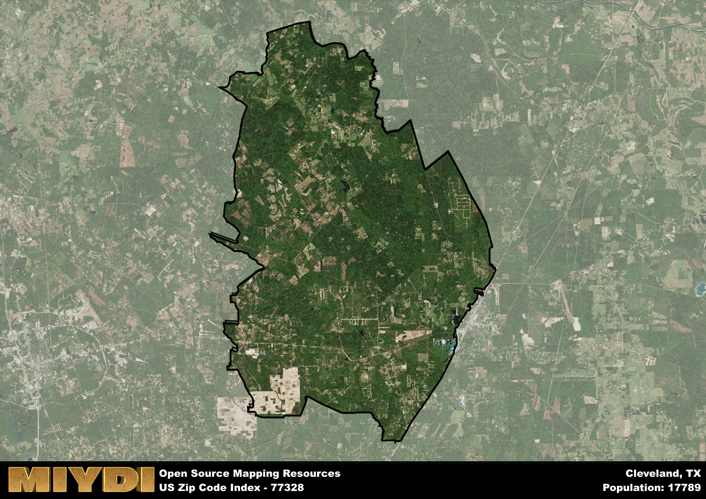

**Area Name:** Cleveland

**Zip Code:** 77328

**State:** TX

Cleveland is a part of the Houston-The Woodlands-Sugar Land - TX Metro Area, and makes up  of the Metro's population.  

# Cleveland, TX (Zip Code: 77328) - A Charming Neighborhood in Greater Houston  

Located in the northeastern part of the Greater Houston metropolitan area, Cleveland, TX is a charming neighborhood that falls within the 77328 zip code. Bordered by the Sam Houston National Forest to the north and the city of Splendora to the south, Cleveland is seamlessly integrated into the larger urban fabric of Houston. Situated along US Highway 59, the neighborhood provides easy access to the amenities of downtown Houston while maintaining its own unique identity and sense of community.

Cleveland has a rich historical narrative that dates back to the early 1800s when it was first settled by pioneers attracted to the area's fertile land and abundant natural resources. The town experienced significant growth in the late 19th century with the arrival of the railroad, which facilitated trade and commerce in the region. Today, Cleveland is known for its small-town charm, friendly residents, and strong sense of community pride that reflects its storied past.

Presently, Cleveland boasts a diverse economy supported by agriculture, manufacturing, and retail sectors. The neighborhood offers a range of neighborhood-specific services such as local shops, restaurants, and schools that cater to the needs of its residents. Outdoor enthusiasts can explore the nearby hiking trails in the Sam Houston National Forest, while history buffs can visit the historic downtown area to admire well-preserved buildings from the town's past. Cleveland, TX is a vibrant neighborhood that blends a rich history with modern amenities, making it a desirable place to live within the Greater Houston area.

# Cleveland Demographics

The population of Cleveland is 17789.  
Cleveland has a population density of 91.98 per square mile.  
The area of Cleveland is 193.41 square miles.  

## Cleveland Income and Economic Data

These demographic numbers are sourced from IRS return data, providing comprehensive insights into the population dynamics and economic trends within Cleveland.

**Breakdown of return types for Cleveland**

The table offers insight into the composition of tax returns filed with the IRS, categorizing them into three main types. Single returns represent filings by individuals, joint returns by married couples, and head of household returns by individuals who qualify as heads of households, typically having dependents. This breakdown provides an understanding of the different filing statuses adopted by taxpayers when submitting their tax documentation.

| Return Types filed for Cleveland                              | Percentage          |
|----------------------------------------------------------|---------------------|
| Single Returns                                            | 0.42 |
| Joint Returns                                             | 0.41 |
| Head Household Returns                                    | 0.15 |

The income and economic data presented here is sourced from the IRS income brackets, utilized for categorizing tax returns by income levels. This table displays income ranges for both single filers and married couples, along with the corresponding number of returns and the percentage within each bracket, providing valuable insight into the distribution of taxes across various income groups.

| Bracket Name       | Single Filer Income Range | Married Couple Range | Number of Returns | Percentage of Returns |
|--------------------|----------------------------|----------------------|-------------------|-----------------------|
| 10% Bracket        | Up to $10,275              | Up to $20,550        | 2930 | 0.39% |
| 12% Bracket        | $10,276 - $41,775          | $20,551 - $83,550    | 1950 | 0.26% |
| 22% Bracket        | $41,776 - $89,075          | $83,551 - $178,150   | 1070 | 0.14% |
| 24% Bracket        | $89,076 - $170,050         | $178,151 - $340,100  | 600 | 0.08% |
| 32% Bracket        | $170,051 - $215,950        | $340,101 - $431,900  | 860 | 0.11% |
| 35% Bracket        | $215,951 - $539,900        | $431,901 - $647,850  | 180 | 0.02% |

### Exploring Taxpayer Diversity: A Breakdown of Different Types of Tax Returns in Cleveland

The table offers insights into various types of tax returns filed, reflecting different aspects of taxpayer activities and demographics. Categories include charitable returns for donations, dependent returns for claimed dependents, educator population, elderly population, real estate returns, self-employment returns, student loan returns, and unemployment returns, providing valuable insights into taxpayer behavior and demographics.

| Cleveland Filing Types                    | Count | Percentage |
|--------------------------------------|-------|------------|
| Charitable Donations                 | 230 | 0.03% |
| Dependents Claimed                   | 180 | 0.024% |
| Educator Residents                   | 130 | 0.017% |
| Elderly Population                   | 1540 | 0.2% |
| Farming Population                   | 220 | 0.029% |
| Real Estate Transactions             | 250 | 0.033% |
| Self-Employed Individuals            | 1290 | 0.17% |
| Student Loan Cases                   | 230 | 0.03% |
| Unemployment Benefit Filings         | 1210 | 0.16% |

## Cleveland AI and Census Variables

The values presented in this dataset for Cleveland are AI-optimized, streamlined, and categorized into relevant buckets for enhanced utility in AI and mapping programs. These simplified values have been optimized to facilitate efficient analysis and integration into various technological applications, offering users accessible and actionable insights into demographics within the Cleveland area.

| AI Variables for Cleveland | Value |
|-------------|-------|
| Shape Area | 675609865.261719 |
| Shape Length | 151134.316199588 |
| CBSA Federal Processing Standard Code | 26420 |

## How to use this free AI optimized Geo-Spatial Data for Cleveland, TX

This data is made freely available under the Creative Commons license, allowing for unrestricted use for any purpose. Users can access static resources directly from GitHub or leverage more advanced functionalities by utilizing the GeoJSON files. All datasets originate from official government or private sector sources and are meticulously compiled into relevant datasets within QGIS. However, the versatility of the data ensures compatibility with any mapping application.

## Data Accuracy Disclaimer
It's important to note that the data provided here may contain errors or discrepancies and should be considered as 'close enough' for business applications and AI rather than a definitive source of truth. This data is aggregated from multiple sources, some of which publish information on wildly different intervals, leading to potential inconsistencies. Additionally, certain data points may not be corrected for Covid-related changes, further impacting accuracy. Moreover, the assumption that demographic trends are consistent throughout a region may lead to discrepancies, as trends often concentrate in areas of highest population density. As a result, dense areas may be slightly underrepresented, while rural areas may be slightly overrepresented, resulting in a more conservative dataset. Furthermore, the focus primarily on areas within US Major and Minor Statistical areas means that approximately 40 million Americans living outside of these areas may not be fully represented. Lastly, the historical background and area descriptions generated using AI are susceptible to potential mistakes, so users should exercise caution when interpreting the information provided.
