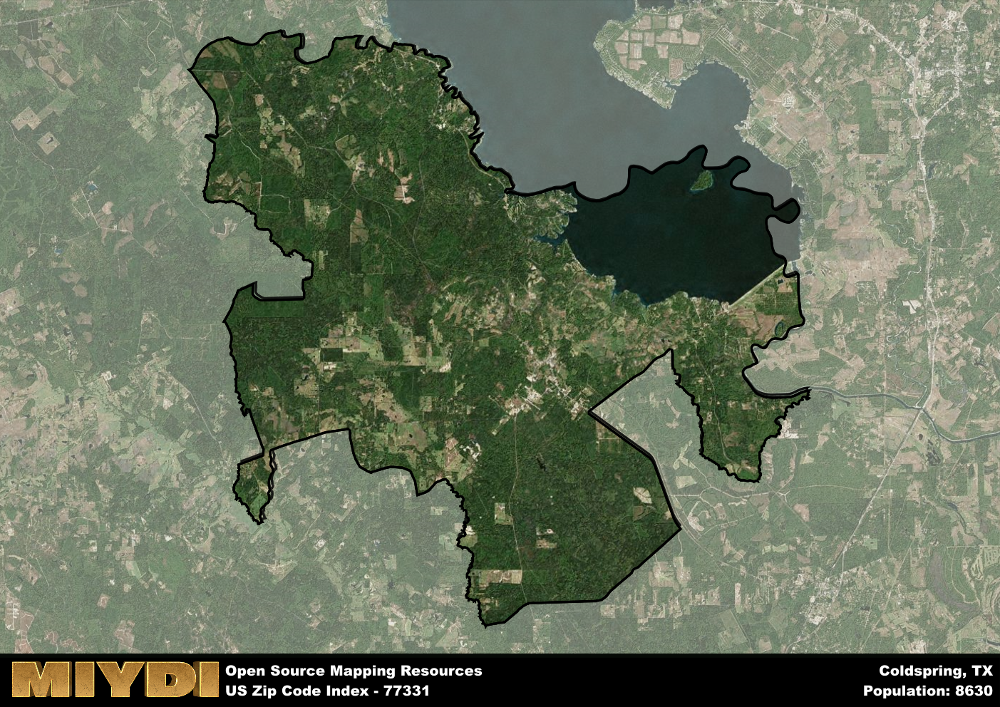

**Area Name:** Coldspring

**Zip Code:** 77331

**State:** TX

# Coldspring: A Charming Zip Code in Texas  

Located in the southeastern part of Texas, zip code 77331 encompasses the charming neighborhood of Coldspring. Situated within San Jacinto County, Coldspring is surrounded by the natural beauty of the Sam Houston National Forest and Lake Livingston. The zip code area is integrated into the larger urban fabric through its proximity to major cities like Houston and Huntsville, making it a popular destination for those seeking a peaceful retreat from the bustling city life.

Coldspring has a rich historical narrative that dates back to its settlement in the mid-19th century. Originally named Cold Spring, the area was known for its refreshing natural springs that attracted settlers. Over the years, Coldspring grew into a bustling community centered around agriculture and timber industries. The area played a significant role in the Texas Revolution and has retained its small-town charm amidst modern developments.

Today, Coldspring offers a mix of residential neighborhoods, local businesses, and recreational amenities. The economy is driven by tourism, outdoor activities, and the service industry. Residents and visitors can enjoy a range of outdoor activities such as fishing, hiking, and camping in the nearby national forest and lake. Coldspring also boasts historic sites like the Old Town Coldspring Square and the San Jacinto County Courthouse Museum, preserving its rich heritage for future generations to appreciate.

# Coldspring Demographics

The population of Coldspring is 8630.  
Coldspring has a population density of 51.74 per square mile.  
The area of Coldspring is 166.79 square miles.  

## Coldspring Income and Economic Data

These demographic numbers are sourced from IRS return data, providing comprehensive insights into the population dynamics and economic trends within Coldspring.

**Breakdown of return types for Coldspring**

The table offers insight into the composition of tax returns filed with the IRS, categorizing them into three main types. Single returns represent filings by individuals, joint returns by married couples, and head of household returns by individuals who qualify as heads of households, typically having dependents. This breakdown provides an understanding of the different filing statuses adopted by taxpayers when submitting their tax documentation.

| Return Types filed for Coldspring                              | Percentage          |
|----------------------------------------------------------|---------------------|
| Single Returns                                            | 0.42 |
| Joint Returns                                             | 0.44 |
| Head Household Returns                                    | 0.13 |

The income and economic data presented here is sourced from the IRS income brackets, utilized for categorizing tax returns by income levels. This table displays income ranges for both single filers and married couples, along with the corresponding number of returns and the percentage within each bracket, providing valuable insight into the distribution of taxes across various income groups.

| Bracket Name       | Single Filer Income Range | Married Couple Range | Number of Returns | Percentage of Returns |
|--------------------|----------------------------|----------------------|-------------------|-----------------------|
| 10% Bracket        | Up to $10,275              | Up to $20,550        | 1130 | 0.35% |
| 12% Bracket        | $10,276 - $41,775          | $20,551 - $83,550    | 740 | 0.23% |
| 22% Bracket        | $41,776 - $89,075          | $83,551 - $178,150   | 470 | 0.15% |
| 24% Bracket        | $89,076 - $170,050         | $178,151 - $340,100  | 330 | 0.1% |
| 32% Bracket        | $170,051 - $215,950        | $340,101 - $431,900  | 430 | 0.13% |
| 35% Bracket        | $215,951 - $539,900        | $431,901 - $647,850  | 140 | 0.04% |

### Exploring Taxpayer Diversity: A Breakdown of Different Types of Tax Returns in Coldspring

The table offers insights into various types of tax returns filed, reflecting different aspects of taxpayer activities and demographics. Categories include charitable returns for donations, dependent returns for claimed dependents, educator population, elderly population, real estate returns, self-employment returns, student loan returns, and unemployment returns, providing valuable insights into taxpayer behavior and demographics.

| Coldspring Filing Types                    | Count | Percentage |
|--------------------------------------|-------|------------|
| Charitable Donations                 | 160 | 0.049% |
| Dependents Claimed                   | 70 | 0.022% |
| Educator Residents                   | 80 | 0.025% |
| Elderly Population                   | 1130 | 0.35% |
| Farming Population                   | 160 | 0.049% |
| Real Estate Transactions             | 170 | 0.052% |
| Self-Employed Individuals            | 450 | 0.139% |
| Student Loan Cases                   | 130 | 0.04% |
| Unemployment Benefit Filings         | 530 | 0.16% |

## Coldspring AI and Census Variables

The values presented in this dataset for Coldspring are AI-optimized, streamlined, and categorized into relevant buckets for enhanced utility in AI and mapping programs. These simplified values have been optimized to facilitate efficient analysis and integration into various technological applications, offering users accessible and actionable insights into demographics within the Coldspring area.

| AI Variables for Coldspring | Value |
|-------------|-------|
| Shape Area | 585109858.269531 |
| Shape Length | 195713.800603819 |

## How to use this free AI optimized Geo-Spatial Data for Coldspring, TX

This data is made freely available under the Creative Commons license, allowing for unrestricted use for any purpose. Users can access static resources directly from GitHub or leverage more advanced functionalities by utilizing the GeoJSON files. All datasets originate from official government or private sector sources and are meticulously compiled into relevant datasets within QGIS. However, the versatility of the data ensures compatibility with any mapping application.

## Data Accuracy Disclaimer
It's important to note that the data provided here may contain errors or discrepancies and should be considered as 'close enough' for business applications and AI rather than a definitive source of truth. This data is aggregated from multiple sources, some of which publish information on wildly different intervals, leading to potential inconsistencies. Additionally, certain data points may not be corrected for Covid-related changes, further impacting accuracy. Moreover, the assumption that demographic trends are consistent throughout a region may lead to discrepancies, as trends often concentrate in areas of highest population density. As a result, dense areas may be slightly underrepresented, while rural areas may be slightly overrepresented, resulting in a more conservative dataset. Furthermore, the focus primarily on areas within US Major and Minor Statistical areas means that approximately 40 million Americans living outside of these areas may not be fully represented. Lastly, the historical background and area descriptions generated using AI are susceptible to potential mistakes, so users should exercise caution when interpreting the information provided.
