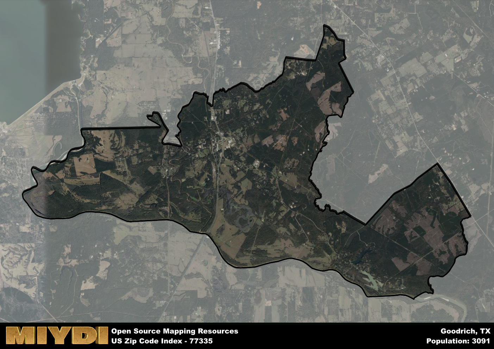

**Area Name:** Goodrich

**Zip Code:** 77335

**State:** TX

# Goodrich: A Charming Community in East Texas  
Located in East Texas, zip code 77335 encompasses the small community of Goodrich. Situated in Polk County, Goodrich is surrounded by the Sam Houston National Forest to the west and the towns of Livingston to the north and Shepherd to the south. The area is known for its lush greenery, serene atmosphere, and proximity to Lake Livingston, making it a popular destination for outdoor enthusiasts and nature lovers.

Goodrich has a rich historical narrative dating back to the early 1800s when it was first settled by pioneers attracted to the fertile land and abundant natural resources. The community grew steadily over the years, with the construction of schools, churches, and businesses contributing to its development. The name "Goodrich" is believed to have been derived from the surname of an early settler, reflecting the strong sense of community and heritage that defines the area to this day.

Today, Goodrich is a close-knit community with a mix of residential, commercial, and agricultural activities. The area boasts a variety of small businesses, restaurants, and local shops that cater to the needs of residents and visitors alike. Recreational opportunities abound, with access to fishing, boating, and hiking in the nearby national forest and lake. Goodrich also has a number of historic sites and landmarks that offer insights into its past, making it a unique and charming destination in East Texas.

# Goodrich Demographics

The population of Goodrich is 3091.  
Goodrich has a population density of 79.38 per square mile.  
The area of Goodrich is 38.94 square miles.  

## Goodrich Income and Economic Data

These demographic numbers are sourced from IRS return data, providing comprehensive insights into the population dynamics and economic trends within Goodrich.

**Breakdown of return types for Goodrich**

The table offers insight into the composition of tax returns filed with the IRS, categorizing them into three main types. Single returns represent filings by individuals, joint returns by married couples, and head of household returns by individuals who qualify as heads of households, typically having dependents. This breakdown provides an understanding of the different filing statuses adopted by taxpayers when submitting their tax documentation.

| Return Types filed for Goodrich                              | Percentage          |
|----------------------------------------------------------|---------------------|
| Single Returns                                            | 0.47 |
| Joint Returns                                             | 0.39 |
| Head Household Returns                                    | 0.14 |

The income and economic data presented here is sourced from the IRS income brackets, utilized for categorizing tax returns by income levels. This table displays income ranges for both single filers and married couples, along with the corresponding number of returns and the percentage within each bracket, providing valuable insight into the distribution of taxes across various income groups.

| Bracket Name       | Single Filer Income Range | Married Couple Range | Number of Returns | Percentage of Returns |
|--------------------|----------------------------|----------------------|-------------------|-----------------------|
| 10% Bracket        | Up to $10,275              | Up to $20,550        | 380 | 0.41% |
| 12% Bracket        | $10,276 - $41,775          | $20,551 - $83,550    | 280 | 0.3% |
| 22% Bracket        | $41,776 - $89,075          | $83,551 - $178,150   | 120 | 0.13% |
| 24% Bracket        | $89,076 - $170,050         | $178,151 - $340,100  | 60 | 0.06% |
| 32% Bracket        | $170,051 - $215,950        | $340,101 - $431,900  | 90 | 0.1% |
| 35% Bracket        | $215,951 - $539,900        | $431,901 - $647,850  | 0 | 0% |

### Exploring Taxpayer Diversity: A Breakdown of Different Types of Tax Returns in Goodrich

The table offers insights into various types of tax returns filed, reflecting different aspects of taxpayer activities and demographics. Categories include charitable returns for donations, dependent returns for claimed dependents, educator population, elderly population, real estate returns, self-employment returns, student loan returns, and unemployment returns, providing valuable insights into taxpayer behavior and demographics.

| Goodrich Filing Types                    | Count | Percentage |
|--------------------------------------|-------|------------|
| Charitable Donations                 | 0 | 0% |
| Dependents Claimed                   | 0 | 0% |
| Educator Residents                   | 0 | 0% |
| Elderly Population                   | 240 | 0.26% |
| Farming Population                   | 30 | 0.032% |
| Real Estate Transactions             | 0 | 0% |
| Self-Employed Individuals            | 150 | 0.161% |
| Student Loan Cases                   | 0 | 0% |
| Unemployment Benefit Filings         | 140 | 0.15% |

## Goodrich AI and Census Variables

The values presented in this dataset for Goodrich are AI-optimized, streamlined, and categorized into relevant buckets for enhanced utility in AI and mapping programs. These simplified values have been optimized to facilitate efficient analysis and integration into various technological applications, offering users accessible and actionable insights into demographics within the Goodrich area.

| AI Variables for Goodrich | Value |
|-------------|-------|
| Shape Area | 136553090.136719 |
| Shape Length | 84295.9873252972 |

## How to use this free AI optimized Geo-Spatial Data for Goodrich, TX

This data is made freely available under the Creative Commons license, allowing for unrestricted use for any purpose. Users can access static resources directly from GitHub or leverage more advanced functionalities by utilizing the GeoJSON files. All datasets originate from official government or private sector sources and are meticulously compiled into relevant datasets within QGIS. However, the versatility of the data ensures compatibility with any mapping application.

## Data Accuracy Disclaimer
It's important to note that the data provided here may contain errors or discrepancies and should be considered as 'close enough' for business applications and AI rather than a definitive source of truth. This data is aggregated from multiple sources, some of which publish information on wildly different intervals, leading to potential inconsistencies. Additionally, certain data points may not be corrected for Covid-related changes, further impacting accuracy. Moreover, the assumption that demographic trends are consistent throughout a region may lead to discrepancies, as trends often concentrate in areas of highest population density. As a result, dense areas may be slightly underrepresented, while rural areas may be slightly overrepresented, resulting in a more conservative dataset. Furthermore, the focus primarily on areas within US Major and Minor Statistical areas means that approximately 40 million Americans living outside of these areas may not be fully represented. Lastly, the historical background and area descriptions generated using AI are susceptible to potential mistakes, so users should exercise caution when interpreting the information provided.
