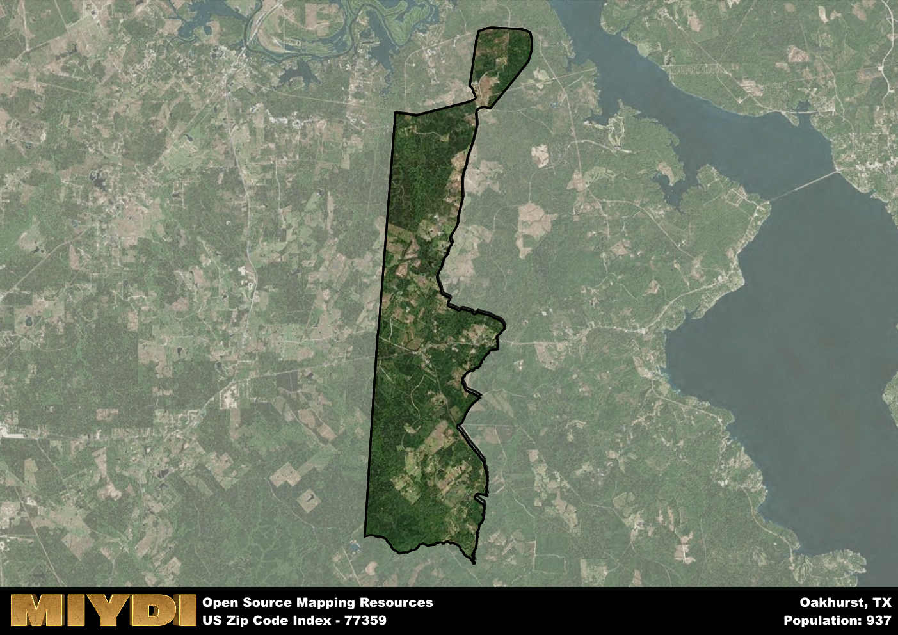

**Area Name:** Oakhurst

**Zip Code:** 77359

**State:** TX

Oakhurst is a part of the Huntsville - TX Micro Area, and makes up  of the Metro's population.  

# Oakhurst (77359): A Charming Neighborhood in East Texas  

Oakhurst, located in zip code 77359, is a quaint neighborhood situated in San Jacinto County, Texas. Bordered by the Sam Houston National Forest to the east and Lake Conroe to the west, Oakhurst seamlessly integrates into the natural beauty of the surrounding landscape. Despite its serene setting, Oakhurst is conveniently located near major cities such as Houston and Conroe, making it a popular choice for those seeking a peaceful retreat while still having access to urban amenities.

Originally settled in the late 1800s, Oakhurst has a rich history rooted in the timber industry and the development of the railroad. The area experienced a period of growth in the early 20th century, attracting residents with its abundance of timber resources and opportunities for employment. The neighborhood was officially named Oakhurst due to its proximity to the vast oak forests that once covered the region, a nod to its natural surroundings that continue to define its character today.

Today, Oakhurst is a tight-knit community known for its friendly atmosphere and small-town charm. The area boasts a mix of residential properties, local businesses, and recreational offerings, including parks, golf courses, and nature trails. Residents and visitors alike can enjoy a range of outdoor activities, from fishing and boating on Lake Conroe to hiking and birdwatching in the nearby national forest. With a focus on preserving its historical heritage and embracing its natural surroundings, Oakhurst remains a hidden gem in East Texas, offering a peaceful escape from the hustle and bustle of city life.

# Oakhurst Demographics

The population of Oakhurst is 937.  
Oakhurst has a population density of 29.24 per square mile.  
The area of Oakhurst is 32.05 square miles.  

## Oakhurst Income and Economic Data

These demographic numbers are sourced from IRS return data, providing comprehensive insights into the population dynamics and economic trends within Oakhurst.

**Breakdown of return types for Oakhurst**

The table offers insight into the composition of tax returns filed with the IRS, categorizing them into three main types. Single returns represent filings by individuals, joint returns by married couples, and head of household returns by individuals who qualify as heads of households, typically having dependents. This breakdown provides an understanding of the different filing statuses adopted by taxpayers when submitting their tax documentation.

| Return Types filed for Oakhurst                              | Percentage          |
|----------------------------------------------------------|---------------------|
| Single Returns                                            | 0.39 |
| Joint Returns                                             | 0.42 |
| Head Household Returns                                    | 0.11 |

The income and economic data presented here is sourced from the IRS income brackets, utilized for categorizing tax returns by income levels. This table displays income ranges for both single filers and married couples, along with the corresponding number of returns and the percentage within each bracket, providing valuable insight into the distribution of taxes across various income groups.

| Bracket Name       | Single Filer Income Range | Married Couple Range | Number of Returns | Percentage of Returns |
|--------------------|----------------------------|----------------------|-------------------|-----------------------|
| 10% Bracket        | Up to $10,275              | Up to $20,550        | 150 | 0.42% |
| 12% Bracket        | $10,276 - $41,775          | $20,551 - $83,550    | 80 | 0.22% |
| 22% Bracket        | $41,776 - $89,075          | $83,551 - $178,150   | 50 | 0.14% |
| 24% Bracket        | $89,076 - $170,050         | $178,151 - $340,100  | 30 | 0.08% |
| 32% Bracket        | $170,051 - $215,950        | $340,101 - $431,900  | 50 | 0.14% |
| 35% Bracket        | $215,951 - $539,900        | $431,901 - $647,850  | 0 | 0% |

### Exploring Taxpayer Diversity: A Breakdown of Different Types of Tax Returns in Oakhurst

The table offers insights into various types of tax returns filed, reflecting different aspects of taxpayer activities and demographics. Categories include charitable returns for donations, dependent returns for claimed dependents, educator population, elderly population, real estate returns, self-employment returns, student loan returns, and unemployment returns, providing valuable insights into taxpayer behavior and demographics.

| Oakhurst Filing Types                    | Count | Percentage |
|--------------------------------------|-------|------------|
| Charitable Donations                 | 0 | 0% |
| Dependents Claimed                   | 0 | 0% |
| Educator Residents                   | 0 | 0% |
| Elderly Population                   | 120 | 0.33% |
| Farming Population                   | 30 | 0.083% |
| Real Estate Transactions             | 0 | 0% |
| Self-Employed Individuals            | 40 | 0.111% |
| Student Loan Cases                   | 0 | 0% |
| Unemployment Benefit Filings         | 50 | 0.14% |

## Oakhurst AI and Census Variables

The values presented in this dataset for Oakhurst are AI-optimized, streamlined, and categorized into relevant buckets for enhanced utility in AI and mapping programs. These simplified values have been optimized to facilitate efficient analysis and integration into various technological applications, offering users accessible and actionable insights into demographics within the Oakhurst area.

| AI Variables for Oakhurst | Value |
|-------------|-------|
| Shape Area | 112764115.582031 |
| Shape Length | 74889.3524433132 |
| CBSA Federal Processing Standard Code | 26660 |

## How to use this free AI optimized Geo-Spatial Data for Oakhurst, TX

This data is made freely available under the Creative Commons license, allowing for unrestricted use for any purpose. Users can access static resources directly from GitHub or leverage more advanced functionalities by utilizing the GeoJSON files. All datasets originate from official government or private sector sources and are meticulously compiled into relevant datasets within QGIS. However, the versatility of the data ensures compatibility with any mapping application.

## Data Accuracy Disclaimer
It's important to note that the data provided here may contain errors or discrepancies and should be considered as 'close enough' for business applications and AI rather than a definitive source of truth. This data is aggregated from multiple sources, some of which publish information on wildly different intervals, leading to potential inconsistencies. Additionally, certain data points may not be corrected for Covid-related changes, further impacting accuracy. Moreover, the assumption that demographic trends are consistent throughout a region may lead to discrepancies, as trends often concentrate in areas of highest population density. As a result, dense areas may be slightly underrepresented, while rural areas may be slightly overrepresented, resulting in a more conservative dataset. Furthermore, the focus primarily on areas within US Major and Minor Statistical areas means that approximately 40 million Americans living outside of these areas may not be fully represented. Lastly, the historical background and area descriptions generated using AI are susceptible to potential mistakes, so users should exercise caution when interpreting the information provided.
