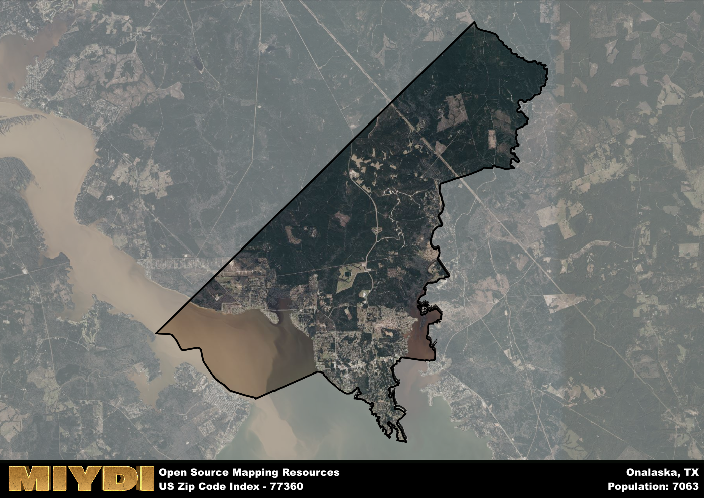

**Area Name:** Onalaska

**Zip Code:** 77360

**State:** TX

# Onalaska: A Charming Neighborhood in East Texas  

Located in East Texas, the zip code 77360 encompasses the quaint neighborhood of Onalaska. Bordered by the shores of Lake Livingston to the east, this area seamlessly blends into the larger Polk County region. Onalaska is a short drive away from the city of Livingston, which serves as the county seat and provides essential services and amenities for residents of the zip code area.

Onalaska has a rich history dating back to the early 19th century when it was primarily inhabited by Native American tribes. The area saw significant growth with the arrival of European settlers, who established farms and ranches in the fertile land surrounding Lake Livingston. The name "Onalaska" is believed to have been inspired by a Native American word meaning "the place of many onions," paying homage to the region's agricultural heritage.

Today, Onalaska is a charming community known for its recreational opportunities on Lake Livingston, including boating, fishing, and camping. The area boasts a mix of local businesses, restaurants, and services catering to residents and visitors alike. With its picturesque lakefront setting, Onalaska has become a popular destination for those seeking a peaceful retreat in the heart of East Texas.

# Onalaska Demographics

The population of Onalaska is 7063.  
Onalaska has a population density of 165.22 per square mile.  
The area of Onalaska is 42.75 square miles.  

## Onalaska Income and Economic Data

These demographic numbers are sourced from IRS return data, providing comprehensive insights into the population dynamics and economic trends within Onalaska.

**Breakdown of return types for Onalaska**

The table offers insight into the composition of tax returns filed with the IRS, categorizing them into three main types. Single returns represent filings by individuals, joint returns by married couples, and head of household returns by individuals who qualify as heads of households, typically having dependents. This breakdown provides an understanding of the different filing statuses adopted by taxpayers when submitting their tax documentation.

| Return Types filed for Onalaska                              | Percentage          |
|----------------------------------------------------------|---------------------|
| Single Returns                                            | 0.42 |
| Joint Returns                                             | 0.42 |
| Head Household Returns                                    | 0.14 |

The income and economic data presented here is sourced from the IRS income brackets, utilized for categorizing tax returns by income levels. This table displays income ranges for both single filers and married couples, along with the corresponding number of returns and the percentage within each bracket, providing valuable insight into the distribution of taxes across various income groups.

| Bracket Name       | Single Filer Income Range | Married Couple Range | Number of Returns | Percentage of Returns |
|--------------------|----------------------------|----------------------|-------------------|-----------------------|
| 10% Bracket        | Up to $10,275              | Up to $20,550        | 1040 | 0.42% |
| 12% Bracket        | $10,276 - $41,775          | $20,551 - $83,550    | 620 | 0.25% |
| 22% Bracket        | $41,776 - $89,075          | $83,551 - $178,150   | 320 | 0.13% |
| 24% Bracket        | $89,076 - $170,050         | $178,151 - $340,100  | 200 | 0.08% |
| 32% Bracket        | $170,051 - $215,950        | $340,101 - $431,900  | 260 | 0.1% |
| 35% Bracket        | $215,951 - $539,900        | $431,901 - $647,850  | 60 | 0.02% |

### Exploring Taxpayer Diversity: A Breakdown of Different Types of Tax Returns in Onalaska

The table offers insights into various types of tax returns filed, reflecting different aspects of taxpayer activities and demographics. Categories include charitable returns for donations, dependent returns for claimed dependents, educator population, elderly population, real estate returns, self-employment returns, student loan returns, and unemployment returns, providing valuable insights into taxpayer behavior and demographics.

| Onalaska Filing Types                    | Count | Percentage |
|--------------------------------------|-------|------------|
| Charitable Donations                 | 50 | 0.02% |
| Dependents Claimed                   | 40 | 0.016% |
| Educator Residents                   | 30 | 0.012% |
| Elderly Population                   | 950 | 0.38% |
| Farming Population                   | 20 | 0.008% |
| Real Estate Transactions             | 60 | 0.024% |
| Self-Employed Individuals            | 350 | 0.14% |
| Student Loan Cases                   | 60 | 0.024% |
| Unemployment Benefit Filings         | 390 | 0.16% |

## Onalaska AI and Census Variables

The values presented in this dataset for Onalaska are AI-optimized, streamlined, and categorized into relevant buckets for enhanced utility in AI and mapping programs. These simplified values have been optimized to facilitate efficient analysis and integration into various technological applications, offering users accessible and actionable insights into demographics within the Onalaska area.

| AI Variables for Onalaska | Value |
|-------------|-------|
| Shape Area | 150743931.648438 |
| Shape Length | 86276.8922539227 |

## How to use this free AI optimized Geo-Spatial Data for Onalaska, TX

This data is made freely available under the Creative Commons license, allowing for unrestricted use for any purpose. Users can access static resources directly from GitHub or leverage more advanced functionalities by utilizing the GeoJSON files. All datasets originate from official government or private sector sources and are meticulously compiled into relevant datasets within QGIS. However, the versatility of the data ensures compatibility with any mapping application.

## Data Accuracy Disclaimer
It's important to note that the data provided here may contain errors or discrepancies and should be considered as 'close enough' for business applications and AI rather than a definitive source of truth. This data is aggregated from multiple sources, some of which publish information on wildly different intervals, leading to potential inconsistencies. Additionally, certain data points may not be corrected for Covid-related changes, further impacting accuracy. Moreover, the assumption that demographic trends are consistent throughout a region may lead to discrepancies, as trends often concentrate in areas of highest population density. As a result, dense areas may be slightly underrepresented, while rural areas may be slightly overrepresented, resulting in a more conservative dataset. Furthermore, the focus primarily on areas within US Major and Minor Statistical areas means that approximately 40 million Americans living outside of these areas may not be fully represented. Lastly, the historical background and area descriptions generated using AI are susceptible to potential mistakes, so users should exercise caution when interpreting the information provided.
