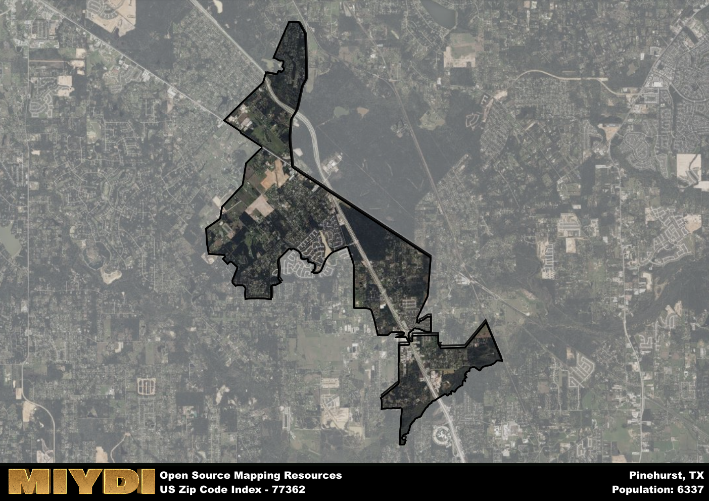

**Area Name:** Pinehurst

**Zip Code:** 77362

**State:** TX

Pinehurst is a part of the Houston-The Woodlands-Sugar Land - TX Metro Area, and makes up  of the Metro's population.  

# Pinehurst: A Charming Neighborhood in the Heart of Texas

Located in Montgomery County, Pinehurst is a quaint neighborhood nestled within the zip code 77362. Bordered by The Woodlands to the east and Magnolia to the west, Pinehurst seamlessly integrates with its surrounding districts, offering residents easy access to major population centers such as Houston and Conroe. This area is known for its serene atmosphere, lush greenery, and close-knit community feel.

Pinehurst has a rich historical narrative, dating back to the late 19th century when it was originally established as a sawmill town. Named after the abundance of pine trees in the area, Pinehurst quickly grew as a hub for lumber production and agriculture. Over the years, the neighborhood has evolved into a residential area, while still maintaining its rural charm and historic roots. Today, Pinehurst stands as a testament to its past, with many historic buildings and landmarks dotting the landscape.

Presently, Pinehurst offers a mix of residential neighborhoods, local businesses, and recreational amenities. The area boasts a thriving economy supported by small businesses, restaurants, and shops catering to the needs of residents. Outdoor enthusiasts can enjoy the nearby hiking trails, parks, and golf courses, while history buffs can explore the historic sites that showcase Pinehurst's unique heritage. With its blend of modern conveniences and small-town charm, Pinehurst continues to be a sought-after community for those looking to escape the hustle and bustle of city life.

# Pinehurst Demographics

The population of Pinehurst is 6337.  
Pinehurst has a population density of 834.91 per square mile.  
The area of Pinehurst is 7.59 square miles.  

## Pinehurst Income and Economic Data

These demographic numbers are sourced from IRS return data, providing comprehensive insights into the population dynamics and economic trends within Pinehurst.

**Breakdown of return types for Pinehurst**

The table offers insight into the composition of tax returns filed with the IRS, categorizing them into three main types. Single returns represent filings by individuals, joint returns by married couples, and head of household returns by individuals who qualify as heads of households, typically having dependents. This breakdown provides an understanding of the different filing statuses adopted by taxpayers when submitting their tax documentation.

| Return Types filed for Pinehurst                              | Percentage          |
|----------------------------------------------------------|---------------------|
| Single Returns                                            | 0.4 |
| Joint Returns                                             | 0.47 |
| Head Household Returns                                    | 0.11 |

The income and economic data presented here is sourced from the IRS income brackets, utilized for categorizing tax returns by income levels. This table displays income ranges for both single filers and married couples, along with the corresponding number of returns and the percentage within each bracket, providing valuable insight into the distribution of taxes across various income groups.

| Bracket Name       | Single Filer Income Range | Married Couple Range | Number of Returns | Percentage of Returns |
|--------------------|----------------------------|----------------------|-------------------|-----------------------|
| 10% Bracket        | Up to $10,275              | Up to $20,550        | 970 | 0.29% |
| 12% Bracket        | $10,276 - $41,775          | $20,551 - $83,550    | 680 | 0.2% |
| 22% Bracket        | $41,776 - $89,075          | $83,551 - $178,150   | 470 | 0.14% |
| 24% Bracket        | $89,076 - $170,050         | $178,151 - $340,100  | 280 | 0.08% |
| 32% Bracket        | $170,051 - $215,950        | $340,101 - $431,900  | 590 | 0.18% |
| 35% Bracket        | $215,951 - $539,900        | $431,901 - $647,850  | 330 | 0.1% |

### Exploring Taxpayer Diversity: A Breakdown of Different Types of Tax Returns in Pinehurst

The table offers insights into various types of tax returns filed, reflecting different aspects of taxpayer activities and demographics. Categories include charitable returns for donations, dependent returns for claimed dependents, educator population, elderly population, real estate returns, self-employment returns, student loan returns, and unemployment returns, providing valuable insights into taxpayer behavior and demographics.

| Pinehurst Filing Types                    | Count | Percentage |
|--------------------------------------|-------|------------|
| Charitable Donations                 | 300 | 0.09% |
| Dependents Claimed                   | 160 | 0.048% |
| Educator Residents                   | 100 | 0.03% |
| Elderly Population                   | 740 | 0.22% |
| Farming Population                   | 30 | 0.009% |
| Real Estate Transactions             | 340 | 0.102% |
| Self-Employed Individuals            | 590 | 0.178% |
| Student Loan Cases                   | 190 | 0.057% |
| Unemployment Benefit Filings         | 460 | 0.14% |

## Pinehurst AI and Census Variables

The values presented in this dataset for Pinehurst are AI-optimized, streamlined, and categorized into relevant buckets for enhanced utility in AI and mapping programs. These simplified values have been optimized to facilitate efficient analysis and integration into various technological applications, offering users accessible and actionable insights into demographics within the Pinehurst area.

| AI Variables for Pinehurst | Value |
|-------------|-------|
| Shape Area | 26364656.6171875 |
| Shape Length | 48653.4999614522 |
| CBSA Federal Processing Standard Code | 26420 |

## How to use this free AI optimized Geo-Spatial Data for Pinehurst, TX

This data is made freely available under the Creative Commons license, allowing for unrestricted use for any purpose. Users can access static resources directly from GitHub or leverage more advanced functionalities by utilizing the GeoJSON files. All datasets originate from official government or private sector sources and are meticulously compiled into relevant datasets within QGIS. However, the versatility of the data ensures compatibility with any mapping application.

## Data Accuracy Disclaimer
It's important to note that the data provided here may contain errors or discrepancies and should be considered as 'close enough' for business applications and AI rather than a definitive source of truth. This data is aggregated from multiple sources, some of which publish information on wildly different intervals, leading to potential inconsistencies. Additionally, certain data points may not be corrected for Covid-related changes, further impacting accuracy. Moreover, the assumption that demographic trends are consistent throughout a region may lead to discrepancies, as trends often concentrate in areas of highest population density. As a result, dense areas may be slightly underrepresented, while rural areas may be slightly overrepresented, resulting in a more conservative dataset. Furthermore, the focus primarily on areas within US Major and Minor Statistical areas means that approximately 40 million Americans living outside of these areas may not be fully represented. Lastly, the historical background and area descriptions generated using AI are susceptible to potential mistakes, so users should exercise caution when interpreting the information provided.
