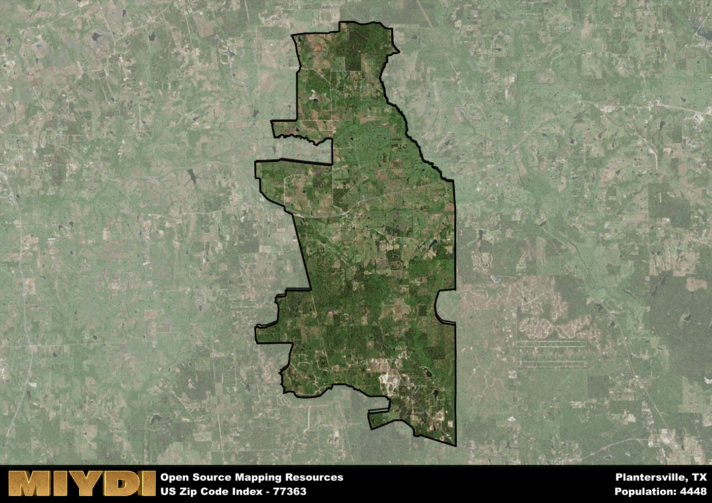

**Area Name:** Plantersville

**Zip Code:** 77363

**State:** TX

Plantersville is a part of the Houston-The Woodlands-Sugar Land - TX Metro Area, and makes up  of the Metro's population.  

# Plantersville: A Quaint Neighborhood in Southeast Texas  

Plantersville, located in the 77363 zip code, is a charming neighborhood situated within the greater metropolitan area of Houston, Texas. Bordered by Magnolia to the north and Todd Mission to the south, Plantersville is approximately 50 miles north of downtown Houston. The area is known for its picturesque landscapes, with rolling hills and lush greenery surrounding the residential communities. Plantersville plays a vital role in the region's agricultural industry, with many residents working in farming and ranching.

Originally settled in the mid-19th century, Plantersville was named for the abundant plantations that once dotted the area. Over time, the neighborhood grew into a thriving community with a strong sense of pride in its history and heritage. Plantersville played a significant role in the development of the surrounding region, serving as a hub for trade and commerce. Today, remnants of its past can be seen in the well-preserved historic buildings and landmarks that dot the landscape.

Present-day Plantersville is a close-knit community that offers a mix of rural charm and modern amenities. The area boasts a variety of locally-owned businesses, including shops, restaurants, and services that cater to residents and visitors alike. Outdoor enthusiasts can enjoy the numerous parks and recreational areas, perfect for hiking, fishing, and picnicking. Plantersville is also home to cultural attractions such as museums and historic sites, showcasing the rich heritage of the area.

# Plantersville Demographics

The population of Plantersville is 4448.  
Plantersville has a population density of 73.29 per square mile.  
The area of Plantersville is 60.69 square miles.  

## Plantersville Income and Economic Data

These demographic numbers are sourced from IRS return data, providing comprehensive insights into the population dynamics and economic trends within Plantersville.

**Breakdown of return types for Plantersville**

The table offers insight into the composition of tax returns filed with the IRS, categorizing them into three main types. Single returns represent filings by individuals, joint returns by married couples, and head of household returns by individuals who qualify as heads of households, typically having dependents. This breakdown provides an understanding of the different filing statuses adopted by taxpayers when submitting their tax documentation.

| Return Types filed for Plantersville                              | Percentage          |
|----------------------------------------------------------|---------------------|
| Single Returns                                            | 0.46 |
| Joint Returns                                             | 0.38 |
| Head Household Returns                                    | 0.15 |

The income and economic data presented here is sourced from the IRS income brackets, utilized for categorizing tax returns by income levels. This table displays income ranges for both single filers and married couples, along with the corresponding number of returns and the percentage within each bracket, providing valuable insight into the distribution of taxes across various income groups.

| Bracket Name       | Single Filer Income Range | Married Couple Range | Number of Returns | Percentage of Returns |
|--------------------|----------------------------|----------------------|-------------------|-----------------------|
| 10% Bracket        | Up to $10,275              | Up to $20,550        | 760 | 0.42% |
| 12% Bracket        | $10,276 - $41,775          | $20,551 - $83,550    | 440 | 0.24% |
| 22% Bracket        | $41,776 - $89,075          | $83,551 - $178,150   | 230 | 0.13% |
| 24% Bracket        | $89,076 - $170,050         | $178,151 - $340,100  | 140 | 0.08% |
| 32% Bracket        | $170,051 - $215,950        | $340,101 - $431,900  | 180 | 0.1% |
| 35% Bracket        | $215,951 - $539,900        | $431,901 - $647,850  | 60 | 0.03% |

### Exploring Taxpayer Diversity: A Breakdown of Different Types of Tax Returns in Plantersville

The table offers insights into various types of tax returns filed, reflecting different aspects of taxpayer activities and demographics. Categories include charitable returns for donations, dependent returns for claimed dependents, educator population, elderly population, real estate returns, self-employment returns, student loan returns, and unemployment returns, providing valuable insights into taxpayer behavior and demographics.

| Plantersville Filing Types                    | Count | Percentage |
|--------------------------------------|-------|------------|
| Charitable Donations                 | 50 | 0.028% |
| Dependents Claimed                   | 30 | 0.017% |
| Educator Residents                   | 30 | 0.017% |
| Elderly Population                   | 420 | 0.23% |
| Farming Population                   | 120 | 0.066% |
| Real Estate Transactions             | 60 | 0.033% |
| Self-Employed Individuals            | 290 | 0.16% |
| Student Loan Cases                   | 70 | 0.039% |
| Unemployment Benefit Filings         | 290 | 0.16% |

## Plantersville AI and Census Variables

The values presented in this dataset for Plantersville are AI-optimized, streamlined, and categorized into relevant buckets for enhanced utility in AI and mapping programs. These simplified values have been optimized to facilitate efficient analysis and integration into various technological applications, offering users accessible and actionable insights into demographics within the Plantersville area.

| AI Variables for Plantersville | Value |
|-------------|-------|
| Shape Area | 211665323.390625 |
| Shape Length | 98204.9473607949 |
| CBSA Federal Processing Standard Code | 26420 |

## How to use this free AI optimized Geo-Spatial Data for Plantersville, TX

This data is made freely available under the Creative Commons license, allowing for unrestricted use for any purpose. Users can access static resources directly from GitHub or leverage more advanced functionalities by utilizing the GeoJSON files. All datasets originate from official government or private sector sources and are meticulously compiled into relevant datasets within QGIS. However, the versatility of the data ensures compatibility with any mapping application.

## Data Accuracy Disclaimer
It's important to note that the data provided here may contain errors or discrepancies and should be considered as 'close enough' for business applications and AI rather than a definitive source of truth. This data is aggregated from multiple sources, some of which publish information on wildly different intervals, leading to potential inconsistencies. Additionally, certain data points may not be corrected for Covid-related changes, further impacting accuracy. Moreover, the assumption that demographic trends are consistent throughout a region may lead to discrepancies, as trends often concentrate in areas of highest population density. As a result, dense areas may be slightly underrepresented, while rural areas may be slightly overrepresented, resulting in a more conservative dataset. Furthermore, the focus primarily on areas within US Major and Minor Statistical areas means that approximately 40 million Americans living outside of these areas may not be fully represented. Lastly, the historical background and area descriptions generated using AI are susceptible to potential mistakes, so users should exercise caution when interpreting the information provided.
